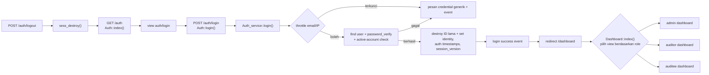
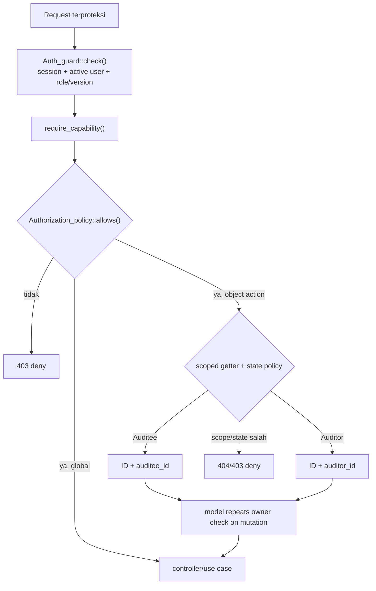
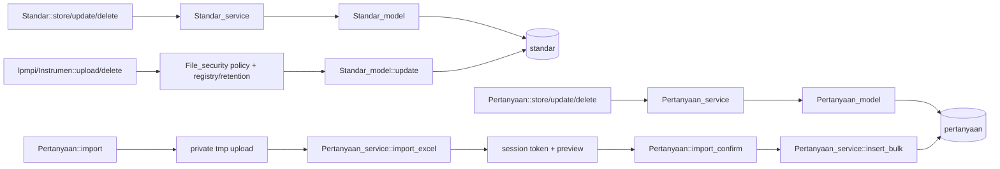
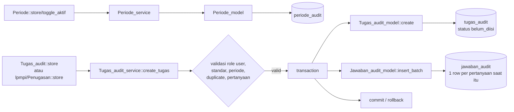
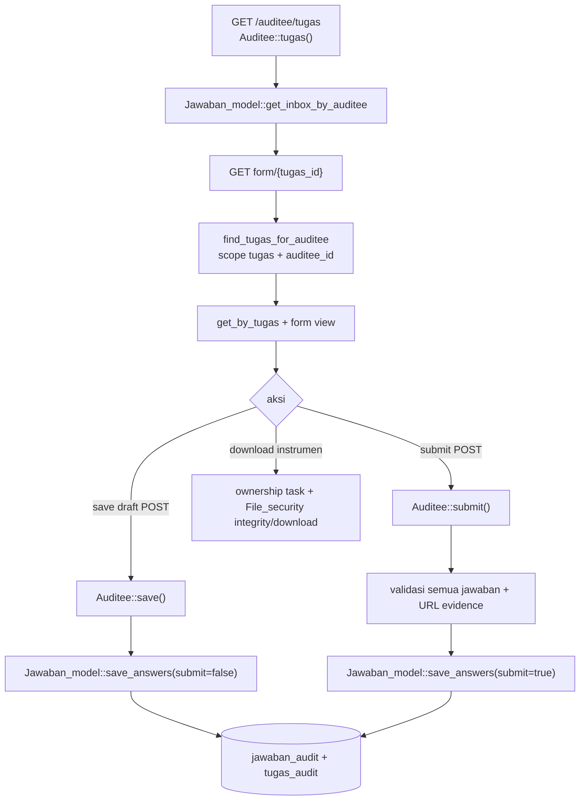
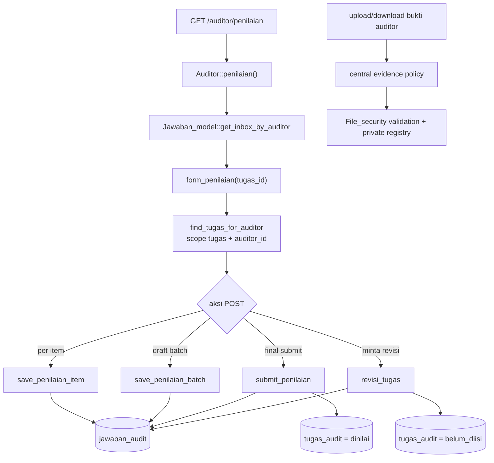
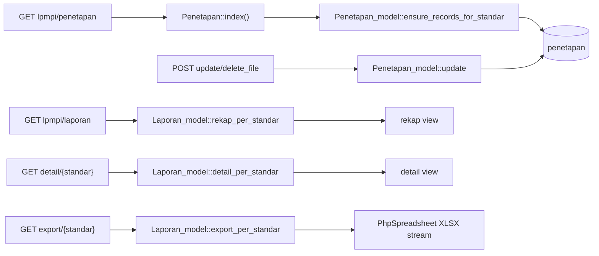
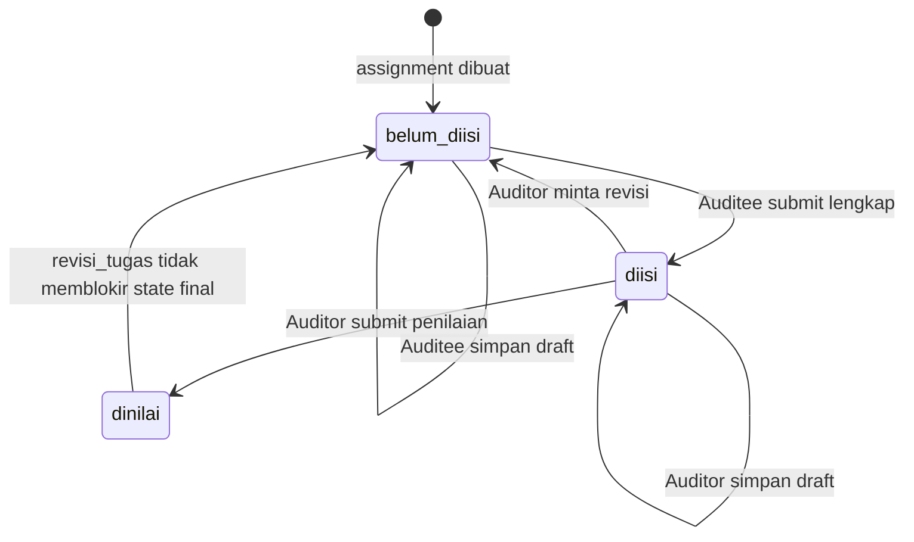

# Current-State Architecture — SPMI / AMI

- **Task:** M0-01
- **Baseline inspeksi:** branch `dev`, commit `3179135`
- **Sifat dokumen:** peta faktual kode saat ini; bukan desain target dan bukan bukti bahwa database produksi identik dengan schema di repository.

## Cara membaca dan batas inspeksi

Label berikut dipakai secara konsisten:

- **EXISTING** — perilaku atau struktur yang ditemukan pada source code/configuration saat ini.
- **PROPOSED** — target yang dinyatakan dalam `BUSINESS_REQUIREMENTS_SPMI_AMI_RTM.md` atau `CODEX_IMPLEMENTATION_PLAN_SPMI_AMI_RTM.md`, tetapi belum boleh dianggap sudah terimplementasi.
- **TO VERIFY** — belum dapat dipastikan hanya dari static inspection; perlu keputusan stakeholder, pemeriksaan runtime/database produksi, atau tugas lanjutan.

Dokumen ini disusun dari kode pada `application/`, schema dan SQL pada `database_schema.sql` serta `migrations/`, konfigurasi root, views, tests, dan helper penyimpanan. Tidak ada query ke database aplikasi, perubahan schema, migrasi, atau perubahan behavior yang dilakukan untuk M0-01.

### Ringkasan pemisahan current state dan target

| Klasifikasi | Ringkasan | Sumber |
|---|---|---|
| **EXISTING** | Aplikasi monolitik CodeIgniter 3 dengan role `super_admin`, `admin_lpmpi`, `auditor`, dan `auditee`; proses AMI memakai `tugas_audit` dan `jawaban_audit`. | `system/core/CodeIgniter.php`; `application/config/routes.php`; `application/config/database.php`; `application/models/Tugas_audit_model.php`; `application/models/Jawaban_model.php` |
| **EXISTING** | Status tugas persisten hanya `belum_diisi`, `diisi`, dan `dinilai`; sejumlah status layar dihitung ulang dari flags/baris jawaban. | `application/config/app_constants.php`; `database_schema.sql`; `application/models/Jawaban_model.php::attach_display_status()` dan `::attach_auditor_penilaian_status()` |
| **EXISTING** | Controller, service, dan model sudah ada, tetapi batas tanggung jawab tidak konsisten. Workflow Auditee/Auditor terbaru memanggil `Jawaban_model` langsung, dan model tersebut juga memuat aturan state transition. | `application/controllers/Auditee.php`; `application/controllers/Auditor.php`; `application/models/Jawaban_model.php` |
| **EXISTING** | M1/M2 menyediakan security, private file, immutable audit, organization scope, dan capability foundation. M3-01/M3-02 menambahkan versi/workflow dokumen SPMI; M3-03 menambahkan master 21 standar milik versi. | `application/libraries/File_security.php`; `application/libraries/Authorization_policy.php`; `application/services/Spmi_version_workflow_service.php`; `application/services/Spmi_standard_service.php`; `application/controllers/Spmi_versions.php`; `application/controllers/Spmi_standards.php`; `migrations/012`–`018` |
| **PROPOSED** | Workflow versioning PPEPP yang lengkap, report read model target, RTM, serta pemisahan controller/service/model/policy/storage/report lanjutan tetap menjadi target milestone berikutnya. | `BUSINESS_REQUIREMENTS_SPMI_AMI_RTM.md`; `CODEX_IMPLEMENTATION_PLAN_SPMI_AMI_RTM.md`, bagian M3–M11, Definition of Done, dan Security Release Gate |
| **TO VERIFY** | Schema dan data produksi, reachability route konvensional untuk controller duplikat dalam subfolder, definisi resmi skala skor, aturan finalisasi/revisi, struktur organisasi/ownership, retensi file, serta keputusan bisnis lain dalam decision register belum dibuktikan oleh source code. | `CODEX_IMPLEMENTATION_PLAN_SPMI_AMI_RTM.md`, bagian assumptions/decision register dan milestone terkait; `application/config/routes.php` |

---

## 1. Ringkasan teknologi

### Backend dan runtime

- **EXISTING:** framework adalah CodeIgniter `3.1.13`, dibaca dari konstanta versi framework. Aplikasi masuk melalui front controller `index.php`. Sumber: `system/core/CodeIgniter.php`; `index.php`.
- **EXISTING:** `composer.json` mensyaratkan PHP `>=7.4` dan mengunci resolusi dependency pada platform PHP `7.4.0`; Docker image memakai `php:8.3-apache`. Sumber: `composer.json` bagian `require` dan `config.platform`; `Dockerfile`.
- **EXISTING:** runtime CLI Laragon yang tersedia saat inspeksi adalah PHP `8.3.30`; ini adalah observasi mesin pengembang, bukan constraint repository. Sumber observasi: `C:\laragon\bin\php\php-8.3.30-Win32-vs16-x64\php.exe --version`.
- **EXISTING:** web server container adalah Apache dengan `mod_rewrite`; deployment Laragon juga diarahkan oleh README untuk memakai Apache. Sumber: `Dockerfile`; `README.md`.
- **EXISTING:** Composer digunakan untuk autoload dan PhpSpreadsheet. File lock ada di workspace, tetapi `composer.lock` diabaikan Git sehingga dependency build dari clone baru tidak dijamin identik. Sumber: `composer.json`; `composer.lock`; `.gitignore`.
- **EXISTING:** script Composer `post-install-cmd` dan `post-update-cmd` menjalankan `sed`, sehingga script tersebut berorientasi shell Unix dan tidak portable secara native ke PowerShell tanpa tool tambahan. Sumber: `composer.json` bagian `scripts`.

### Database

- **EXISTING:** aplikasi memakai driver CodeIgniter `mysqli` dan Query Builder. README menyebut MySQL/MariaDB; Docker Compose memakai MySQL `8.0`. Sumber: `application/config/database.php`; `README.md`; `compose.yaml`.
- **EXISTING:** binary database Laragon yang tersedia saat inspeksi adalah MySQL `8.4.3`; ini tidak membuktikan versi server/schema yang sedang dipakai aplikasi. Sumber observasi: `C:\laragon\bin\mysql\mysql-8.4.3-winx64\bin\mysql.exe --version`.
- **EXISTING:** konfigurasi produksi dibuat fail-closed bila environment database wajib tidak tersedia, sedangkan lingkungan lokal mempunyai fallback development. Nilai credential tidak didokumentasikan di sini. Sumber: `application/config/database.php`.
- **EXISTING:** migrasi CodeIgniter dinonaktifkan (`migration_enabled = FALSE`); repository menyediakan SQL manual bernomor `001`–`017`, termasuk dua file bernomor `009`. Sumber: `application/config/migration.php`; `migrations/`.
- **TO VERIFY:** versi migration yang benar-benar sudah diterapkan dan perbedaan schema produksi harus diperiksa read-only pada M0-02; keberadaan file SQL tidak membuktikan penerapan pada database tertentu. Sumber: `application/config/migration.php`; `migrations/`; `CODEX_IMPLEMENTATION_PLAN_SPMI_AMI_RTM.md`, M0-02.

### Frontend dan asset

- **EXISTING:** UI server-rendered memakai Bootstrap `4.6.0`, Font Awesome `5.15.4`, jQuery Slim `3.5.1`, dan Chart.js dari CDN. Sumber: `application/views/layouts/header.php`; `application/views/layouts/footer.php`; `application/views/dashboard/super_admin.php`; `application/views/lpmpi/laporan/index.php`; `application/views/lpmpi/profil/index.php`.
- **EXISTING:** Chart.js dimuat tanpa versi yang dipin secara eksplisit, sedangkan library frontend utama lain memakai versi tertentu. Sumber: `application/views/dashboard/super_admin.php`; `application/views/lpmpi/laporan/index.php`; `application/views/lpmpi/profil/index.php`.
- **EXISTING:** asset lokal utama berada di `assets/`; tampilan dibagi per role/modul di `application/views/`. Sumber: `assets/`; `application/views/`.

### Konfigurasi lingkungan dan baseline security

- **EXISTING:** `CI_ENV` wajib menghasilkan salah satu environment `development`, `testing`, atau `production`; environment yang tidak valid memunculkan pesan “The application environment is not set correctly.” Sumber: `index.php`.
- **EXISTING:** session memakai file driver, cookie `HttpOnly`, `SameSite=Lax`, regenerasi periodik 300 detik dengan ID lama dihancurkan, idle timeout 30 menit, dan absolute timeout 8 jam. Development memakai fallback save path aplikasi; production mewajibkan `APP_SESSION_SAVE_PATH` yang writable dan berada di luar document root. Sumber: `application/config/config.php` bagian Session Variables dan validasi production.
- **EXISTING:** CSRF protection aktif secara global, tanpa exclusion route, dan token tidak diregenerasi setiap submit. Global XSS filtering tidak aktif. Sumber: `application/config/config.php` bagian CSRF dan Global XSS Filtering.
- **EXISTING:** production memvalidasi HTTPS base URL/allowed Host, encryption key, secure cookie, threshold log non-debug, trusted proxy format, serta lokasi private storage/log/session yang writable dan berada di luar document root. Credential database privileged/default ditolak, query recording dimatikan, dan setiap request/log teknis memiliki correlation ID. Sumber: `index.php`; `application/config/security_bootstrap.php`, `config.php`, dan `database.php`; `application/core/MY_Log.php` dan `MY_Exceptions.php`.
- **EXISTING:** source aplikasi tidak mendefinisikan header CSP, `X-Frame-Options`, `X-Content-Type-Options`, `Referrer-Policy`, `Permissions-Policy`, atau HSTS; README menyerahkan sebagian hardening transport ke web server. Sumber: pencarian pada `application/`, `index.php`, dan `.htaccess`; `README.md`.
- **PROPOSED:** seluruh security release gate pada implementation plan tetap merupakan kriteria target dan harus diverifikasi ulang pada milestone yang relevan. Sumber: `CODEX_IMPLEMENTATION_PLAN_SPMI_AMI_RTM.md`, bagian Security Release Gate.

---

## 2. Struktur direktori penting

| Path | Fungsi current state | Status dan catatan |
|---|---|---|
| `index.php` | Front controller, pemilihan environment, dan bootstrap CodeIgniter. | **EXISTING**; validasi `CI_ENV` ada di file ini. |
| `application/config/` | Routes, autoload, database, session/cookie/CSRF, migration flag, dan konstanta status. | **EXISTING**; lihat `routes.php`, `autoload.php`, `database.php`, `config.php`, `migration.php`, `app_constants.php`. |
| `application/controllers/` | Controller root untuk auth, dashboard, admin umum, Auditee, dan Auditor. | **EXISTING**; workflow Auditee/Auditor terbaru berada pada controller root. |
| `application/controllers/lpmpi/` | Controller LPMPI: akun, instrumen, laporan, penetapan, dan penugasan. | **EXISTING**; mayoritas mewarisi `Admin_Lpmpi_Controller`. |
| `application/controllers/auditee/` | Controller `Tugas` yang menduplikasi sebagian besar workflow `Auditee` root. | **EXISTING**, tetapi status route aktualnya **TO VERIFY**; lihat bagian duplikasi. |
| `application/controllers/auditor/` | Proxy `Penilaian` ke controller `Auditor` root. | **EXISTING**, compatibility proxy; reachability konvensional **TO VERIFY**. |
| `application/core/MY_Controller.php` | Base controller yang memetakan kelompok controller ke capability. | **EXISTING**; seluruh keputusan capability didelegasikan ke `Auth_guard`/`Authorization_policy`. |
| `application/libraries/Auth_guard.php` | Validasi session/account dan gerbang capability untuk seluruh controller. | **EXISTING**; role-only `only()` sudah dihapus pada M1-04. |
| `application/libraries/Authorization_policy.php` | Matriks capability, policy object/state, query scope, deny-default, dan explicit Super Admin override. | **EXISTING** sejak M1-04; M2-01 menambah capability master unit dan M2-02 menambah management serta active direct membership API. RTM/PIC tetap belum mempunyai model. |
| `application/services/` | Sebagian orchestration dan validasi bisnis. | **EXISTING**; batasnya belum seragam dan tidak semua workflow aktif melewati service. |
| `application/models/` | Query/persistence, tetapi `Jawaban_model` juga memuat state transition dan aturan workflow. | **EXISTING**; belum sesuai boundary target. |
| `application/helpers/app_helper.php` | Helper status/label, output encoding, dan resolver private storage terbatas kategori. | **EXISTING**; production menolak fallback legacy dari document root. |
| `application/libraries/File_security.php` | Boundary upload/download: policy kategori, content inspection, random storage name, checksum, metadata, event, retention, dan attachment streaming. | **EXISTING** sejak M1-06; antivirus/CDR belum terintegrasi. |
| `application/views/` | Views per modul dan templates/sidebar per role. | **EXISTING**; menu role adalah indikator UI, bukan enforcement authorization. |
| `application/cache/sessions/` dan `application/logs/` | Session file dan application log default. | **EXISTING**; konfigurasi produksi memeriksa lokasi/permission. Sumber: `application/config/config.php`. |
| `uploads/` | Legacy files di bawah document root dan logo profil publik. | **EXISTING**; direktori legacy tertentu dilindungi `.htaccess`, sedangkan `uploads/profil` memang dilayani sebagai URL publik. |
| `migrations/` | SQL manual incremental `001`–`017`. | **EXISTING**; tidak dijalankan otomatis karena `application/config/migration.php`. |
| `database_schema.sql` | Baseline schema gabungan untuk instalasi saat ini. | **EXISTING** sebagai artefak repository; kesesuaian dengan production **TO VERIFY**. |
| `database_dummy.sql` | Seed/demo data. | **EXISTING**; mengandung credential/demo record dan tidak boleh dipakai sebagai sumber credential produksi. |
| `tests/` | Regression source/runtime dan harness HTTP/database smoke terisolasi. | **EXISTING**; policy, authentication, encoding, file security, ownership, evidence IDOR, final-state mutation, dan workflow utama tercakup; concurrency/visual/antivirus/production belum diuji. |
| `Dockerfile`, `compose.yaml` | Lingkungan container opsional. | **EXISTING**; berbeda dari workflow Laragon tetapi memakai codebase/config yang sama. |
| `BUSINESS_REQUIREMENTS_SPMI_AMI_RTM.md` | Kebutuhan bisnis target. | **PROPOSED** bila belum didukung bukti current code. |
| `CODEX_IMPLEMENTATION_PLAN_SPMI_AMI_RTM.md` | Urutan milestone, boundary target, DoD, dan security gate. | **PROPOSED**; bukan deskripsi otomatis atas current code. |

Class policy pusat sudah tersedia di `application/libraries/Authorization_policy.php`. Class khusus `Storage` dan `ReportReadModel` belum tersedia; storage masih berupa helper + logic controller, sedangkan reporting memakai controller/model langsung. Sumber: `application/libraries/Authorization_policy.php`; `application/helpers/app_helper.php`; `application/controllers/lpmpi/Laporan.php`; `application/models/Laporan_model.php`.

---

## 3. Peta entry point dan routes

### Entry point

1. Request masuk melalui `index.php`, yang menetapkan `ENVIRONMENT`, error display, dan path CodeIgniter.
2. Router memakai `application/config/routes.php`; default controller adalah `Auth`.
3. Library database, session, dan form validation serta helper URL/form/security/app diautoload. Sumber: `application/config/autoload.php`.
4. Route yang tidak didefinisikan eksplisit tetap dapat mengikuti convention-based routing CodeIgniter bila tidak dibatasi web server/router. Sumber: `application/config/routes.php`; `system/core/Router.php`.

### Route autentikasi dan redirect

| Aksi | Route/entry | Handler | Redirect/view |
|---|---|---|---|
| Login form | `/`, `/auth`, `/auth/index` | `Auth::index()` | User yang sudah login diarahkan ke `/dashboard`; selain itu `auth/login`. Sumber: `application/controllers/Auth.php::index()`. |
| Login submit | `/auth/login` | `Auth::login()` → `Auth_service::login()` | Berhasil ke `/dashboard`, gagal kembali dengan pesan generik. Sumber: `application/controllers/Auth.php::login()`; `application/services/Auth_service.php::login()`. |
| Logout | `/auth/logout` | `Auth::logout()` | Hanya POST; destroy session lalu ke `/auth`. Sumber: `application/controllers/Auth.php::logout()`. |
| Landing pascalogin | `/dashboard` | `Dashboard::index()` | View dipilih dari role: admin gabungan, auditor, atau auditee. Sumber: `application/controllers/Dashboard.php::index()`. |

### Route utama per role/modul

Enforcement role diringkas di bagian authorization; tabel ini memetakan permukaan URL yang terlihat di route dan sidebar.

| Role/modul | Route utama | Handler/sumber |
|---|---|---|
| Semua user login | `/dashboard`, `/account`, `/account/update`, `/account/photo`, `/profil` | `application/controllers/Dashboard.php`; `application/controllers/Account.php`; `application/controllers/Profil.php`; explicit route di `application/config/routes.php`. |
| `super_admin` | `/users/*`, ditambah seluruh permukaan admin/LPMPI yang guard-nya mengizinkan `super_admin` | `application/controllers/Users.php::__construct()`; controller lain pada tabel ini; `application/views/layouts/sidebar.php`. |
| Admin/LPMPI | `/periode/*`, `/standar/*`, `/pertanyaan/*`, `/tugas_audit/*`, `/lpmpi/akun/*`, `/lpmpi/instrumen/*`, `/lpmpi/penugasan/*`, `/lpmpi/penetapan/*`, `/lpmpi/laporan/*`, dan pengelolaan `/profil/*` | `application/controllers/Periode.php`; `Standar.php`; `Pertanyaan.php`; `Tugas_audit.php`; `application/controllers/lpmpi/*.php`; `Profil.php::require_manage()`. |
| Auditee | `/auditee`, `/auditee/tugas`, `/auditee/form/{id}`, `/auditee/save/{id}`, `/auditee/submit/{id}`, `/auditee/konfirmasi/{id}`, `/auditee/download_instrumen/{id}` | Explicit aliases ke `application/controllers/Auditee.php` di `application/config/routes.php`. |
| Auditee aliases lama | `/auditee/isi/{id}`, `/auditee/simpan_jawaban/{id}`, serta bentuk `/auditee/tugas/form|save|submit|konfirmasi|download_instrumen` | Explicit aliases ke method root `Auditee` di `application/config/routes.php`. |
| Auditor baru | `/auditor/penilaian`, `/auditor/penilaian/form/{id}`, `/save_item/{id}`, `/save/{id}`, `/submit/{id}`, `/revisi/{id}`, `/download_bukti/{id}` | Explicit aliases ke `application/controllers/Auditor.php` di `application/config/routes.php`. |
| Auditor lama/hybrid | `/auditor`, `/auditor/tugas`, `/auditor/nilai/{id}`, `/auditor/simpan_nilai/{id}` | Convention route ke method dalam `application/controllers/Auditor.php`; beberapa link masih berada di `application/views/layouts/sidebar.php` dan dashboard. |
| Laporan | `/lpmpi/laporan`, `/lpmpi/laporan/detail/{standar}`, `/lpmpi/laporan/export/{standar}` | `application/controllers/lpmpi/Laporan.php::index()`, `::detail()`, dan `::export()`. |

Catatan akses:

- **EXISTING:** `/auditor/nilai/{id}` mempunyai explicit route ke `Auditor::form_penilaian()`, sehingga nama lama diarahkan ke form baru. Sumber: `application/config/routes.php`; `application/controllers/Auditor.php::form_penilaian()`.
- **EXISTING:** menu `admin_lpmpi` tidak menampilkan semua endpoint yang secara guard masih mengizinkan role tersebut; UI menu tidak boleh dianggap sebagai authorization boundary. Sumber: `application/views/layouts/sidebar.php`; constructors `Standar`, `Pertanyaan`, `Tugas_audit`, dan base `Admin_Lpmpi_Controller` di `application/core/MY_Controller.php`.
- **TO VERIFY:** apakah URL konvensional menuju `auditee/Tugas` atau `auditor/Penilaian` dapat diakses pada seluruh konfigurasi server. Tidak ada explicit route yang menunjuk ke kedua class subfolder tersebut. Sumber: `application/config/routes.php`; `application/controllers/auditee/Tugas.php`; `application/controllers/auditor/Penilaian.php`.

---

## 4. Authentication flow

Sumber diagram: `application/controllers/Auth.php::index()`, `::login()`, `::logout()`; `application/services/Auth_service.php::login()`; `application/models/User_model.php::find_by_email()`; `application/controllers/Dashboard.php::index()`.

### Detail autentikasi current state

- **EXISTING:** email dicari di `users`, lalu password diverifikasi dengan `password_verify`; pembuatan/perubahan password memakai `password_hash(PASSWORD_DEFAULT)`. Sumber: `application/services/Auth_service.php::login()`; `application/services/User_service.php::create_user()` dan `::update_user()`.
- **EXISTING:** pesan login gagal tidak membedakan email tidak ditemukan dan password salah. Sumber: `application/controllers/Auth.php::login()`; `application/services/Auth_service.php::login()`.
- **EXISTING:** session diregenerasi dengan ID lama dihancurkan sebelum authenticated state ditulis; logout hanya menerima POST dan menghancurkan session. Sumber: `application/services/Auth_service.php`; `application/controllers/Auth.php`.
- **EXISTING:** throttle database membatasi 5 kegagalan per email atau 20 per IP dalam 15 menit. Login gagal/sukses/throttled, logout, timeout, dan revocation dicatat dengan email/IP/user-agent berupa HMAC, bukan nilai mentah. Sumber: `application/libraries/Auth_security.php`; `application/models/Auth_security_event_model.php`; tabel `auth_security_events`.
- **EXISTING:** `Auth_guard` dan turunan `MY_Controller` memvalidasi akun aktif, role, dan `session_version` terhadap database pada setiap request terlindungi; perubahan password/role/status mencabut sesi lama. Sumber: `application/libraries/Auth_guard.php`; `application/core/MY_Controller.php`; `application/services/User_service.php`.
- **EXISTING:** akun mempunyai status aktif/nonaktif; akun nonaktif tidak dapat login atau dipilih untuk penugasan baru. Sumber: migration `012`; `Auth_service`; `Tugas_audit_service`; layar pengelolaan pengguna/akun.
- **EXISTING:** M1-08 menyediakan general immutable audit ledger untuk current authentication/account/master/assignment/submission/file/export surfaces. Trigger menolak update/delete dan hash chain dapat diverifikasi melalui CLI. MFA/SSO, formal retention/legal hold, external anchoring, dan event modul target yang belum ada tetap terbuka.
- **TO VERIFY:** kebijakan password institusi, kebutuhan MFA/SSO, aturan deaktivasi akun, dan timeout bisnis harus diputuskan stakeholder. Sumber: `BUSINESS_REQUIREMENTS_SPMI_AMI_RTM.md`; `CODEX_IMPLEMENTATION_PLAN_SPMI_AMI_RTM.md`, decision register.

---

## 5. Authorization flow

### Satu policy untuk dua bentuk controller

`CI_Controller` langsung dan subclass `MY_Controller` tetap ada untuk kompatibilitas, tetapi keduanya memakai gerbang yang sama: `Auth_guard::require_capability()` → `Authorization_policy::allows()`. Tidak ada lagi jalur role-only `Auth_guard::only()` atau `_check_role()`.

Sumber diagram: `application/libraries/Auth_guard.php`; `application/libraries/Authorization_policy.php`; `application/core/MY_Controller.php`; controller Auditee/Auditor; scoped methods `Jawaban_model`.

### Matriks authorization aktual

| Area | Role / scope current state | Enforcement |
|---|---|---|
| Dashboard | Semua role valid; view berdasarkan role. | Capability `dashboard.view`; role hanya memilih view setelah policy lolos. |
| Users global | Hanya `super_admin`. | Capability `users.manage`. |
| Akun Auditor/Auditee | `super_admin` dan `admin_lpmpi`; tipe akun dibatasi service. | Capability `participant_accounts.manage`. |
| Standar/indikator/import | `super_admin` dan `admin_lpmpi`. | `spmi.standard.manage`, `spmi.indicator.manage`, dan `spmi.import`. |
| Periode/instrumen/penetapan | `super_admin` dan `admin_lpmpi`. | `audit.period.manage` dan `audit.package.manage`. |
| Penugasan/tugas audit umum | `super_admin` dan `admin_lpmpi`. | `audit.assignment.manage`. |
| Laporan/export current | `super_admin` dan `admin_lpmpi`. | `audit.report.view` dan action guard `audit.report.export`. |
| Profil lihat/kelola | Semua role dapat lihat; dua admin dapat kelola. | `profile.view` dan `profile.manage`. |
| Account settings/photo | Self; target dari session dan URL tidak menerima user ID. | Capability `account.self` + session user ID. |
| Unit/jabatan user | Super Admin untuk semua target; Admin LPMPI untuk Auditor/Auditee. | Capability `user_unit_assignments.manage` + object target check. |
| Auditee task/answer | Hanya assignment dengan `auditee_id` current user; submitted/final tidak editable. | `audit.submission.fill`/`submit`, `canViewAuditAssignment()`, dan scoped model recheck. |
| Auditor task/answer/file | Hanya assignment/evidence dengan `auditor_id` current user; final assessment tidak editable. | `audit.assessment.fill`/`submit`, `canAssessAssignment()`, dan scoped model recheck. |
| RTM/PIC/follow-up | Tidak ada model/capability efektif. | Policy method tersedia tetapi selalu `FALSE` (deny default). |

### Kesenjangan boundary authorization

- **EXISTING:** capability dan object/state authorization dipusatkan pada `Authorization_policy`; jalur controller utama dan legacy memakai policy yang sama.
- **EXISTING:** list/count participant sudah ter-scope user; detail, mutasi, instrumen, dan bukti memakai ID + owner pada query, lalu model mengulang guard mutasi.
- **EXISTING:** sensitive Super Admin override mempunyai API terpisah, alasan wajib, event database, dan technical security log; belum ada endpoint UI yang menggunakannya.
- **EXISTING M2-02:** direct organization membership mempunyai unit ID stabil,
  kode jabatan, masa berlaku, primary flag, dan policy active-assignment; nilai
  legacy `nama_unit` tidak menjadi sumber kewenangan.
- **EXISTING M2-03:** 18 capability minimum mempunyai role matrix dan scope
  mode eksplisit. Guard dapat menggabungkan capability dengan direct active
  unit assignment; Super Admin mempunyai organization scope global.
- **KNOWN LIMIT:** objek legacy yang belum menyimpan `organization_unit_id`
  masih institution-wide untuk admin. Tidak ada mapping dari `nama_unit`.
  Lead Auditor, observer, dan multi-role capability assignment belum
  dimodelkan.
- **DENY DEFAULT:** RTM/finalizer/PIC/verifier belum ada; policy selalu menolak sampai keputusan bisnis dan model scope tersedia.

---

## 6. Alur proses utama

### 6.1 Admin — standar, pertanyaan, dan instrumen

Sumber diagram: `application/controllers/Standar.php`; `application/services/Standar_service.php`; `application/models/Standar_model.php`; `application/controllers/Pertanyaan.php`; `application/services/Pertanyaan_service.php`; `application/models/Pertanyaan_model.php`; `application/controllers/lpmpi/Instrumen.php`; `application/libraries/File_security.php`.

- **EXISTING:** standar dan pertanyaan adalah master mutable; delete bersifat hard delete. Foreign key schema dapat meneruskan penghapusan ke data turunannya. Sumber: `application/services/Standar_service.php::delete_standar()`; `application/services/Pertanyaan_service.php::delete_pertanyaan()`; `database_schema.sql`.
- **EXISTING:** import pertanyaan menggunakan preview + token satu kali di session sebelum bulk insert dalam transaction. Sumber: `application/controllers/Pertanyaan.php::import()`, `::import_confirm()`, `::active_imports()`; `application/services/Pertanyaan_service.php::import_excel()` dan `::insert_bulk()`.
- **EXISTING:** kolom target pertanyaan masih berupa field tahunan pada record pertanyaan saat ini, bukan versioned target entity. Sumber: `database_schema.sql` tabel `pertanyaan`; `application/models/Pertanyaan_model.php`.
- **EXISTING M3-01/M3-02:** `spmi_versions` menyimpan identity/revision,
  organization unit, effective range, private source asset/path/SHA-256,
  lifecycle actor provenance, single-active key, dan history guards.
  `Spmi_version_workflow_service` dan `Spmi_versions` membuka
  draft/review/approve/activate/retire/clone dengan organization scope,
  separation of duties, private PDF ownership, row lock/transaction, dan
  immutable audit event. Sumber: `migrations/017_create_spmi_versions.sql`;
  `database_schema.sql`; `application/models/Spmi_version_model.php`;
  `application/services/Spmi_version_workflow_service.php`;
  `application/controllers/Spmi_versions.php`.
- **EXISTING M3-03:** `spmi_standards` menyimpan code/name, kelompok/jenis,
  rasional/definisi, urutan, dan status aktif per `spmi_version`. Seed 21
  standar berasal dari config/service. Mutation hanya untuk draft; trigger
  menolak perubahan non-draft dan hard delete; clone versi menyalin standar
  secara transaksional. Sumber:
  `migrations/018_create_spmi_standards.sql`;
  `application/config/spmi_standard_seed.php`;
  `application/models/Spmi_standard_model.php`;
  `application/services/Spmi_standard_service.php`;
  `application/controllers/Spmi_standards.php`.
- **PROPOSED M3-04–M6:** versioned statement/indicator/target serta
  cutover legacy masih target.
  `standar` dan `pertanyaan` lama tetap mutable pada checkpoint ini. Sumber:
  `BUSINESS_REQUIREMENTS_SPMI_AMI_RTM.md`;
  `CODEX_IMPLEMENTATION_PLAN_SPMI_AMI_RTM.md`, M3–M6.

### 6.2 Periode, penugasan, dan pembentukan jawaban

Sumber diagram: `application/controllers/Periode.php`; `application/services/Periode_service.php`; `application/models/Periode_model.php`; `application/controllers/Tugas_audit.php::store()`; `application/controllers/lpmpi/Penugasan.php::store()`; `application/services/Tugas_audit_service.php::create_tugas()`; `application/models/Tugas_audit_model.php::create()`; `application/models/Jawaban_audit_model.php::insert_batch()`.

- **EXISTING:** service mencegah lebih dari satu periode aktif melalui transaction/application logic, tetapi schema tidak mempunyai constraint unik yang membuktikan invariant tersebut pada semua writer. Sumber: `application/services/Periode_service.php::toggle_aktif()`; `database_schema.sql` tabel `periode_audit`.
- **EXISTING:** dua UI/controller penugasan menggunakan service yang sama: `Tugas_audit` dan `lpmpi/Penugasan`. Sumber: `application/controllers/Tugas_audit.php`; `application/controllers/lpmpi/Penugasan.php`; `application/services/Tugas_audit_service.php`.
- **EXISTING:** saat assignment dibuat, sistem membuat baris `jawaban_audit` untuk pertanyaan yang ada. Baris tersebut tetap mereferensikan record `pertanyaan`; teks/target tidak disalin sebagai immutable snapshot. Sumber: `application/services/Tugas_audit_service.php::create_tugas()`; `application/models/Jawaban_audit_model.php::insert_batch()`; `database_schema.sql`.
- **EXISTING:** duplicate assignment dicegah oleh query service/model, bukan unique constraint database pada kombinasi assignment. Sumber: `application/services/Tugas_audit_service.php::create_tugas()`; `application/models/Tugas_audit_model.php::exists_duplicate()`; `database_schema.sql`.
- **PROPOSED:** audit cycle, scope snapshot, team/lead auditor, frozen instrument, dan immutable audit history adalah target model. Sumber: `BUSINESS_REQUIREMENTS_SPMI_AMI_RTM.md`; `CODEX_IMPLEMENTATION_PLAN_SPMI_AMI_RTM.md`, M7.

### 6.3 Auditee — isi, draft, dan submit

Sumber diagram: `application/controllers/Auditee.php::tugas()`, `::form()`, `::save()`, `::submit()`, `::download_instrumen()`; `application/models/Jawaban_model.php::get_inbox_by_auditee()`, `::find_tugas_for_auditee()`, `::get_by_tugas()`, `::save_answers()`.

- **EXISTING:** workflow root `Auditee` memanggil `Jawaban_model` langsung; `Auditee_service` tidak direferensikan oleh controller aktif yang ditemukan. Sumber: `application/controllers/Auditee.php`; `application/services/Auditee_service.php`; pencarian referensi `Auditee_service` pada `application/`.
- **EXISTING:** evidence Auditee adalah jawaban teks dan URL `http/https`; current flow tidak mengunggah file evidence Auditee. Sumber: `application/controllers/Auditee.php::set_answer_rules()`; `application/models/Jawaban_model.php::is_valid_evidence_url()`.
- **EXISTING:** submit membutuhkan seluruh item terisi dan URL valid; setelah submit, UI membuat jawaban read-only sampai direvisi oleh Auditor. Sumber: `application/controllers/Auditee.php::submit()` dan `::load_form_view()`; `application/models/Jawaban_model.php::save_answers()` dan `::attach_display_status()`.
- **TO VERIFY:** bukti URL eksternal dapat berubah/hilang dan belum menjadi immutable evidence package; kebutuhan snapshot/checksum/retensi harus diputuskan. Sumber: `BUSINESS_REQUIREMENTS_SPMI_AMI_RTM.md`; `application/models/Jawaban_model.php::is_valid_evidence_url()`.

### 6.4 Auditor — draft penilaian, revisi, dan final

Sumber diagram: `application/controllers/Auditor.php::penilaian()`, `::form_penilaian()`, `::save_penilaian_item()`, `::save_penilaian_draft()`, `::submit_penilaian()`, `::revisi_penilaian()`, `::handle_bukti_upload()`, `::download_bukti_penilaian()`; `application/models/Jawaban_model.php` methods terkait.

- **EXISTING:** skor valid adalah integer `1`–`4`, dengan label presentasi dari helper. Definisi ini hard-coded dan belum dibuktikan sebagai keputusan bisnis final. Sumber: `application/models/Jawaban_model.php::normalize_penilaian_row()` dan `::submit_penilaian()`; `application/helpers/app_helper.php::skor_audit_options()`.
- **EXISTING:** draft item/batch dan final submit tersimpan pada record jawaban yang sama; final submit mengatur flags/timestamp penilaian dan status tugas `dinilai`. Sumber: `application/models/Jawaban_model.php::save_penilaian_item()`, `::save_penilaian_batch()`, dan `::submit_penilaian()`.
- **EXISTING:** revisi membuka kembali task dengan mereset flags submission/assessment dan status tugas ke `belum_diisi`, tetapi tidak mewajibkan alasan revisi, tidak mencatat history terpisah, dan tidak menghapus nilai/temuan/file lama. Sumber: `application/models/Jawaban_model.php::revisi_tugas()`; `application/controllers/Auditor.php::revisi_penilaian()`.
- **EXISTING:** workflow lama pada `Auditor::tugas()`, `::nilai()`, dan `::simpan_nilai()` masih menggunakan `Auditor_service` dan `Jawaban_audit_model`, sementara workflow baru menggunakan `Jawaban_model` langsung. Sumber: `application/controllers/Auditor.php`; `application/services/Auditor_service.php`; `application/models/Jawaban_audit_model.php`.
- **PROPOSED:** review/submission/finalization yang auditable, reasoned revision, immutable final result, dan finding/follow-up model terpisah adalah target. Sumber: `BUSINESS_REQUIREMENTS_SPMI_AMI_RTM.md`; `CODEX_IMPLEMENTATION_PLAN_SPMI_AMI_RTM.md`, M9–M10.
- **TO VERIFY:** arti resmi setiap skor, apakah revisi boleh dilakukan setelah final, siapa yang dapat finalisasi, dan apakah approval berlapis dibutuhkan. Sumber: `CODEX_IMPLEMENTATION_PLAN_SPMI_AMI_RTM.md`, decision register.

### 6.5 LPMPI — penetapan dan laporan

Sumber diagram: `application/controllers/lpmpi/Penetapan.php`; `application/models/Penetapan_model.php`; `application/controllers/lpmpi/Laporan.php`; `application/models/Laporan_model.php`.

- **EXISTING:** membuka index Penetapan dapat menulis baris default yang belum ada melalui `ensure_records_for_standar()`, sehingga GET mempunyai side effect database. Sumber: `application/controllers/lpmpi/Penetapan.php::index()`; `application/models/Penetapan_model.php::ensure_records_for_standar()`.
- **EXISTING:** laporan adalah query/read + XLSX langsung atas tabel operasional; belum ada report snapshot/final report entity/PDF. Sumber: `application/models/Laporan_model.php`; `application/controllers/lpmpi/Laporan.php::export()`.
- **EXISTING:** query laporan tidak membatasi hasil pada `is_nilai_submitted = 1` atau status final; nilai draft non-null dapat ikut ke agregasi/detail. Sumber: `application/models/Laporan_model.php::rekap_per_standar()`, `::detail_per_standar()`, dan `::export_per_standar()`.
- **EXISTING:** export menulis seluruh text sebagai explicit string dan hanya membuat hyperlink untuk URL HTTP/HTTPS yang lolos `ami_safe_http_url()`. Smoke test membuka kembali XLSX dan membuktikan payload formula tetap bertipe string serta URL berbahaya tidak menjadi hyperlink. Sumber: `application/controllers/lpmpi/Laporan.php::set_cell_text()` dan `::set_link_cell()`; `tests/smoke/run.php`.
- **PROPOSED:** RTM, follow-up, monitoring, evidence trail, dan report final/read model adalah target M10–M11. Sumber: `BUSINESS_REQUIREMENTS_SPMI_AMI_RTM.md`; `CODEX_IMPLEMENTATION_PLAN_SPMI_AMI_RTM.md`, M10–M11.

---

## 7. Pemetaan tanggung jawab per modul

| Modul | Controller | Service/orchestration | Model | View utama | Tabel/touchpoint | Penilaian boundary |
|---|---|---|---|---|---|---|
| Authentication | `application/controllers/Auth.php` | `application/services/Auth_service.php` | `application/models/User_model.php` | `application/views/auth/login.php` | `users`, session files, `auth_security_events`, `security_audit_logs` | **EXISTING:** pembagian cukup jelas; active-account guard, rate limit, session revocation, dan immutable audit event sudah aktif. MFA/SSO dan monitoring operasional masih terbuka. |
| Dashboard | `application/controllers/Dashboard.php` | `application/services/Dashboard_service.php` | Beberapa model statistik | `application/views/dashboard/*` | `users`, `standar`, `pertanyaan`, `tugas_audit`, `jawaban_audit`, `periode_audit` | **EXISTING:** service mengagregasi banyak model; status lama dan baru masih berbaur. |
| User global | `application/controllers/Users.php` | `application/services/User_service.php` | `application/models/User_model.php` | `application/views/users/*` | `users`; assignment checks | **EXISTING:** delete/role guard berada di service, tetapi last-super-admin hanya dilindungi pada perubahan role, bukan seluruh jalur delete. Sumber method: `User_service::update_user()` dan `::delete_user()`. |
| Akun LPMPI | `application/controllers/lpmpi/Akun.php` | `application/services/User_service.php` | `application/models/User_model.php` | `application/views/lpmpi/akun/*` | `users`, `tugas_audit` | **EXISTING:** reuse service baik, role scope spesifik berada pada controller/service. |
| Account self-service | `application/controllers/Account.php` | `application/services/Account_service.php` | `application/models/User_model.php` | `application/views/account/index.php` | `users`, private `user_photos` | **EXISTING:** self scope dan file validation lebih kuat dibanding upload lain. |
| Profil lembaga | `application/controllers/Profil.php` | `application/services/Pddikti_service.php` | `application/models/Profil_model.php` | `application/views/lpmpi/profil/*` | `profil_lembaga`, `profil_prodi`, `profil_mahasiswa_stats`, public logo | **EXISTING:** controller mengorkestrasi update/sync/storage langsung; model melakukan replace bulk. |
| Periode | `application/controllers/Periode.php` | `application/services/Periode_service.php` | `application/models/Periode_model.php` | `application/views/lpmpi/periode/*` | `periode_audit` | **EXISTING:** invariant satu aktif hanya pada application service. |
| Standar | `application/controllers/Standar.php` | `application/services/Standar_service.php` | `application/models/Standar_model.php` | `application/views/standar/*` | `standar` | **EXISTING:** CRUD hard-delete, belum versioned. |
| Pertanyaan/import | `application/controllers/Pertanyaan.php` | `application/services/Pertanyaan_service.php` | `application/models/Pertanyaan_model.php` | `application/views/pertanyaan/*` | `pertanyaan`, private tmp, session token | **EXISTING:** parsing/business berada di service; lifecycle versi belum ada. |
| Instrumen | `application/controllers/lpmpi/Instrumen.php` | Tidak ada service khusus | `application/models/Standar_model.php` | `application/views/lpmpi/instrumen/index.php` | `standar.file_instrumen`, private/legacy file | **EXISTING:** auth, upload, persistence, dan delete file di controller. |
| Penetapan | `application/controllers/lpmpi/Penetapan.php` | Tidak ada service khusus | `application/models/Penetapan_model.php` | `application/views/lpmpi/penetapan/index.php` | `penetapan`, private/legacy file | **EXISTING:** controller + model langsung; GET melakukan ensure/write. |
| Penugasan admin | `application/controllers/Tugas_audit.php`, `application/controllers/lpmpi/Penugasan.php` | `application/services/Tugas_audit_service.php` | `Tugas_audit_model`, `Tugas_model`, `Jawaban_audit_model` | `application/views/tugas_audit/*`, `application/views/lpmpi/penugasan/*` | `tugas_audit`, `jawaban_audit`, master user/standar/periode/pertanyaan | **EXISTING:** shared service, tetapi dua permukaan controller/view dan model alias. |
| Auditee | `application/controllers/Auditee.php`, duplikat `auditee/Tugas.php` | `Auditee_service` ada tetapi tidak dipakai workflow root | `Jawaban_model`, `Tugas_audit_model` | `application/views/auditee/*` | `tugas_audit`, `jawaban_audit`, `standar` | **EXISTING:** controller → model langsung; business/state berada di model. |
| Auditor | `application/controllers/Auditor.php`, proxy `auditor/Penilaian.php` | `Auditor_service` untuk flow lama; flow baru bypass service | `Jawaban_model`, `Jawaban_audit_model`, `Tugas_audit_model` | `application/views/auditor/*` | `tugas_audit`, `jawaban_audit`, private bukti | **EXISTING:** flow hybrid; risiko aturan divergen. |
| Laporan | `application/controllers/lpmpi/Laporan.php` | Tidak ada report service/read-model khusus | `application/models/Laporan_model.php` | `application/views/lpmpi/laporan/*` | query `standar`, `tugas_audit`, `jawaban_audit`, XLSX stream | **EXISTING:** operational query langsung, belum snapshot/final entity. |

Boundary target berikut **PROPOSED**, bukan current state:

- Controller hanya request validation, pemanggilan service, dan render response.
- Service menangani business rules, authorization orchestration, state transition, transaction, serta audit event.
- Model fokus pada query/persistence.
- Policy menangani capability, ownership, dan organization scope.
- Storage menangani validation, private storage, metadata, dan authorized download.
- Report memakai read model/export yang hanya membaca state final yang sah.

Sumber proposal: `CODEX_IMPLEMENTATION_PLAN_SPMI_AMI_RTM.md`, bagian controller/service/model/policy/storage/report boundaries.

---

## 8. Duplikasi, flow lama, dan status pemakaian

Status di bawah adalah hasil static reference tracing pada baseline ini. “Unused” tidak berarti aman dihapus tanpa M0-02/runtime check.

| Komponen | Duplikasi/relasi | Status | Bukti |
|---|---|---|---|
| `application/controllers/Auditee.php` | Workflow root baru/utama. | **ACTIVE** | Explicit routes `/auditee/*` menunjuk ke class ini; `application/config/routes.php`. |
| `application/controllers/auditee/Tugas.php` | Hampir menduplikasi form/save/submit/download dari controller root. | **LEGACY / UNCERTAIN REACHABILITY** | Tidak dituju explicit route; convention-based URL masih **TO VERIFY**. Sumber: file controller; `application/config/routes.php`. |
| `application/services/Auditee_service.php` | Implementasi Auditee lama berbasis `Tugas_audit_model`/`Jawaban_audit_model`. | **UNUSED BY INSPECTED CONTROLLERS** | Tidak ditemukan instantiation/reference di luar definisinya; controller root dan subfolder memakai `Jawaban_model` langsung. |
| `application/views/auditee/index.php`, `tugas.php`, `isi.php` | Views lama dibanding inbox/form baru. | **UNUSED BY INSPECTED CONTROLLERS** | Controller aktif memuat `application/views/auditee/inbox.php` dan `application/views/auditee/form_isian.php`; konfirmasi memakai form yang sama melalui `Auditee::load_form_view()`. Sumber: `application/controllers/Auditee.php::konfirmasi()`. |
| `application/controllers/Auditor.php` | Mengandung flow lama dan flow penilaian baru sekaligus. | **ACTIVE / HYBRID** | Sidebar mengarah ke `/auditor/tugas` dan `/auditor/penilaian`; explicit routes baru dan method lama ada dalam class yang sama. Sumber: controller, routes, sidebar. |
| `application/controllers/auditor/Penilaian.php` | Proxy yang mendelegasikan ke method `Auditor` root. | **COMPATIBILITY / UNCERTAIN REACHABILITY** | Class extends root controller dan hanya meneruskan action; tidak dituju explicit routes. |
| `application/services/Auditor_service.php` | Service flow Auditor lama. | **ACTIVE LEGACY** | Dipakai `Auditor::index()`, `::tugas()`, `::nilai()`, dan `::simpan_nilai()`; flow `/auditor/penilaian` tidak memakainya. |
| `application/views/auditor/index.php`, `tugas.php`, `nilai.php` | Views flow lama. | **ACTIVE LEGACY** | Dimuat oleh method lama pada `application/controllers/Auditor.php`. |
| `application/views/auditor/inbox.php`, `form_penilaian.php` | Views flow penilaian baru. | **ACTIVE** | Dimuat oleh `Auditor::penilaian()` dan `::form_penilaian()`. |
| `application/models/Tugas_audit_model.php` | Model canonical task. | **ACTIVE** | Dipakai services, dashboard, dan admin task. |
| `application/models/Tugas_model.php` | Subclass kosong dari `Tugas_audit_model`. | **ACTIVE ALIAS** | Dipakai `application/controllers/lpmpi/Penugasan.php` untuk listing; tidak menambah behavior. |
| `application/models/Jawaban_model.php` | Model besar untuk inbox, ownership, Auditee, Auditor, status, dan assessment. | **ACTIVE PRIMARY FOR NEW FLOW** | Dipakai controller root Auditee/Auditor dan dashboard. |
| `application/models/Jawaban_audit_model.php` | Thin persistence untuk insert/update batch. | **ACTIVE LEGACY/SHARED** | Dipakai saat assignment membuat rows dan oleh services lama; `Tugas_audit_service::create_tugas()`, `Auditor_service`, `Auditee_service`. |
| `Tugas_audit` vs `lpmpi/Penugasan` | Dua controller/view untuk penugasan. | **BOTH ACTIVE** | Keduanya memakai `Tugas_audit_service`; keduanya muncul dalam permukaan admin/sidebar. |
| Alias `/auditee/isi`, `/auditee/simpan_jawaban`, `/auditor/nilai` | Route compatibility. | **ACTIVE ALIASES** | Didefinisikan eksplisit di `application/config/routes.php`. |

Implikasi: penghapusan atau konsolidasi belum boleh dilakukan hanya berdasarkan tabel ini. M0-02 perlu menguji access log/route runtime, entry point dari bookmark/integrasi, dan data yang dibuat oleh kedua flow. Sumber rencana: `CODEX_IMPLEMENTATION_PLAN_SPMI_AMI_RTM.md`, M0-02 dan aturan no-delete sebelum bukti.

---

## 9. State machine audit saat ini

### State persisten

`tugas_audit.status` hanya mempunyai tiga nilai:

Sumber: `application/config/app_constants.php`; `database_schema.sql` tabel `tugas_audit`; `application/services/Tugas_audit_service.php::create_tugas()`; `application/models/Jawaban_model.php::save_answers()`, `::save_penilaian_batch()`, `::submit_penilaian()`, dan `::revisi_tugas()`.

### Flags yang memengaruhi state layar

| Field/derivasi | Makna current code | Sumber |
|---|---|---|
| `jawaban_audit.is_submitted` | Item Auditee dianggap telah disubmit. | `database_schema.sql`; `Jawaban_model::save_answers()`. |
| `jawaban_audit.submitted_at` | Waktu submit Auditee; dapat tetap terisi setelah revisi. | `database_schema.sql`; `Jawaban_model::save_answers()` dan `::revisi_tugas()`. |
| `jawaban_audit.is_nilai_submitted` | Item penilaian Auditor dianggap final. | `database_schema.sql`; `Jawaban_model::submit_penilaian()` dan `::revisi_tugas()`. |
| `jawaban_audit.nilai_submitted_at` | Waktu submit nilai; direset saat revisi. | `database_schema.sql`; `Jawaban_model::submit_penilaian()` dan `::revisi_tugas()`. |
| Auditee `belum_diisi/draft/submitted/dinilai/revisi` | Dihitung dari gabungan isi jawaban, URL, flags, timestamp, nilai, dan status tugas. | `Jawaban_model::attach_display_status()`. |
| Auditor `perlu_dinilai/draft/selesai` dan readonly | Dihitung dari isi skor dan flags penilaian. | `Jawaban_model::attach_auditor_penilaian_status()`. |

### Sifat dan risiko state current state

- **EXISTING:** satu aggregate task tersebar pada satu row `tugas_audit` dan banyak row `jawaban_audit`; tidak ada revision/version number untuk optimistic locking. Sumber: `database_schema.sql`; `application/models/Jawaban_model.php`.
- **EXISTING:** aturan state dan transaction berada di model `Jawaban_model`, bukan service/domain transition khusus. Sumber: `application/models/Jawaban_model.php::save_answers()`, `::submit_penilaian()`, dan `::revisi_tugas()`.
- **EXISTING:** perubahan tetap menimpa row operasional, tetapi M1-08 mencatat transition hash/ringkasan pada ledger append-only untuk submit Auditee, submit Auditor, dan reopen. Ledger bukan snapshot penuh dan belum menggantikan kebutuhan immutable final aggregate. Sumber: `Security_audit_log_model`; `Audit_logger`; `Jawaban_model`.
- **EXISTING:** deadline periode ditampilkan/dibaca, tetapi mutation Auditee/Auditor tidak memvalidasi tanggal periode sebagai gate. Sumber: `application/controllers/Auditee.php`; `application/controllers/Auditor.php`; `application/models/Jawaban_model.php`.
- **EXISTING:** revisi dapat berasal dari task yang sudah `dinilai`, karena `revisi_tugas()` memeriksa submission Auditee tetapi tidak menolak state final; revisi juga menyisakan skor/temuan/file sebelumnya. Sumber: `application/models/Jawaban_model.php::revisi_tugas()`.
- **EXISTING:** sebagian flags dapat berbeda antar-item; display status mengagregasikannya di application code dan schema tidak mempunyai constraint lintas row. Sumber: `application/models/Jawaban_model.php::attach_display_status()` dan `::attach_auditor_penilaian_status()`; `database_schema.sql`.
- **PROPOSED:** state machine formal, transition service, revision reason/history, immutable finalization, audit events, dan concurrency/idempotency control adalah target milestone. Sumber: `CODEX_IMPLEMENTATION_PLAN_SPMI_AMI_RTM.md`, boundaries serta M7–M10.
- **TO VERIFY:** definisi final state, siapa approver terakhir, deadline behavior, reopen policy, dan kebutuhan partial revision harus dikunci bersama stakeholder. Sumber: `BUSINESS_REQUIREMENTS_SPMI_AMI_RTM.md`; implementation plan decision register.

---

## 10. File handling dan storage

### Mekanisme bersama

- **EXISTING:** `private_storage_dir()` hanya menerima kategori allowlist sensitif/temporary. Root berasal dari `APP_PRIVATE_STORAGE_PATH` atau fallback temporary directory OS. Sumber: `application/helpers/app_helper.php::private_storage_dir()`.
- **EXISTING:** `private_storage_path()` menolak nama yang bukan `basename` dan mencari private storage terlebih dahulu. Fallback legacy `uploads/{kategori}` hanya berlaku di non-production; production fail closed sampai file dipindahkan. Sumber: `application/helpers/app_helper.php::private_storage_path()`.
- **EXISTING:** produksi mengharuskan private storage berada di luar web root dan writable. Sumber: `application/config/config.php`.
- **EXISTING:** legacy `uploads/instrumen`, `uploads/penetapan`, dan `uploads/bukti_auditor` mempunyai `.htaccess` deny; perlindungan ini spesifik pada web server yang menghormati `.htaccess`. Sumber: file `.htaccess` pada masing-masing directory; `README.md`.
- **EXISTING:** `file_assets` menyimpan original/storage name, owner, scope, MIME, size, SHA-256, status, uploader, deletion, dan retention; `file_security_events` menyimpan upload/download/blocked/retirement/purge event + request ID. Sumber: migration 013; `File_asset_model`; `File_security`.

### Matriks upload/download

| Fitur | Input dan batas | Penyimpanan/nama | Authorization/download | Validasi dan lifecycle |
|---|---|---|---|---|
| Sumber versi SPMI | PDF, maks. 20 MiB | Private `spmi_source`, random 192-bit name; satu aset per versi | `spmi.version.manage` + direct organization scope melalui `Spmi_versions` | Content/checksum validation, owner binding, clone ke aset baru, replacement retention, dan verified download. |
| Foto account | JPEG/PNG, maks. 2 MiB | Private `user_photos`, random 192-bit name; path di `users.profile_photo_path` | Self-only melalui `Account::photo()` | Central content/image validation, metadata/checksum, DB row `FOR UPDATE`, replacement soft-delete 90 hari. |
| Logo profil | JPG/JPEG/PNG, maks. 4 MiB | `uploads/profil`, random 192-bit name | Asset publik; pengelolaan hanya admin/LPMPI | Central image validation + metadata/checksum; public scope adalah exception yang didokumentasikan. |
| Import pertanyaan | XLSX, maks. 2 MiB | Private `tmp`, random name; dihancurkan sesudah parse | Admin/LPMPI; preview token session satu kali, TTL 30 menit | Central OOXML validation menolak macro/ActiveX/embedding/path berbahaya; temporary cleanup dicatat. |
| Instrumen standar | PDF/DOCX/XLSX/PNG/JPEG, maks. 5 MiB | Private `instrumen`, random name, original name metadata | Admin/LPMPI upload/delete/download; Auditee download harus memiliki task | Content validation/checksum saat access, attachment+nosniff, event, replacement soft-delete 90 hari. |
| File penetapan | PDF/DOCX/XLSX/PNG/JPEG, maks. 5 MiB | Private `penetapan`, random name, original metadata | Admin/LPMPI controller | Central validation/checksum/event; delete/replace adalah soft-delete 90 hari. |
| Bukti Auditor | PDF/DOCX/XLSX/PNG/JPEG, maks. 5 MiB | Private `bukti_auditor`, random name, original metadata | Evidence harus lolos central assignment policy | Central validation/checksum/event, attachment+nosniff; replace soft-delete 90 hari. |
| Bukti Auditee | URL `http/https` per jawaban | URL disimpan pada `jawaban_audit`, tanpa salinan file | Task scoped ke Auditee pada form/save/submit | Syntax/scheme diperiksa; ketersediaan, hash, content snapshot, dan malware target tidak diverifikasi. Sumber: `Auditee::set_answer_rules()`; `Jawaban_model::is_valid_evidence_url()` dan `::save_answers()`. |
| Export laporan | XLSX generated on request | Stream response, bukan stored report | Admin/LPMPI melalui `Admin_Lpmpi_Controller` | Text explicit-string dan URL validation; belum ada signed artifact/final report snapshot. Sumber: `application/controllers/lpmpi/Laporan.php::export()`, `::set_cell_text()`, `::set_link_cell()`. |

Catatan security:

- **EXISTING:** seluruh upload route aktif melewati `File_security`; browser MIME tidak dipercaya. PDF memakai signature, gambar memakai `finfo`+decoder, dan DOCX/XLSX diperiksa sebagai container. Sumber: `application/libraries/File_security.php`.
- **EXISTING:** private file disajikan melalui authorized controller dengan attachment, nosniff, CSP sandbox, no-store, original-name metadata, integrity check, dan event. Production menolak legacy document-root fallback. Sumber: `File_security`; controllers file terkait.
- **EXISTING:** migration filesystem legacy tersedia dengan dry-run default dan verifikasi checksum sebelum source dihapus. Sumber: `scripts/migrate_private_storage.php`; `docs/security/file-security.md`.
- **TO VERIFY:** antivirus/CDR, legal hold, batas ukuran resmi stakeholder, OS no-execute/ACL, scheduled purge production, serta selesainya migrasi legacy pada setiap deployment.

---

## 11. Touchpoint database utama

Bagian ini sengaja bukan inventaris schema lengkap. Detail kolom/constraint harus diaudit pada M0-02.

| Domain/touchpoint | Tabel current state | Writer/reader penting | Catatan |
|---|---|---|---|
| Identity | `users` | `User_model`, `Auth_service`, `User_service`, `Account_service` | Role dan account profile berada pada satu tabel; assignment mengacu ke user. Sumber: `database_schema.sql`; classes terkait. |
| Periode AMI | `periode_audit` | `Periode_model`, `Periode_service`, `Tugas_audit_model` | Satu-periode-aktif dijaga application service, bukan constraint schema. |
| Master instrumen | `standar`, `pertanyaan` | `Standar_model/service`, `Pertanyaan_model/service`, `Instrumen` | Mutable current master; jawaban tetap FK ke pertanyaan/standar current row. |
| Assignment | `tugas_audit` | `Tugas_audit_model/service`, dua controller admin, dashboard | Memuat auditor, auditee, standar, periode, dan status tiga-state. |
| Respons/penilaian | `jawaban_audit` | `Jawaban_model`, `Jawaban_audit_model`, Auditee/Auditor, Laporan | Jawaban, evidence URL, skor, temuan, file, serta flags submit/final berada pada row yang sama. |
| Penetapan PPEPP saat ini | `penetapan` | `Penetapan_model/controller` | Tiga kategori dibuat/di-update per standar; belum versioned workflow. |
| Profil lembaga | `profil_lembaga`, `profil_prodi`, `profil_mahasiswa_stats` | `Profil_model`, `Profil`, `Pddikti_service` | Sinkronisasi mengganti dataset prodi/statistik dalam transaction. |

### Constraint dan coupling yang relevan

- **EXISTING:** schema mendefinisikan cascade delete dari master/user/periode ke task/answer pada beberapa relasi. Hard delete dari UI/service karena itu dapat menghapus histori audit turunannya. Sumber: `database_schema.sql`; `User_service::delete_user()`; `Standar_service::delete_standar()`; `Periode_service::delete()`; `Tugas_audit_service::delete_tugas()`.
- **EXISTING:** tidak ada snapshot immutable teks pertanyaan/standar/target pada assignment atau jawaban. Sumber: `database_schema.sql`; `Tugas_audit_service::create_tugas()`.
- **EXISTING:** tidak ada unique constraint assignment tuple yang menyamai duplicate check application, dan tidak ada unique constraint yang menjamin satu row `penetapan` per `(standar, kategori)`. Sumber: `database_schema.sql`; `Tugas_audit_model::exists_duplicate()`; `Penetapan_model::ensure_records_for_standar()`.
- **EXISTING:** dua migration bernomor `009` membuat urutan manual/operasional ambigu walaupun nama file berbeda. Sumber: `migrations/009_alter_pertanyaan_add_columns.sql`; `migrations/009_alter_profil_pddikti_id_lengths.sql`.
- **EXISTING:** migration `010`, `011`, dan `012` memakai pemeriksaan/idempotency SQL. Migration `012` diterapkan dua kali dengan sukses pada database Laragon lokal; penerapan production tetap **TO VERIFY**. Sumber: `migrations/010_reconcile_pertanyaan_columns.sql`; `011_add_users_profile_photo_path.sql`; `012_authentication_hardening.sql`.
- **TO VERIFY:** production schema drift, engine/collation/timezone, orphan rows, duplicate assignments, mixed flags, data sensitivity, dan ukuran tabel harus diperiksa read-only di M0-02. Sumber rencana: `CODEX_IMPLEMENTATION_PLAN_SPMI_AMI_RTM.md`, M0-02.

---

## 12. Testability dan quality gate saat ini

### Tests yang tersedia

| Test | Jenis | Cakupan aktual | Batasan |
|---|---|---|---|
| `tests/hardening_regression.php` | Script PHP dengan assertion atas isi source/config | Logout POST, chart serialization, import token/limits, private storage patterns, dan keberadaan ownership checks | Tidak menjalankan HTTP request, database, upload nyata, CSRF round-trip, atau concurrent state transition. |
| `tests/authorization_policy_regression.php` | Script PHP dengan assertion source + deny-default runtime | Capability matrix, central policy delegation, scoped query, legacy route guard, explicit override, dan RTM/PIC deny-default | Runtime object matrix berada di smoke; RTM/PIC belum memiliki entity HTTP. |
| `tests/output_encoding_regression.php` | Script PHP runtime helper + assertion source | HTML/attribute/entity encoding, multiline text, URL allowlist, JSON script context, business-view convention, error page, dan XLSX writer pattern | Tidak menjalankan browser DOM/JavaScript atau surface target yang belum ada. |
| `tests/file_security_regression.php` | Script PHP dengan assertion source/schema | Central upload boundary, allow/deny types, signature/container checks, random name, checksum, attachment headers, events, retention, purge, dan controller adoption | Tidak menjalankan antivirus/OS ACL atau deployment production. |
| `tests/security_headers_regression.php` | Script PHP runtime policy + assertion seluruh view | CSP nonce, origin allowlist, anti-framing/nosniff/referrer/permissions/cache policy, kondisi HSTS, dan nonce pada seluruh script/style | Tidak menjalankan browser visual/console, availability CDN, atau reverse proxy production. |
| `tests/security_audit_regression.php` | Script PHP dengan assertion schema/source/integration | Ledger/chain schema, append-only triggers/model, HMAC/redaction, event integration, CLI verifier, local migration guard, dan no mutation UI | Tidak membuktikan privilege DBA production, external anchor, retention, backup/restore, atau concurrency writer. |
| `tests/account_settings_regression.php` | Script PHP dengan assertion atas source | Route/account self-scope, upload validation patterns, private photo, dan view/output expectations | Tidak melakukan image upload/download nyata, DB transaction, atau authorization request antar-user. |
| `tests/spmi_versions_regression.php` | Assertion source/schema/workflow | Foundation constraint, service transition, scope guard, private clone, routes, dan UI state | Runtime HTTP/database berada pada smoke; belum ada concurrent writer stress test. |
| `tests/spmi_standards_regression.php` | Assertion source/schema/config/service | Schema/trigger, seed 21, draft mutation, per-version uniqueness, clone, scope, routes, dan UI state | Runtime HTTP/database berada pada smoke; belum ada concurrent writer stress test. |
| `tests/smoke/run.php` | HTTP end-to-end dengan PHP built-in server dan database MySQL sementara | 34 kasus: CSP, auth/session, AMI workflow/ownership, SPMI approval/clone/activation, XSS/XLSX, file security/retention, immutable audit event, full hash-chain verification, HMAC identifiers, dan direct update/delete trigger rejection | Tidak menguji antivirus, seluruh format/kategori, browser visual, concurrency, external audit anchor, CDN, reverse proxy, atau production. Panduan: `tests/smoke/README.md`. |

### Tooling dan gate

- **EXISTING:** selain tiga entry test di atas, tidak ditemukan CI workflow, konfigurasi PHPStan/Psalm, atau konfigurasi PHPUnit yang dirujuk Composer. Sumber: repository file tree di luar `vendor/`; `tests/`; `.github/` tidak ada.
- **EXISTING:** `composer.json` mempunyai script `test:coverage` yang menunjuk `tests/travis/sqlite.phpunit.xml`, tetapi file tersebut tidak ada pada baseline. Sumber: `composer.json`; `tests/`.
- **EXISTING:** PHPUnit tercantum sebagai dev dependency dan versi lokal tercatat di lock file, tetapi regression scripts dan smoke harness bukan PHPUnit test class. Sumber: `composer.json`; `composer.lock`; `tests/*.php`.
- **EXISTING:** syntax lint dan regression scripts dapat dijalankan tanpa database. Smoke harness memerlukan MySQL lokal, membuat database acak `ami_smoke_*`, menjalankan HTTP pada localhost, lalu menghapus database sementara. Sumber: `tests/smoke/run.php`; `tests/smoke/README.md`.
- **EXISTING:** M1-05 memusatkan business-view encoding pada `ami_e()`/`ami_text()`, URL browser pada `ami_safe_http_url()`, dan script data pada `ami_json()`. Regression menyimpan payload HTML/SVG/script/entity/URL mentah dan membuktikan output HTML/JSON/XLSX pada surface aktif. Sumber: `application/helpers/app_helper.php`; `docs/security/output-encoding.md`; `tests/output_encoding_regression.php`; `tests/smoke/run.php`.
- **EXISTING:** M1-06 memusatkan upload/download pada `File_security`, menambah registry/checksum/event/retention, dan membuktikan multipart upload, spoof rejection, private storage, integrity denial, headers, serta soft-delete melalui smoke. Sumber: `docs/security/file-security.md`; migration 013; `tests/file_security_regression.php`; `tests/smoke/run.php`.
- **EXISTING:** M1-07 memasang header pada front controller, memakai nonce per request untuk seluruh script/style element, melarang inline event JavaScript, membatasi CDN, menerapkan no-store pada halaman dinamis, dan mengaktifkan HSTS hanya untuk production HTTPS. Sumber: `application/config/security_headers.php`; `docs/security/security-headers.md`; `tests/security_headers_regression.php`; `tests/smoke/run.php`.
- **EXISTING:** M1-08 menambah central audit boundary, HMAC snapshot/network identifiers, allowlisted summary, serialized SHA-256 chain, trigger append-only, CLI verifier, dan event pada current sensitive surfaces. Sumber: migration 014; `Audit_logger`; `Security_audit_log_model`; `docs/security/immutable-audit-log.md`; regression/smoke.
- **PROPOSED:** DoD mengharuskan test yang relevan, authorization/ownership negative tests, migration verification/rollback plan, file security, auditability, dan release gate. Sumber: `CODEX_IMPLEMENTATION_PLAN_SPMI_AMI_RTM.md`, Definition of Done dan Security Release Gate.

### Quality gaps yang perlu dibawa ke milestone

1. Smoke test sudah mencakup login, dashboard role, CSRF form round-trip, serta ownership negatif pada form Auditee/Auditor; role matrix endpoint lain dan mutation IDOR lain belum dicakup. Sumber: `tests/smoke/run.php`; controllers auth/guard.
2. Database sementara menguji efek transaksi workflow, tetapi belum ada test khusus unique/check invariant, rollback failure path, cascade impact, migration, restore, atau schema drift. Sumber: `tests/smoke/run.php`; `database_schema.sql`; `migrations/`.
3. End-to-end mencakup assignment → Auditee draft/submit → Auditor final → report; cabang revisi/reopen belum diuji. Sumber: `tests/smoke/run.php`; workflow controllers/models.
4. Adversarial PDF/content-mismatch/script, authorized download, integrity, dan retention sudah diuji; antivirus/EICAR, seluruh OpenXML/image category, OS ACL/no-execute, legal hold, serta production legacy migration belum diuji.
5. Belum ada concurrency/idempotency test pada submit/revisi/finalisasi. Sumber: `tests/`; `application/models/Jawaban_model.php`.
6. Test membuktikan laporan dapat dibuka setelah finalisasi, tetapi belum membuktikan bahwa laporan menolak/mengabaikan nilai draft; query saat ini juga tidak menerapkan filter final. Sumber: `tests/smoke/run.php`; `application/models/Laporan_model.php`.
7. CSP/header telah diuji statis dan melalui HTTP, tetapi visual/console browser, availability CDN, serta perilaku HSTS di balik reverse proxy production belum diuji.

---

## 13. Risiko dan temuan

Severity di bawah menilai dampak current architecture terhadap integritas AMI/SPMI dan release security. Ini bukan hasil penetration test.

### Critical

Tidak ada vulnerability **Critical** yang dapat dikonfirmasi hanya dari static inspection baseline ini. Status ini bukan pernyataan bahwa aplikasi siap produksi; beberapa temuan High merupakan release blocker untuk target SPMI/AMI yang auditable.

### High

1. **Histori audit dapat hilang melalui hard delete + cascade.** User, standar, periode, tugas, dan pertanyaan mempunyai jalur delete; schema menerapkan cascade pada relasi penting. Ini bertentangan dengan kebutuhan histori/traceability dan membuat current data bukan immutable record. Sumber: `User_service::delete_user()`; `Standar_service::delete_standar()`; `Periode_service::delete()`; `Tugas_audit_service::delete_tugas()`; `Pertanyaan_service::delete_pertanyaan()`; `database_schema.sql`.
2. **Assignment tidak membekukan instrumen.** Jawaban mereferensikan pertanyaan mutable, sehingga edit/hapus master setelah assignment dapat mengubah konteks atau menghapus histori. Sumber: `Tugas_audit_service::create_tugas()`; `Jawaban_audit_model::insert_batch()`; `database_schema.sql`.
3. **Laporan dapat mencampur nilai draft dengan hasil final.** Query laporan membaca skor non-null tanpa filter `is_nilai_submitted`/final state. Sumber: `Laporan_model::rekap_per_standar()`, `::detail_per_standar()`, dan `::export_per_standar()`.
4. **Finalisasi/revisi belum auditable dan dapat membuka hasil yang sudah dinilai.** `revisi_tugas()` tidak meminta reason/history, tidak menolak `dinilai`, dan menyisakan nilai/temuan/file lama. Sumber: `Jawaban_model::revisi_tugas()`; `Auditor::revisi_penilaian()`.
5. **Dua generasi workflow Auditee/Auditor hidup bersama.** Model/service/controller berbeda dapat menerapkan rule/status berbeda terhadap tabel yang sama. Sumber: `Auditee.php`; `auditee/Tugas.php`; `Auditee_service.php`; `Auditor.php`; `auditor/Penilaian.php`; `Auditor_service.php`; `Jawaban_model.php`; `Jawaban_audit_model.php`.
6. **Cakupan/atomicity audit masih perlu dilanjutkan.** Current login, akun/role, master, periode, assignment, submit/revisi/nilai, file, dan export menghasilkan ledger M1-08, tetapi beberapa legacy service melakukan business commit sebelum append. Final report terpisah, RTM, PIC/target, dan follow-up belum memiliki surface/event. External head anchoring dan formal retention juga belum tersedia. Sumber: `Audit_logger`; integrasi service/controller; `docs/security/immutable-audit-log.md`.

### Medium

1. **Authorization terlalu kasar untuk target organisasi.** Role + assignment ownership ada, tetapi capability/policy/unit scope belum ada dan role session tidak di-refresh. Sumber: `Auth_guard.php`; `MY_Controller.php`; `Jawaban_model` ownership methods.
2. **Invariant penting hanya dijaga application code.** Satu periode aktif, duplicate assignment, dan uniqueness penetapan tidak dijamin constraint database. Sumber: `Periode_service::toggle_aktif()`; `Tugas_audit_model::exists_duplicate()`; `Penetapan_model::ensure_records_for_standar()`; `database_schema.sql`.
3. **GET Penetapan mempunyai side effect write.** Request read dapat membuat records dan tidak mengikuti ekspektasi safe/idempotent GET. Sumber: `Penetapan::index()`; `Penetapan_model::ensure_records_for_standar()`.
4. **Antivirus/CDR belum tersedia.** Central content validation, checksum, dan OOXML inspection sudah aktif, tetapi belum ada malware engine atau content-disarm service. Sumber: `File_security.php`; `docs/security/file-security.md`.
5. **Migrasi legacy private file masih tindakan deployment.** Production menolak fallback document-root dan script migrasi checksum tersedia, tetapi setiap deployment harus membuktikan dry-run/apply, backup, dan tidak ada file tertinggal. Sumber: `scripts/migrate_private_storage.php`; `README.md`.
6. **Authentication hardening belum lengkap.** Tidak ada active-account check, rate limiting, MFA, login audit, atau absolute timeout khusus. Sumber: `Auth_service::login()`; `User_model`; `database_schema.sql`; `config.php`.
7. **Tidak ada concurrency/version control pada aggregate audit.** Concurrent save/submit/revisi dapat menjadi last-write-wins atau menghasilkan flags campuran. Sumber: `Jawaban_model`; `database_schema.sql`.
8. **Delete last super-admin tidak sepenuhnya dilindungi.** Service mencegah role change yang menghilangkan super-admin terakhir, tetapi jalur delete tidak menunjukkan check ekuivalen. Sumber: `User_service::update_user()` dan `::delete_user()`.
9. **GET/report tidak memiliki final snapshot.** XLSX selalu dibangun dari data operasional yang dapat berubah dan tidak mempunyai signature/version artifact. Sumber: `Laporan::export()`; `Laporan_model`.
10. **CSP masih mengizinkan atribut style inline.** Seluruh script/style element memakai nonce dan event handler inline ditolak, tetapi 126 atribut style legacy masih memerlukan `style-src-attr 'unsafe-inline'`. Refactor class/stylesheet diperlukan sebelum pengecualian ini dapat dihapus. Sumber: `application/config/security_headers.php`; `application/views/`; `docs/security/security-headers.md`.

### Low

1. **Dependency reproducibility lemah karena `composer.lock` di-ignore.** Build clone baru dapat mengambil patch release berbeda. Sumber: `.gitignore`; `composer.json`; `Dockerfile`.
2. **Composer scripts tidak portable ke Windows native.** Script memakai `sed`. Sumber: `composer.json`.
3. **Chart.js tidak dipin versinya.** Perubahan CDN upstream dapat mengubah behavior frontend. Sumber: `application/views/dashboard/super_admin.php`; `application/views/lpmpi/laporan/index.php`; `application/views/lpmpi/profil/index.php`.
4. **Nomor migration `009` duplikat.** Ini meningkatkan ambiguity pada runbook manual. Sumber: dua file `migrations/009_*.sql`.
5. **Route aliases dan duplicate controllers memperbesar attack/maintenance surface.** Reachability sebagian route perlu diverifikasi sebelum konsolidasi. Sumber: `application/config/routes.php`; controller subfolder.
6. **Docker Compose memuat credential contoh untuk development.** Nilainya tidak boleh dipakai ulang di deployment nyata. Sumber: `compose.yaml`; `README.md`.

### Ambiguitas yang harus tetap **TO VERIFY**

- Definisi resmi skala nilai `1`–`4`, threshold kepatuhan, dan apakah nilai nol/tidak berlaku dibutuhkan. Sumber current hard-code: `app_helper.php::skor_audit_options()`; `Jawaban_model`.
- Makna final, siapa yang berhak finalisasi/reopen, kebutuhan approval LPMPI, revision reason, dan selective revision. Sumber gap: `Jawaban_model::revisi_tugas()`; business requirements.
- Unit/prodi/organisasi mana yang membatasi admin, auditor, auditee, standar, dan laporan. Sumber gap: current guards dan decision register.
- Apakah satu assignment dapat memiliki team/lead auditor, observer, co-auditee, dan scope lebih dari satu standar. Sumber current schema: `database_schema.sql` tabel `tugas_audit`.
- Retensi, klasifikasi sensitivitas, ukuran maksimum, tipe file, antivirus/CDR, checksum, dan migration plan legacy file. Sumber current file controllers/helper.
- Timezone resmi, cut-off periode, behavior saat lewat deadline, dan reopen period. Sumber current config/period workflow.
- Kesesuaian `database_schema.sql` dengan production dan migrasi mana yang telah diterapkan. Sumber: schema/migrations; M0-02.
- Route/controller legacy mana yang masih digunakan user, bookmark, atau integrasi eksternal. Sumber: `routes.php`; duplicate controller/view table.
- Apakah credential/demo records di `database_dummy.sql` pernah dipakai di luar development. Nilai tidak dicantumkan di dokumen ini. Sumber: `database_dummy.sql`.

---

## 14. Urutan baca yang direkomendasikan untuk tugas berikutnya

Urutan ini memprioritaskan boundary dan risiko yang harus dipahami sebelum perubahan.

### M0-02 — audit database dan data secara read-only

1. `CODEX_IMPLEMENTATION_PLAN_SPMI_AMI_RTM.md`, M0-02 dan aturan safety.
2. `database_schema.sql`.
3. Seluruh `migrations/*.sql`, dengan perhatian khusus pada dua `009`, lalu rekonsiliasi `010` dan profile photo `011`.
4. `application/config/database.php` dan `application/config/migration.php`.
5. `application/models/Tugas_audit_model.php`, `Jawaban_model.php`, `Jawaban_audit_model.php`, `Pertanyaan_model.php`, `Penetapan_model.php`, `Periode_model.php`, dan `User_model.php`.
6. `database_dummy.sql` hanya untuk struktur/seed expectation; jangan menyalin credential atau personal-like data ke laporan.
7. `docs/DATABASE.md` dan bagian upgrade/runbook di `README.md`.

Tujuan baca: schema drift, FK/cascade, duplicate/invariant, mixed state flags, data sensitivity, dan rollback/backup readiness. Sumber target: implementation plan M0-02.

### M1 — security foundation dan boundary dasar

1. `index.php`.
2. `application/config/config.php`, `database.php`, `autoload.php`, `routes.php`.
3. `application/controllers/Auth.php`, `application/services/Auth_service.php`, `application/models/User_model.php`.
4. `application/libraries/Auth_guard.php` dan `application/core/MY_Controller.php`.
5. `application/helpers/app_helper.php`.
6. Semua controller file handling: `Account.php`, `Profil.php`, `Pertanyaan.php`, `lpmpi/Instrumen.php`, `lpmpi/Penetapan.php`, `Auditor.php`.
7. `application/views/layouts/header.php`, `application/views/layouts/footer.php`, dan `application/views/layouts/sidebar.php`.
8. `tests/hardening_regression.php`, `tests/account_settings_regression.php`, `tests/smoke/run.php`, `tests/smoke/README.md`, `Dockerfile`, `compose.yaml`, dan `README.md`.

### M2 — identity, role, capability, dan organization scope

M2-01 sudah menambahkan `organization_units`, service validasi hierarki,
capability `organization_units.manage`, UI administrasi, seed root, serta
regression/smoke. M2-02 menambahkan `user_unit_assignments`, periode berlaku,
primary assignment, UI histori, capability management, dan API policy untuk
membership langsung yang aktif. M2-03 menambahkan matriks capability per
domain/aksi, memetakan controller dan sidebar, serta guard kombinasi
capability + direct active unit scope tanpa parent/descendant inheritance.

1. `application/controllers/Users.php`, `lpmpi/Akun.php`, dan `Account.php`.
2. `application/controllers/Organization_units.php`,
   `application/services/Organization_unit_service.php`, dan
   `application/models/Organization_unit_model.php`.
3. `application/controllers/User_unit_assignments.php`,
   `application/services/User_unit_assignment_service.php`, dan
   `application/models/User_unit_assignment_model.php`.
4. `application/services/User_service.php`, `Account_service.php`, dan
   `application/models/User_model.php`.
5. `application/libraries/Auth_guard.php`; `application/core/MY_Controller.php`.
6. `application/views/layouts/sidebar.php` dan
   `application/views/lpmpi/organization_units/*`.
7. Assignment references pada `Tugas_audit_service.php` dan `Tugas_audit_model.php`.
8. `migrations/001_add_admin_lpmpi_role.sql`, `007_alter_users_add_unit_columns.sql`, `011_add_users_profile_photo_path.sql`, `012_authentication_hardening.sql`, `013_file_security_foundation.sql`, `014_immutable_security_audit_log.sql`, `015_create_organization_units.sql`, dan `016_create_user_unit_assignments.sql`.

### M3 — foundation dokumen/standar/indikator target

1. Business requirements bagian PPEPP, versioning, standard statement, indicator, target, evidence.
2. Implementation plan M3–M6 agar M3 tidak menutup keputusan milestone berikutnya.
3. `application/controllers/Standar.php`, `Pertanyaan.php`, dan `lpmpi/Instrumen.php`.
4. `application/services/Standar_service.php` dan `Pertanyaan_service.php`.
5. `application/models/Standar_model.php` dan `Pertanyaan_model.php`.
6. `database_schema.sql` tabel `standar`/`pertanyaan`; migrations `006`, kedua `009`, dan `010`.
7. Foundation M3-01:
   `application/models/Spmi_version_model.php`,
   `migrations/017_create_spmi_versions.sql`, dan policy `spmi_source` pada
   `application/libraries/File_security.php`.
8. Workflow M3-02:
   `application/services/Spmi_version_workflow_service.php`,
   `application/controllers/Spmi_versions.php`, dan
   `application/views/lpmpi/spmi_versions/*`.
9. Master standar M3-03:
   `application/models/Spmi_standard_model.php`,
   `application/services/Spmi_standard_service.php`,
   `application/controllers/Spmi_standards.php`,
   `application/views/lpmpi/spmi_standards/*`, dan
   `migrations/018_create_spmi_standards.sql`.
10. Views legacy `application/views/standar/*`, `pertanyaan/*`, dan
   `lpmpi/instrumen/*`.

### M7 — audit cycle, scope snapshot, dan assignment

1. Implementation plan M7 serta keputusan cycle/scope/team/freeze.
2. `application/controllers/Periode.php`, `Tugas_audit.php`, dan `lpmpi/Penugasan.php`.
3. `application/services/Periode_service.php` dan `Tugas_audit_service.php`.
4. `application/models/Periode_model.php`, `Tugas_audit_model.php`, `Tugas_model.php`, dan `Jawaban_audit_model.php`.
5. `database_schema.sql`; migrations `002`, `004`, dan `005`.
6. Dashboard/service dan views penugasan untuk compatibility impact.

### M8 — Auditee submission dan evidence

1. `application/config/routes.php` untuk semua alias.
2. `application/controllers/Auditee.php`.
3. `application/controllers/auditee/Tugas.php`.
4. `application/models/Jawaban_model.php`, khususnya ownership, `save_answers()`, dan display status.
5. `application/services/Auditee_service.php` dan `Jawaban_audit_model.php` untuk legacy comparison.
6. `application/views/auditee/*`.
7. `application/helpers/app_helper.php` dan evidence/storage requirements.

### M9 — Auditor assessment, revision, dan finalization

1. `application/controllers/Auditor.php`.
2. `application/controllers/auditor/Penilaian.php`.
3. `application/models/Jawaban_model.php`, khususnya penilaian, submit, revision, dan ownership.
4. `application/services/Auditor_service.php`; `Jawaban_audit_model.php`.
5. `application/views/auditor/*`.
6. `application/helpers/app_helper.php::skor_audit_options()` dan private storage helper.
7. `application/models/Laporan_model.php` untuk memastikan final state tidak bocor sebagai draft report.

### M11 — RTM, monitoring, dan report final

1. Business requirements bagian RTM, tindak lanjut, monitoring, reporting, traceability, dan audit trail.
2. Implementation plan M10–M11 dan Security Release Gate.
3. `application/controllers/lpmpi/Laporan.php` dan `application/models/Laporan_model.php`.
4. `application/controllers/lpmpi/Penetapan.php` dan `application/models/Penetapan_model.php`.
5. `application/views/lpmpi/laporan/*` dan `lpmpi/penetapan/*`.
6. `database_schema.sql` untuk membuktikan bahwa current state belum mempunyai RTM/follow-up/final report entities.
7. State/finalization code di `Jawaban_model.php` agar report hanya membaca outcome final yang sah.

---

## Kesimpulan current state

**EXISTING:** aplikasi telah menyediakan login berbasis role, master standar/pertanyaan, periode, assignment, pengisian Auditee, penilaian Auditor, file pendukung, dan laporan XLSX. Ownership query pada workflow baru dan private storage helper merupakan baseline yang berguna. Sumber: controllers/services/models dan helper yang dipetakan di atas.

**EXISTING:** arsitektur masih berupa monolit CI3 dengan boundary yang bercampur, duplicate/hybrid workflows, mutable master, hard delete/cascade, state yang tersebar, serta report yang membaca tabel operasional. Kondisi ini belum memenuhi kebutuhan versioning, immutable traceability, RTM, dan final report target. Sumber: `application/`; `database_schema.sql`; perbandingan dengan dua dokumen requirement/plan.

**PROPOSED:** milestone sesudah M0 harus memperkenalkan target secara bertahap, mengikuti dependency order, Definition of Done, dan Security Release Gate; proposal tersebut tidak boleh di-backfill ke current-state map sebagai fakta.

**TO VERIFY:** M0-02 harus menjadi pemeriksaan read-only berikutnya sebelum migration atau refactor: validasi schema/data nyata, duplicate/legacy usage, state inconsistency, file exposure, dan keputusan bisnis yang masih terbuka.
