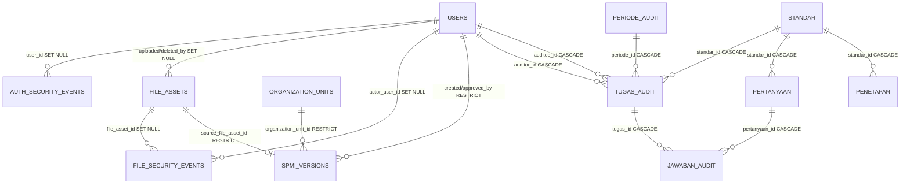

# Current Database Schema Inventory

- **Task:** M0-02
- **Baseline source:** branch `dev`, commit `3179135`
- **Runtime snapshot:** initial 2026-07-24; additive verification through M3-03
  on 2026-07-25, local Laragon database only
- **Safety:** metadata and aggregate counts only; no application row values are reproduced.

## 1. Scope and evidence

This inventory compares four sources:

1. Fresh-install baseline in `database_schema.sql`.
2. Incremental SQL in `migrations/001_*.sql` through `migrations/018_*.sql`.
3. Tables, columns, joins, filters, and writes referenced by `application/models/*.php` and their services.
4. Runtime metadata from `INFORMATION_SCHEMA` plus aggregate consistency checks executed by `scripts/database/audit_readonly.php`.

The runtime inspection used a `START TRANSACTION READ ONLY` transaction. It did not execute migration, DDL, insert, update, or delete statements. Names, email addresses, passwords, evidence URLs, stored filenames, and filesystem paths were neither printed nor copied into this document.

M1-03 later applied additive migration `012_authentication_hardening.sql` to the same local Laragon database and repeated it once to verify idempotency. The updated counts and authentication table/columns below were then re-read from `INFORMATION_SCHEMA`; no application row values were printed.

M1-06 adds `file_assets` and `file_security_events` to the fresh-install schema and migration 013. Migration 013 was applied twice to the configured local Laragon database to verify idempotency, then re-read through the read-only audit. The same tables and runtime behavior were also exercised in the smoke suite's disposable database.

M1-08 adds `security_audit_logs`, `security_audit_chain_state`, and two append-only triggers through migration 014. Migration 014 was applied twice locally, the chain verifier passed, and disposable smoke testing proved direct update/delete rejection plus end-to-end hash verification.

M2-01 later adds `organization_units` through migration 015. Migration 015
was executed against the local development database and exercised by the
disposable smoke database.

M2-02 adds `user_unit_assignments` through migration 016. Migration 016 was
applied to the local development database on 2026-07-25; its indexes, two
foreign keys, two check constraints, and zero-row initial state were verified.
M3-01 adds `spmi_versions` through migration 017. Migration 017 was applied
twice to the local development database on 2026-07-25. Its 17 columns, three
domain unique keys, four RESTRICT foreign keys, five checks, two history
triggers, and zero-row initial state were verified. The disposable smoke
database also proved single-active, date, immutable-active, retirement, and
no-delete behavior.

M3-03 adds `spmi_standards` through migration 018. Migration 018 was applied
twice to the local development database on 2026-07-25. Its 12 columns, three
domain indexes, one RESTRICT foreign key, four checks, three draft/history
triggers, and zero-row initial state were verified. The disposable smoke
database proved the 21-row seed, 8/3/3/7 distribution, per-version unique
code, draft-only mutation/reorder, clone, and no-delete behavior.

The counts below now describe that local development schema through migration
018. They are not a production attestation.

Classification:

- **ACTUAL:** confirmed in the inspected local runtime schema.
- **BASELINE:** declared by `database_schema.sql`.
- **MIGRATION:** represented by one or more files under `migrations/`.
- **MISSING:** an invariant used by current code but not enforced by the database.
- **TO VERIFY:** requires production metadata, stakeholder policy, or a later task.

This is not a production database attestation. Production schema, row counts, SQL mode, collation, timezone, and file availability remain **TO VERIFY**.

---

## 2. Executive summary

| Item | Local runtime result | Evidence |
|---|---:|---|
| Database server | MySQL 8.4.3 | Read-only runtime metadata from `scripts/database/audit_readonly.php schema` |
| Base tables | 18 | `INFORMATION_SCHEMA.TABLES` after migration 017 |
| Columns | 206 | `INFORMATION_SCHEMA.COLUMNS` after migration 017 |
| Storage engine | 18/18 InnoDB | `INFORMATION_SCHEMA.TABLES` |
| Table collation | 13 `utf8mb3_general_ci`, 4 `utf8mb4`, chain state ASCII | `INFORMATION_SCHEMA.TABLES` |
| Primary keys | 18 | `INFORMATION_SCHEMA.STATISTICS` |
| Non-primary unique keys | 9, including three version keys | `INFORMATION_SCHEMA.STATISTICS`; `database_schema.sql` |
| Index rows | 96 | `INFORMATION_SCHEMA.STATISTICS` |
| Foreign keys | 20 | `INFORMATION_SCHEMA.KEY_COLUMN_USAGE` |
| Foreign-key delete rule | 8 `CASCADE`, 5 `SET NULL`, 7 `RESTRICT` | `INFORMATION_SCHEMA.REFERENTIAL_CONSTRAINTS` |
| Check constraints | 8 | `INFORMATION_SCHEMA.TABLE_CONSTRAINTS` |
| Triggers | 4 history/append-only guards | `INFORMATION_SCHEMA.TRIGGERS` |
| Migration ledger table | 0 | Runtime table list; `application/config/migration.php` |
| Runtime FK enforcement | Enabled for the inspection session | `@@SESSION.foreign_key_checks = 1` |
| Required consistency checks with findings | 1 | Three `tugas_audit` rows have no period |
| Missing local file references | 0 | Aggregate filesystem checks in `audit_readonly.php` |

### Main conclusions

- **ACTUAL LOCAL DEVELOPMENT:** 18 tables and 206 columns through migration 017 were found in the inspected local runtime.
- **MIGRATION coverage exists but is not a migration ledger:** expected effects of SQL files through `017` are visible locally, but no table proves historical execution order.
- **One current data issue was confirmed:** 3 of 8 local tasks have `periode_id IS NULL` or an unresolved period. No row identities or data values were printed. Evidence: `audit_readonly.php checks`.
- **Correctness constraints are incomplete:** assignment uniqueness, one answer per task/question, one penetapan row per standard/category, score range, boolean flags, valid period dates, and one active period are application conventions rather than database invariants. Evidence: current indexes/checks and model/service methods listed below.
- **Cascade deletion is broad:** deleting a user, standard, period, task, or question can delete operational audit records through the eight cascade relationships. Evidence: `database_schema.sql`; runtime foreign-key metadata.

---

## 3. Source-to-runtime comparison

| Source | What it establishes | Result against local runtime |
|---|---|---|
| `database_schema.sql` | Fresh-install definition for 19 current tables, including changes through migration 018. | **MATCH:** organization, assignment, version, and standard additions are present locally and exercised by disposable smoke testing. |
| `migrations/001_add_admin_lpmpi_role.sql` | Adds `admin_lpmpi` to `users.role`. | **PRESENT:** runtime enum contains the four expected roles. |
| `migrations/002_create_periode_audit.sql` | Creates `periode_audit`. | **PRESENT.** |
| `migrations/003_create_penetapan.sql` | Creates `penetapan` and its standard FK. | **PRESENT.** |
| `migrations/004_alter_tugas_audit_add_periode.sql` | Adds nullable `tugas_audit.periode_id` and FK. | **PRESENT;** 3 local legacy tasks still have no period. |
| `migrations/005_alter_jawaban_audit_new_columns.sql` | Renames legacy columns and adds submission/assessment/evidence fields. | **PRESENT:** current names and fields exist. The migration assumes legacy names and is not safe to rerun. |
| `migrations/006_alter_standar_add_file_instrumen.sql` | Adds `standar.file_instrumen`. | **PRESENT.** |
| `migrations/007_alter_users_add_unit_columns.sql` | Adds `nama_unit` and `jenis_unit`. | **PRESENT.** |
| `migrations/008_create_profil_tables.sql` | Creates three profile tables. | **PRESENT.** |
| `migrations/009_alter_pertanyaan_add_columns.sql` | Adds order, baseline, annual targets, and category. | **PRESENT.** |
| `migrations/009_alter_profil_pddikti_id_lengths.sql` | Expands two PDDIKTI identifiers to 255 characters. | **PRESENT.** |
| `migrations/010_reconcile_pertanyaan_columns.sql` | Idempotently adds missing question columns through a temporary stored procedure. | **RESULT PRESENT;** execution history is unknown. |
| `migrations/011_add_users_profile_photo_path.sql` | Idempotently adds account photo path. | **PRESENT.** |
| `migrations/012_authentication_hardening.sql` | Idempotently adds account status/session metadata and the authentication security-event table. | **PRESENT;** executed twice locally to verify safe re-execution. |
| `migrations/013_file_security_foundation.sql` | Idempotently creates file metadata/retention and file security-event tables. | **PRESENT;** executed twice locally and exercised in disposable smoke databases. Production remains a separate deployment migration. |
| `migrations/014_immutable_security_audit_log.sql` | Creates the central audit ledger, serialized chain head, and update/delete rejection triggers. | **PRESENT;** executed twice locally; chain and tamper rejection exercised in disposable smoke databases. |
| `migrations/015_create_organization_units.sql` | Creates the organization hierarchy, unique code, self FK, active flag, and university root seed. | **PRESENT;** applied locally and covered by M2-01 regression/smoke. Production remains to verify. |
| `migrations/016_create_user_unit_assignments.sql` | Creates dated user/unit/position membership, primary flag, indexes, checks, and RESTRICT foreign keys. | **PRESENT;** applied locally with zero initial rows and covered by M2-02 regression/smoke. Production remains to verify. |
| `migrations/017_create_spmi_versions.sql` | Creates organization-scoped SPMI document versions, private source provenance, effective dates, single-active key, and history triggers. | **PRESENT;** applied twice locally with zero initial rows and covered by M3-01 regression/smoke. Production remains to verify. |
| `migrations/018_create_spmi_standards.sql` | Creates version-owned SPMI standards, per-version code uniqueness, group/type checks, ordering indexes, and draft/history triggers. | **PRESENT;** applied twice locally with zero initial rows and covered by M3-03 regression/smoke. Production remains to verify. |
| `application/models/*.php` | Current table/query expectations. | **MATCH:** file/audit, organization, assignment, SPMI version, and SPMI standard tables are present in local development. |

### Important migration limitations

- CodeIgniter migrations are disabled with `$config['migration_enabled'] = FALSE`. The files under `migrations/` are raw manual SQL, not CodeIgniter migration classes. Source: `application/config/migration.php`; `migrations/`.
- There are two migrations numbered `009`; filename sorting gives an order, but the numeric sequence is ambiguous. Source: `migrations/009_alter_pertanyaan_add_columns.sql`; `migrations/009_alter_profil_pddikti_id_lengths.sql`.
- Most historical `ALTER TABLE` migrations are not idempotent. Files `010`–`018` are safe to re-run, but earlier alter files generally fail when reapplied. Migrations 014, 017, and 018 recreate their history triggers and should run in a maintenance window.
- Migration `005` expects `jawaban_audit.tugas_audit_id` and `catatan` to exist, drops a named FK, and renames those columns. It cannot be applied safely to `database_schema.sql`, which already contains `tugas_id` and `temuan`. Source: `migrations/005_alter_jawaban_audit_new_columns.sql`; `database_schema.sql`.
- Rollback instructions are comments, not executable/versioned down migrations. DDL also causes implicit commits in MySQL. Source: all files under `migrations/`.
- There is no runtime migration ledger table. Consequently, “effect is present” does not prove which migration produced it. Source: runtime table list.

---

## 4. Runtime database profile

| Setting | Local runtime | Repository configuration / risk |
|---|---|---|
| Server | MySQL 8.4.3 | Docker uses MySQL 8.0 and README also permits MariaDB. Cross-engine behavior is **TO VERIFY**. Sources: `compose.yaml`; `README.md`. |
| Engine | InnoDB for all tables | Matches `database_schema.sql`. |
| Database/table charset | `utf8mb3` | Repository declares `DEFAULT CHARSET=utf8`; CodeIgniter connection uses `utf8`. Full Unicode/emoji requires a reviewed `utf8mb4` migration later. Sources: `database_schema.sql`; `application/config/database.php`. |
| Collation | `utf8mb3_general_ci` | Case/accent behavior must be considered for future unique business keys. |
| Session SQL mode | `ONLY_FULL_GROUP_BY, STRICT_TRANS_TABLES, NO_ZERO_IN_DATE, NO_ZERO_DATE, ERROR_FOR_DIVISION_BY_ZERO, NO_ENGINE_SUBSTITUTION` | Local server is strict, but CodeIgniter sets `stricton = FALSE`, so production depends on server defaults. Source: `application/config/database.php`. |
| Database timezone | `SYSTEM` | PHP/CI uses local time reference. Windows, Docker, and production system timezone may differ. Sources: runtime metadata; `application/config/config.php`. |
| Identifier case behavior | `lower_case_table_names = 1` | Expected on Windows; Linux container may differ. Current application identifiers are consistently lowercase, reducing but not eliminating portability risk. |
| Query builder | Enabled | Source: `application/config/database.php`. |
| Saved queries | Enabled | Source: `application/config/database.php`; memory impact should be reviewed for production separately. |

---

## 5. Relationship map



The three profile tables have no foreign keys to each other or to application identity/audit tables. Source: `database_schema.sql`; runtime foreign-key metadata.

`security_audit_logs.actor_user_id` intentionally has no user foreign key so a later account deletion cannot rewrite historical actor identity. Integrity is enforced by append-only triggers and the hash chain rather than cascades.

---

## 6. Detailed table inventory

Notation:

- `NO` under Nullable means `NOT NULL`.
- `AI` means `AUTO_INCREMENT`.
- MySQL displays omitted nullable defaults as `NULL`.

### 6.1 `users`

Purpose: authentication identity, role, optional unit metadata, and account photo reference. Main code: `application/models/User_model.php`; `application/services/Auth_service.php`; `application/services/User_service.php`; `application/services/Account_service.php`.

| Column | Runtime type | Nullable | Default / extra |
|---|---|---:|---|
| `id` | `int` | NO | AI, primary key |
| `nama` | `varchar(100)` | NO | none |
| `email` | `varchar(100)` | NO | unique |
| `password` | `varchar(255)` | NO | none |
| `role` | `enum('super_admin','admin_lpmpi','auditor','auditee')` | NO | none |
| `nama_unit` | `varchar(100)` | YES | `NULL` |
| `jenis_unit` | `enum('prodi','unit','lembaga')` | YES | `NULL` |
| `profile_photo_path` | `varchar(255)` | YES | `NULL` |
| `is_active` | `tinyint(1)` | NO | `1` |
| `session_version` | `int unsigned` | NO | `1` |
| `password_changed_at` | `datetime` | YES | `NULL` |
| `last_login_at` | `datetime` | YES | `NULL` |
| `created_at` | `datetime` | YES | `CURRENT_TIMESTAMP` |

Keys and relationships:

- `PRIMARY KEY (id)`.
- `UNIQUE KEY (email)`; the runtime index name is `email`.
- Referenced twice by `tugas_audit` with `ON DELETE CASCADE`.
- Referenced by `auth_security_events.user_id` with `ON DELETE SET NULL`.

Missing database invariants:

- `is_active` has no database `CHECK (is_active IN (0,1))`; application services only write 0/1.
- No check tying `role = 'auditee'` to required unit fields.
- Last-active-Super-Admin protection is enforced by `User_service`, not by a database constraint.
- No database rule that a referenced `auditor_id` has role `auditor` or `auditee_id` has role `auditee`; current enforcement is in `Tugas_audit_service::create_tugas()`.

### 6.1a `auth_security_events`

Purpose: append-only authentication/security-control events, shared login-throttle history, and explicit sensitive Super Admin authorization overrides. Main code: `application/models/Auth_security_event_model.php`; `application/libraries/Auth_security.php`; `application/libraries/Authorization_policy.php`.

| Column | Runtime type | Nullable | Default / extra |
|---|---|---:|---|
| `id` | `bigint unsigned` | NO | AI, primary key |
| `user_id` | `int` | YES | `NULL`, FK |
| `email_hash` | `char(64)` | NO | none |
| `ip_hash` | `char(64)` | NO | none |
| `user_agent_hash` | `char(64)` | NO | none |
| `event_type` | `varchar(40)` | NO | none |
| `reason` | `varchar(40)` | YES | `NULL` |
| `request_id` | `char(64)` | NO | none |
| `created_at` | `datetime(6)` | NO | `CURRENT_TIMESTAMP(6)` |

Indexes support failure-window lookup by email/IP, user history, and request correlation. The optional user foreign key uses `ON DELETE SET NULL`, preserving the pseudonymous event when a user row is deleted. M1-04 adds the allowlisted `authorization_override` event type; its allowlisted `reason` value identifies the protected object category, while the mandatory human reason is written only to the protected technical security log. Raw email, IP, user-agent, password, cookie, and request body are not stored in this table.

### 6.1b `file_assets` and `file_security_events`

Status: **ACTUAL / BASELINE / MIGRATION 013** on the inspected local database. Production remains **TO VERIFY**.

`file_assets` is the registry for category/owner, private/public/temporary scope, random storage name, original name, extension, server-detected MIME, byte size, SHA-256, active/deleted/quarantined/purged state, legacy marker, uploader/deleter, retention deadline, and purge timestamp. Its unique key is `(category, stored_name)`; indexes support owner/status, retention, and checksum lookup.

`file_security_events` records asset/actor, event/outcome/reason, category/owner, request ID, and timestamp for upload, blocked upload/download, download, retirement, temporary destruction, legacy registration, and purge. Optional user and asset foreign keys use `ON DELETE SET NULL`.

Legacy domain tables retain their current storage-name columns for
compatibility. M1-06 resolves those opaque names through this registry in
application code; there is no polymorphic database foreign key from
`standar`, `penetapan`, `jawaban_audit`, `users`, or `profil_lembaga` to
`file_assets`. M3-01 is the first target entity with an explicit
`spmi_versions.source_file_asset_id` RESTRICT foreign key plus an immutable
path/checksum snapshot.

### 6.1c `security_audit_logs` and `security_audit_chain_state`

Status: **ACTUAL / BASELINE / MIGRATION 014** on the inspected local database. Production remains **TO VERIFY**.

`security_audit_logs` contains 17 columns: immutable event UUID, actor, event/object/action/outcome, HMAC before/after snapshots, allowlisted JSON summary, pseudonymized IP/user-agent fields, request ID, previous/entry hashes, and microsecond timestamp. It has a primary key, unique UUID and entry-hash keys, plus actor/object/event/request indexes.

`security_audit_chain_state` contains one row with the current head and last log ID. Writers lock this row before appending, which serializes concurrent chain updates. The two database triggers reject every update or delete against the log table. There is no normal purge or web mutation route.

The local runtime currently has an empty ledger immediately after migration and a genesis chain-state row. Disposable HTTP smoke testing populates the ledger, verifies every link, and proves both trigger rejections without retaining fixture data.

### 6.1d `spmi_versions`

Status: **ACTUAL / BASELINE / MIGRATION 017** on the inspected local
development database. Production remains **TO VERIFY**.

Purpose: organization-scoped identity and immutable provenance for versioned
SPMI source documents. Main code:
`application/models/Spmi_version_model.php`;
`application/libraries/File_security.php`;
`migrations/017_create_spmi_versions.sql`.

The table has 17 columns covering document identity/title/revision, effective
range, private file asset/path/SHA-256, lifecycle status, creator/approver,
timestamps, and a generated active slot. Unique keys enforce revision
identity, one active row per organization/document, and one source asset per
version. Four foreign keys use `RESTRICT`.

Five check constraints reject blank identity fields, reversed date ranges,
non-opaque/non-PDF source paths, malformed lowercase SHA-256 values, and
approval provenance inconsistent with lifecycle. One trigger prevents active content
from being edited or moved back to an earlier state; retirement remains
possible. A second trigger rejects every hard delete.

The local table contains zero rows after migration. No legacy `standar` or
`pertanyaan` data was backfilled. M3-02 provides the authorized,
transactional, audited workflow for draft creation, review, approval,
activation, retirement, clone, and file ownership.

### 6.1e `spmi_standards`

Status: **ACTUAL / BASELINE / MIGRATION 018** on the inspected local
development database. Production remains **TO VERIFY**.

Purpose: version-owned master standard structure. Main code:
`application/models/Spmi_standard_model.php`;
`application/services/Spmi_standard_service.php`;
`migrations/018_create_spmi_standards.sql`.

The table has 12 columns: version FK, code/name, group/type,
rationale/definitions, explicit order, active flag, and timestamps. A unique
key enforces code uniqueness inside one version while permitting the same code
across versions. Group/order indexes support the master UI. The RESTRICT
foreign key prevents loss through parent deletion.

Four checks enforce nonblank identity, positive order, boolean active state,
and the SN Dikti/internal group pairing. Insert and update triggers require a
draft parent; the update trigger also prevents moving a row between versions.
A third trigger rejects all hard deletes. Seed data is not stored in migration
SQL: config/service loads exactly 21 rows with the required 8/3/3/7
distribution into an empty draft.

The local table contains zero rows after migration. Disposable smoke testing
creates a draft, loads 21 rows, edits/toggles/reorders, makes the source
read-only, and proves transactional clone independence.

### 6.2 `periode_audit`

Purpose: audit period metadata and active-period selection. Main code: `application/models/Periode_model.php`; `application/services/Periode_service.php`.

| Column | Runtime type | Nullable | Default / extra |
|---|---|---:|---|
| `id` | `int` | NO | AI, primary key |
| `nama_periode` | `varchar(100)` | NO | none |
| `tahun_akademik` | `varchar(20)` | NO | none |
| `semester` | `enum('ganjil','genap')` | NO | none |
| `tanggal_buka` | `date` | NO | none |
| `tanggal_tutup` | `date` | NO | none |
| `is_aktif` | `tinyint(1)` | YES | `0` |
| `created_at` | `datetime` | YES | `CURRENT_TIMESTAMP` |

Keys and relationships:

- `PRIMARY KEY (id)`.
- Referenced by `tugas_audit.periode_id` with `ON DELETE CASCADE`.

Missing database invariants:

- No check for `tanggal_tutup >= tanggal_buka`.
- `is_aktif` is nullable and has no boolean check.
- No database constraint permits at most one active period. `Periode_service` deactivates other rows in application transactions.
- No unique business key for academic year/semester/name; the intended uniqueness is **TO VERIFY**.

### 6.3 `standar`

Purpose: mutable standard master and instrument file reference. Main code: `application/models/Standar_model.php`; `application/services/Standar_service.php`; `application/controllers/lpmpi/Instrumen.php`.

| Column | Runtime type | Nullable | Default / extra |
|---|---|---:|---|
| `id` | `int` | NO | AI, primary key |
| `nama_standar` | `varchar(200)` | NO | none |
| `deskripsi` | `text` | YES | `NULL` |
| `file_instrumen` | `varchar(255)` | YES | `NULL` |
| `created_at` | `datetime` | YES | `CURRENT_TIMESTAMP` |

Keys and relationships:

- `PRIMARY KEY (id)`.
- Parent of `pertanyaan`, `tugas_audit`, and `penetapan`; all three FKs use `ON DELETE CASCADE`.

Missing database invariants:

- No version/effective-date/finalization fields.
- No immutable code or unique business identifier for a standard.
- `file_instrumen` remains an opaque compatibility reference; registry metadata/checksum/retention is stored in `file_assets` without a database FK.

### 6.4 `pertanyaan`

Purpose: questions/instrument items and current baseline/annual targets. Main code: `application/models/Pertanyaan_model.php`; `application/services/Pertanyaan_service.php`.

| Column | Runtime type | Nullable | Default / extra |
|---|---|---:|---|
| `id` | `int` | NO | AI, primary key |
| `standar_id` | `int` | NO | FK |
| `urutan` | `int` | YES | `NULL` |
| `isi_pertanyaan` | `text` | NO | none |
| `nilai_standar` | `text` | YES | `NULL` |
| `baseline` | `varchar(255)` | YES | `NULL` |
| `target_2025` | `varchar(255)` | YES | `NULL` |
| `target_2026` | `varchar(255)` | YES | `NULL` |
| `target_2027` | `varchar(255)` | YES | `NULL` |
| `target_2028` | `varchar(255)` | YES | `NULL` |
| `target_2029` | `varchar(255)` | YES | `NULL` |
| `target_2030` | `varchar(255)` | YES | `NULL` |
| `kategori` | `enum('IKU','IKT')` | YES | `NULL` |
| `created_at` | `datetime` | YES | `CURRENT_TIMESTAMP` |

Keys and relationships:

- `PRIMARY KEY (id)`.
- Index/FK `fk_pertanyaan_standar (standar_id)` → `standar.id`, `ON DELETE CASCADE`.
- Parent of `jawaban_audit.pertanyaan_id`, also `ON DELETE CASCADE`.

Missing database invariants:

- No unique `(standar_id, urutan)` rule.
- No check that `urutan` is positive.
- Category is nullable.
- Annual targets are columns on a mutable row instead of versioned target records.
- A question can be changed/deleted after assignment; `jawaban_audit` does not hold an immutable question snapshot.

### 6.5 `tugas_audit`

Purpose: one current assignment connecting an auditor, auditee, standard, optional period, and aggregate status. Main code: `application/models/Tugas_audit_model.php`; `application/services/Tugas_audit_service.php`; `application/models/Jawaban_model.php`.

| Column | Runtime type | Nullable | Default / extra |
|---|---|---:|---|
| `id` | `int` | NO | AI, primary key |
| `auditor_id` | `int` | NO | FK |
| `auditee_id` | `int` | NO | FK |
| `standar_id` | `int` | NO | FK |
| `periode_id` | `int` | YES | `NULL`, FK |
| `status` | `enum('belum_diisi','diisi','dinilai')` | YES | `belum_diisi` |
| `created_at` | `datetime` | YES | `CURRENT_TIMESTAMP` |

Keys and relationships:

- `PRIMARY KEY (id)`.
- `fk_tugas_auditor (auditor_id)` → `users.id`, `ON DELETE CASCADE`.
- `fk_tugas_auditee (auditee_id)` → `users.id`, `ON DELETE CASCADE`.
- `fk_tugas_standar (standar_id)` → `standar.id`, `ON DELETE CASCADE`.
- `fk_tugas_periode (periode_id)` → `periode_audit.id`, `ON DELETE CASCADE`.
- Parent of `jawaban_audit.tugas_id`, `ON DELETE CASCADE`.

Missing database invariants:

- No unique `(periode_id, standar_id, auditor_id, auditee_id)` key even though `Tugas_audit_model::exists_duplicate()` treats it as unique.
- `periode_id` is nullable even though current `Tugas_audit_service::create_tugas()` requires a valid period.
- `status` is nullable.
- No constraint prevents `auditor_id = auditee_id`.
- No database enforcement for user roles.
- No version/scope/team/frozen-instrument reference.

### 6.6 `jawaban_audit`

Purpose: Auditee answer/evidence plus Auditor score, finding, recommendation, file, and submission flags in the same row. Main code: `application/models/Jawaban_model.php`; `application/models/Jawaban_audit_model.php`.

| Column | Runtime type | Nullable | Default / extra |
|---|---|---:|---|
| `id` | `int` | NO | AI, primary key |
| `tugas_id` | `int` | NO | FK |
| `pertanyaan_id` | `int` | NO | FK |
| `jawaban` | `text` | YES | `NULL` |
| `link_bukti` | `varchar(500)` | YES | `NULL` |
| `is_submitted` | `tinyint(1)` | YES | `0` |
| `submitted_at` | `datetime` | YES | `NULL` |
| `skor` | `int` | YES | `NULL` |
| `temuan` | `text` | YES | `NULL` |
| `jenis_temuan` | `enum('ob','kts')` | YES | `NULL` |
| `saran_perbaikan` | `text` | YES | `NULL` |
| `rencana_perbaikan` | `text` | YES | `NULL` |
| `dokumen_bukti` | `varchar(255)` | YES | `NULL` |
| `tgl_bukti` | `date` | YES | `NULL` |
| `is_nilai_submitted` | `tinyint(1)` | YES | `0` |
| `nilai_submitted_at` | `datetime` | YES | `NULL` |
| `created_at` | `datetime` | YES | `CURRENT_TIMESTAMP` |
| `updated_at` | `datetime` | YES | `NULL` |

Keys and relationships:

- `PRIMARY KEY (id)`.
- `fk_jawaban_tugas (tugas_id)` → `tugas_audit.id`, `ON DELETE CASCADE`.
- `fk_jawaban_pertanyaan (pertanyaan_id)` → `pertanyaan.id`, `ON DELETE CASCADE`.

Missing database invariants:

- No unique `(tugas_id, pertanyaan_id)` key even though assignment creation intends one answer row per question.
- No score-range check for the `1..4` rule used by `Jawaban_model::normalize_penilaian_row()` and `::submit_penilaian()`.
- Submission flags are nullable and have no `IN (0,1)` checks.
- No check connects submitted flags with their timestamps.
- No constraint verifies that the question belongs to the same standard as the task.
- No immutable answer/assessment revisions, finalization version, amendment, or state event history.
- `dokumen_bukti` remains an opaque compatibility reference; evidence metadata/checksum/retention is stored in `file_assets` without a database FK.

### 6.7 `penetapan`

Purpose: current `pelaksanaan`, `pengendalian`, and `peningkatan` records and optional documents for each standard. Main code: `application/models/Penetapan_model.php`; `application/controllers/lpmpi/Penetapan.php`.

| Column | Runtime type | Nullable | Default / extra |
|---|---|---:|---|
| `id` | `int` | NO | AI, primary key |
| `standar_id` | `int` | NO | FK |
| `kategori` | `enum('pelaksanaan','pengendalian','peningkatan')` | NO | none |
| `status` | `varchar(100)` | YES | `NULL` |
| `deskripsi` | `text` | YES | `NULL` |
| `file_path` | `varchar(255)` | YES | `NULL` |
| `created_at` | `datetime` | YES | `CURRENT_TIMESTAMP` |
| `updated_at` | `datetime` | YES | `NULL`, updates on row change |

Keys and relationships:

- `PRIMARY KEY (id)`.
- `fk_penetapan_standar (standar_id)` → `standar.id`, `ON DELETE CASCADE`.

Missing database invariants:

- No unique `(standar_id, kategori)` key even though `Penetapan_model::exists()` and `::ensure_records_for_standar()` assume one row.
- `status` is unconstrained free text.
- No version/finalization/history fields or document metadata.

### 6.8 `profil_lembaga`

Purpose: institution profile, optional public logo, PDDIKTI identifiers, and synchronization timestamp. Main code: `application/models/Profil_model.php`; `application/controllers/Profil.php`; `application/services/Pddikti_service.php`.

| Column | Runtime type | Nullable | Default / extra |
|---|---|---:|---|
| `id` | `int` | NO | AI, primary key |
| `id_pt_pddikti` | `varchar(255)` | YES | `NULL` |
| `nama_pt_pddikti` | `varchar(200)` | YES | `NULL` |
| `nama_pt` | `varchar(200)` | YES | `NULL` |
| `kode_pt` | `varchar(20)` | YES | `NULL` |
| `nomor_sk_pt` | `varchar(100)` | YES | `NULL` |
| `tanggal_sk_pt` | `date` | YES | `NULL` |
| `tanggal_berdiri` | `date` | YES | `NULL` |
| `jumlah_dosen` | `int` | YES | `NULL` |
| `jumlah_tendik` | `int` | YES | `NULL` |
| `akreditasi` | `varchar(100)` | YES | `NULL` |
| `akreditasi_berlaku_sampai` | `date` | YES | `NULL` |
| `status_pt` | `varchar(50)` | YES | `NULL` |
| `kode_pos` | `varchar(10)` | YES | `NULL` |
| `telepon` | `varchar(30)` | YES | `NULL` |
| `faksimile` | `varchar(30)` | YES | `NULL` |
| `email` | `varchar(100)` | YES | `NULL` |
| `logo_path` | `varchar(255)` | YES | `NULL` |
| `logo_url` | `varchar(500)` | YES | `NULL` |
| `last_sync_at` | `datetime` | YES | `NULL` |
| `updated_at` | `datetime` | YES | `NULL`, updates on row change |
| `created_at` | `datetime` | YES | `CURRENT_TIMESTAMP` |

Keys and relationships:

- `PRIMARY KEY (id)`.
- No foreign keys or non-primary indexes.

Missing database invariants:

- The application treats this as singleton-like data, but the database permits multiple rows.
- No unique key on the PDDIKTI institution identifier or institution code.
- No checks for non-negative staff counts.
- No file metadata/history for logos.

### 6.9 `profil_prodi`

Purpose: replaceable PDDIKTI program snapshot. Main code: `application/models/Profil_model.php::replace_prodi()`.

| Column | Runtime type | Nullable | Default / extra |
|---|---|---:|---|
| `id` | `int` | NO | AI, primary key |
| `id_prodi_pddikti` | `varchar(255)` | YES | `NULL` |
| `kode_prodi` | `varchar(20)` | YES | `NULL` |
| `nama_prodi` | `varchar(200)` | YES | `NULL` |
| `status` | `varchar(50)` | YES | `NULL` |
| `jenjang` | `varchar(20)` | YES | `NULL` |
| `akreditasi` | `varchar(50)` | YES | `NULL` |
| `tanggal_sk_akreditasi` | `date` | YES | `NULL` |
| `rasio_dosen_mahasiswa` | `varchar(20)` | YES | `NULL` |
| `created_at` | `datetime` | YES | `CURRENT_TIMESTAMP` |
| `updated_at` | `datetime` | YES | `NULL`, updates on row change |

Keys and relationships:

- `PRIMARY KEY (id)`.
- No foreign keys or non-primary indexes.

Missing database invariants:

- No unique PDDIKTI program identifier or program code.
- No synchronization batch/version reference.
- `Profil_model::replace_prodi()` empties and rebuilds the table, so it is a current snapshot rather than history.

### 6.10 `profil_mahasiswa_stats`

Purpose: replaceable student totals grouped by level. Main code: `application/models/Profil_model.php::replace_mahasiswa_stats()`.

| Column | Runtime type | Nullable | Default / extra |
|---|---|---:|---|
| `id` | `int` | NO | AI, primary key |
| `jenjang` | `varchar(50)` | YES | `NULL` |
| `jumlah` | `int` | YES | `0` |
| `updated_at` | `datetime` | YES | `NULL`, updates on row change |
| `created_at` | `datetime` | YES | `CURRENT_TIMESTAMP` |

Keys and relationships:

- `PRIMARY KEY (id)`.
- No foreign keys or non-primary indexes.

Missing database invariants:

- No unique key on `jenjang`.
- No check for `jumlah >= 0`.
- No synchronization batch/version reference.
- `Profil_model::replace_mahasiswa_stats()` empties and rebuilds this current snapshot.

---

## 7. Existing constraints, indexes, and enums

### Existing foreign keys

| Constraint | Child → parent | Delete | Update |
|---|---|---|---|
| `fk_pertanyaan_standar` | `pertanyaan.standar_id` → `standar.id` | CASCADE | NO ACTION |
| `fk_tugas_auditor` | `tugas_audit.auditor_id` → `users.id` | CASCADE | NO ACTION |
| `fk_tugas_auditee` | `tugas_audit.auditee_id` → `users.id` | CASCADE | NO ACTION |
| `fk_tugas_standar` | `tugas_audit.standar_id` → `standar.id` | CASCADE | NO ACTION |
| `fk_tugas_periode` | `tugas_audit.periode_id` → `periode_audit.id` | CASCADE | NO ACTION |
| `fk_jawaban_tugas` | `jawaban_audit.tugas_id` → `tugas_audit.id` | CASCADE | NO ACTION |
| `fk_jawaban_pertanyaan` | `jawaban_audit.pertanyaan_id` → `pertanyaan.id` | CASCADE | NO ACTION |
| `fk_penetapan_standar` | `penetapan.standar_id` → `standar.id` | CASCADE | NO ACTION |

| `fk_auth_event_user` | `auth_security_events.user_id` → `users.id` | SET NULL | NO ACTION |
| `fk_file_asset_uploaded_by` | `file_assets.uploaded_by` → `users.id` | SET NULL | NO ACTION |
| `fk_file_asset_deleted_by` | `file_assets.deleted_by` → `users.id` | SET NULL | NO ACTION |
| `fk_file_event_asset` | `file_security_events.file_asset_id` → `file_assets.id` | SET NULL | NO ACTION |
| `fk_file_event_actor` | `file_security_events.actor_user_id` → `users.id` | SET NULL | NO ACTION |

Every FK has a supporting single-column BTREE index in the local runtime. Source: runtime `INFORMATION_SCHEMA.STATISTICS`.

### Existing unique keys

- Primary key `id` on all 15 tables.
- Non-primary unique keys are `users.email`, `file_assets(category, stored_name)`, `security_audit_logs.event_uuid`, and `security_audit_logs.entry_hash`.

### Existing enums

| Table.column | Allowed values |
|---|---|
| `users.role` | `super_admin`, `admin_lpmpi`, `auditor`, `auditee` |
| `users.jenis_unit` | `prodi`, `unit`, `lembaga` |
| `periode_audit.semester` | `ganjil`, `genap` |
| `pertanyaan.kategori` | `IKU`, `IKT` |
| `tugas_audit.status` | `belum_diisi`, `diisi`, `dinilai` |
| `jawaban_audit.jenis_temuan` | `ob`, `kts` |
| `penetapan.kategori` | `pelaksanaan`, `pengendalian`, `peningkatan` |
| `file_assets.storage_scope` | `private`, `public`, `temporary` |
| `file_assets.status` | `active`, `deleted`, `quarantined`, `purged` |

### Existing check constraints

None. Boolean/range/date/cross-field rules are enforced only by application code, if at all.

---

## 8. Missing constraints

No constraint is added by M0-02. The following list is input for later design/migration tasks.

### High-confidence correctness constraints

| Priority | Missing invariant | Current code assumption | Migration precondition |
|---|---|---|---|
| P0 | Unique `jawaban_audit(tugas_id, pertanyaan_id)` | Assignment creates one answer per current question; reads aggregate by task. Sources: `Tugas_audit_service::create_tugas()`; `Jawaban_model::get_by_tugas()`. | Run duplicate check; local result is 0. |
| P0 | Unique `penetapan(standar_id, kategori)` | `Penetapan_model::exists()` and `::ensure_records_for_standar()` assume one row per category. | Run duplicate check; local result is 0. |
| P0 | Unique assignment `(periode_id, standar_id, auditor_id, auditee_id)` | `Tugas_audit_model::exists_duplicate()` treats this tuple as unique. | Resolve null periods and duplicate groups; local duplicate result is 0, but 3 tasks lack a period. |
| P0 | `tugas_audit.periode_id NOT NULL` for the current workflow | `Tugas_audit_service::create_tugas()` requires a valid period. | Backfill or explicitly classify the 3 legacy tasks first. |
| P1 | `jawaban_audit.skor` check: `NULL OR BETWEEN 1 AND 4` | `Jawaban_model` validates this range. | Local out-of-range count is 0; stakeholder must confirm the scale. |
| P1 | State flags `NOT NULL DEFAULT 0` with `IN (0,1)` checks | `Jawaban_model` repeatedly uses `COALESCE` because null is currently possible. | Local null/invalid flag count is 0. |
| P1 | `periode_audit.tanggal_tutup >= tanggal_buka` | `Periode_service` validates date order in application code. | Local invalid-date count is 0. |
| P1 | At most one active period | `Periode_service` deactivates all others before activation. | Confirm whether zero active periods is allowed; local “more than one” count is 0. |
| P1 | `tugas_audit.status NOT NULL DEFAULT 'belum_diisi'` | State logic assumes one of three values. | Confirm no null/legacy state in production. |
| P1 | Submitted flag/timestamp consistency | Submit methods write both fields together. | Local “submitted without timestamp” counts are 0. Revision semantics for retained `submitted_at` must be preserved deliberately. |

### Cross-table rules not expressible as ordinary MySQL checks

- `tugas_audit.auditor_id` must reference a user with role `auditor`, and `auditee_id` must reference role `auditee`. Current enforcement: `Tugas_audit_service::create_tugas()`.
- `auditor_id` and `auditee_id` should not identify the same user. Current role separation usually prevents it, but no database rule exists.
- `jawaban_audit.pertanyaan_id` should belong to the same standard as `tugas_audit.standar_id`. The local mismatch count is 0.
- Task status should agree with all answer submission/assessment flags. Current enforcement is transactional application logic in `Jawaban_model`.

These need a service/domain policy, snapshot design, carefully reviewed trigger, or revised relational model. They should not be added as ad hoc triggers during M0.

### Constraints requiring business confirmation

- Unique business identifier/version for standards.
- Unique `(standar_id, urutan)` for questions.
- Unique PDDIKTI identifiers/program codes.
- Singleton `profil_lembaga`.
- Unique `profil_mahasiswa_stats.jenjang`.
- Non-negative profile/statistics counts.
- Whether one or multiple auditors/auditees are allowed in future assignment design.

Sources: `BUSINESS_REQUIREMENTS_SPMI_AMI_RTM.md`; `CODEX_IMPLEMENTATION_PLAN_SPMI_AMI_RTM.md` decision items and M2–M7.

---

## 9. Index requirements

### Indexes required for correctness

These unique indexes implement the high-confidence invariants after data cleanup:

1. `UNIQUE jawaban_audit(tugas_id, pertanyaan_id)`.
2. `UNIQUE penetapan(standar_id, kategori)`.
3. `UNIQUE tugas_audit(periode_id, standar_id, auditor_id, auditee_id)` after null-period remediation.

### Performance indexes supported by current query shapes

| Candidate | Query evidence | Notes |
|---|---|---|
| `tugas_audit(periode_id, status)` | `Tugas_audit_model::count_by_status_for_period()` and admin filters use both fields. | High-confidence candidate for period dashboards. |
| `pertanyaan(standar_id, urutan, id)` | `Pertanyaan_model::get_all()` and `::get_by_standar()` filter by standard and order by `urutan`, then `id`. | High-confidence candidate; existing FK index covers only `standar_id`. |
| `tugas_audit(auditee_id, periode_id, id)` | `Jawaban_model::get_inbox_by_auditee()` filters auditee and optionally period, then groups/orders by task id. | Validate against production cardinality and `EXPLAIN`. |
| `tugas_audit(standar_id, periode_id, auditee_id)` | `Laporan_model` filters report rows by standard, optional period, and optional auditee. | Validate against final-report query redesign; do not optimize the legacy report prematurely. |
| `users(role, nama, id)` | `User_model::get_lpmpi_accounts()` filters by role and orders by role/name. | Low urgency at current size; validate production cardinality. |

Indexes on low-cardinality flags alone (`status`, `is_aktif`, `is_submitted`) are not recommended without workload evidence. The local database has only 8 tasks and 41 answers, so local execution plans cannot justify production performance decisions. Run `EXPLAIN` against sanitized production-like volume before implementing non-unique performance indexes.

Adding the proposed composite unique keys may make some current FK indexes redundant. Any future migration must inspect `SHOW INDEX`, retain an index whose leftmost columns satisfy each FK, and avoid duplicate indexes.

---

## 10. Data-quality checks and local results

Command:

```powershell
& 'C:\laragon\bin\php\php-8.3.30-Win32-vs16-x64\php.exe' scripts\database\audit_readonly.php checks
```

The portable form, when `php` is on `PATH`, is:

```text
php scripts/database/audit_readonly.php checks
```

### Required checks

| Check | Local problem count | Interpretation |
|---|---:|---|
| Tasks without answers | 0 | Every local task has at least one answer row. |
| Answers without tasks | 0 | No task orphan was found. |
| Answers without questions | 0 | No question orphan was found. |
| Tasks without periods | **3** | Confirmed legacy/null-period records; remediation is required before `periode_id NOT NULL` or assignment uniqueness. |
| Invalid user roles | 0 | All local role values are in the expected enum set. |
| Invalid task status/flag aggregate | 0 | No mismatch under the current three-state rules encoded by the checker. |
| Mixed `is_submitted` within one task | 0 | No partially submitted task was found. |
| Mixed `is_nilai_submitted` within one task | 0 | No partially finalized assessment was found. |
| Missing referenced files | 0 | All local non-empty file references resolved using current private/legacy storage rules. |

### Supplemental checks

All returned zero locally:

- assignment references wrong user roles;
- auditor and auditee are the same user;
- submitted flag without submission timestamp;
- assessment-submitted flag without assessment timestamp;
- duplicate assignment tuple;
- duplicate answer for one task/question;
- duplicate penetapan category for one standard;
- more than one active period;
- invalid period date range;
- score outside `1..4`;
- non-boolean or null state flags;
- question standard different from task standard;
- answer count different from the current question master;
- more than one institution profile row.

### Aggregate local row counts

These counts provide test-environment scale only and contain no row data:

| Table | Rows |
|---|---:|
| `users` | 6 |
| `periode_audit` | 2 |
| `standar` | 7 |
| `pertanyaan` | 49 |
| `spmi_versions` | 0 |
| `spmi_standards` | 0 |
| `tugas_audit` | 8 |
| `jawaban_audit` | 41 |
| `penetapan` | 21 |
| `profil_lembaga` | 1 |
| `profil_prodi` | 11 |
| `profil_mahasiswa_stats` | 1 |

### Interpretation limits

- A zero count is a point-in-time result, not a database guarantee where the corresponding constraint is absent.
- “Answer count differs from current master” detects current drift, but it cannot prove that an assignment retained the exact historical question set because no immutable snapshot exists.
- File checks run against the machine executing the script. A zero local count does not prove production/object-storage availability.
- The checker intentionally does not print problem row IDs or sensitive fields. A separately approved remediation workflow should retrieve scoped identifiers under controlled access.

---

## 11. Read-only audit script

File: `scripts/database/audit_readonly.php`.

### Schema export

```text
php scripts/database/audit_readonly.php schema
```

Outputs only:

- server version;
- table name, engine, and collation;
- column name/type/nullability/default/extra/charset/collation;
- index metadata;
- foreign-key metadata and referential actions.
- check-constraint metadata when exposed by the database server.

It does not output application rows.

### Consistency and file checks

```text
php scripts/database/audit_readonly.php checks
```

Safety properties:

- CLI-only execution.
- Uses the repository database configuration without printing credentials.
- Starts a MySQL `READ ONLY` transaction.
- All data checks are hard-coded `SELECT` statements.
- Emits aggregate problem counts and table row counts only.
- Reads stored file values internally but emits only missing-reference counts.
- Rolls the transaction back on success or failure.
- Exits non-zero when configuration, connection, or a check fails.

Environment:

- Uses `CI_ENV` when set.
- Defaults to `development` for the current Laragon workflow.
- Production configuration remains fail-closed through `application/config/database.php`.

---

## 12. Orphan and cascade analysis

### Orphans prevented by current FKs

With `foreign_key_checks = 1`, direct orphans are prevented for:

- question → standard;
- task → auditor user;
- task → auditee user;
- task → standard;
- non-null task period → period;
- answer → task;
- answer → question;
- penetapan → standard.

The checker still tests answer/task/question orphans because imports, disabled FK checks, old backups, or production drift can bypass expectations.

### Orphans/coupling not covered by FKs

- A task may have no period because `periode_id` is nullable; 3 local rows do.
- A task may have no answer rows.
- A task may contain duplicate answer rows for the same question.
- A task answer may point to a question from another standard.
- A standard can have an incomplete set of the three penetapan categories.
- Profile snapshot tables have no batch/parent relationship.
- Stored file paths can reference absent files.

### Cascade blast radius

| Deleted parent | Automatic effect |
|---|---|
| `users` row used as auditor/auditee | Deletes related `tugas_audit`, then their `jawaban_audit`. |
| `periode_audit` | Deletes all tasks in that period, then answers. |
| `standar` | Deletes questions, assignments, and penetapan; dependent answers are also deleted through task/question cascades. |
| `pertanyaan` | Deletes its historical/current answers. |
| `tugas_audit` | Deletes all answers for the task. |

Sources: `database_schema.sql`; runtime referential actions; delete methods in `User_model`, `Periode_model`, `Standar_model`, `Pertanyaan_model`, and `Tugas_audit_model`.

For an auditable SPMI/AMI system, these cascades are a high data-retention risk. M0-02 does not alter them. Any future replacement with restrict/soft-delete/versioning must include backup, production-like migration testing, data backfill, and restore/rollback proof.

---

## 13. Security and privacy findings

- No secret or credential was copied into this document or the audit output. Database credentials remain sourced by `application/config/database.php`.
- The audit tool masks sensitive row content by design; it reports only aggregate counts.
- `users.password` is stored in the same identity table but was never selected by the audit.
- `profil_lembaga` contains contact data, `users` contains personal identity data, and `jawaban_audit` may contain evidence URLs/findings. These tables require least-privilege production access and controlled backups.
- Eight operational foreign keys cascade deletes, creating an availability/integrity risk for audit history; the authentication event and four file-security actor/asset FKs use `SET NULL`.
- Application configuration does not force strict SQL mode (`stricton = FALSE`); the inspected local server is strict, but production must be checked independently.
- `utf8mb3` cannot represent all Unicode code points. Conversion to `utf8mb4` must be a separate tested migration, not an M0-02 side effect.
- Runtime database timezone is `SYSTEM` and datetime columns are timezone-naive. Cross-environment timezone policy is **TO VERIFY**.
- Raw manual migrations have no cryptographic checksum, execution ledger, or automated rollback proof.
- `database_dummy.sql` contains demo credentials/data and was not used as a runtime evidence source beyond prior structural awareness. It must not be treated as production-safe seed material.

---

## 14. Proposed remediation order

This is planning input only; no item is implemented by M0-02.

1. **Classify/backfill the 3 null-period tasks** without inventing business dates or periods.
2. Re-run the checker against a protected production snapshot and resolve any additional duplicates/orphans.
3. Establish a migration ledger/versioning convention and remove duplicate numbering for future migrations without renaming already-deployed files until deployment history is known.
4. Add high-confidence unique keys for answers, penetapan, and assignments.
5. Tighten nullability/check constraints for state flags, score, status, and period dates.
6. Decide whether active-period uniqueness belongs in a generated unique key or another reviewed design.
7. Review cascade-delete policy against immutable audit-history requirements.
8. Add performance indexes only after `EXPLAIN` on production-like cardinality and after target query/read-model design is settled.
9. Plan `utf8mb4`, timezone, backup/restore, and rollback tests as separate reviewed migration work.

Each database change must follow the implementation plan rules: idempotent where possible, no direct destructive cleanup, tested on a copy, and accompanied by rollback or restore procedure. Source: `CODEX_IMPLEMENTATION_PLAN_SPMI_AMI_RTM.md`, execution rules, Definition of Done, and Security Release Gate.

---

## 15. Items still TO VERIFY

- Production database engine/version, schema drift, indexes, SQL mode, FK enforcement, collation, and timezone.
- Whether the 3 null-period local tasks are intentionally pre-period legacy data and which period, if any, they belong to.
- Whether zero active periods is permitted.
- Official score scale and whether `1..4` is final.
- Whether assignment uniqueness changes when team/lead auditors or multi-unit scope are introduced.
- Standard/question business keys and version semantics.
- Production file-storage root, legacy file reachability, and retention policy.
- Expected uniqueness for PDDIKTI institution/program identifiers and profile statistics.
- Required retention/legal hold before replacing cascade deletion.
- Backup restore success and migration rollback behavior.

---

## 16. Acceptance criteria evidence

- [x] Actual local schema structure exported without application data.
- [x] `database_schema.sql`, migrations, model queries, and available runtime schema compared.
- [x] Tables, columns, types, nullability, FKs, unique keys, indexes, enums, and orphan risks documented.
- [x] Missing constraints listed.
- [x] Required/candidate indexes listed with query evidence.
- [x] Read-only script created at `scripts/database/audit_readonly.php`.
- [x] Required consistency queries implemented.
- [x] Missing-file references checked without printing paths.
- [x] Sensitive values excluded.
- [x] No migration, DDL, or data mutation performed.

## Rollback for M0-02 artifacts

M0-02 changes documentation and a standalone read-only audit script only. Database rollback is not applicable because no database state changed. Reverting this task consists only of removing the two M0-02 artifact files in version control.
