# Manual Pengguna Internal AMI dan SPMI

<!-- markdownlint-disable MD013 MD024 MD060 -->

**Dokumen kontrol**: Manual internal ini berlaku untuk penggunaan aplikasi AMI dan SPMI yang sedang aktif. SPMI adalah alur utama yang dipakai saat ini. Arsip AMI Legacy hanya dipakai sebagai domain sejarah dan kompatibilitas baca saja, tanpa instruksi mutasi, impor ulang, backfill, atau migrasi data legacy.

**Target pembaca**: Super Admin, Admin LPMPI, Auditee, Auditor, dan tim pendukung internal yang perlu memahami alur kerja, batas akses, dan cara membaca data pada aplikasi.

**Revisi**: 1.0

**Tanggal**: 2026-08-30

## Navigasi cepat

* [Ruang lingkup dan konvensi](#ruang-lingkup-dan-konvensi)
* [Ikhtisar peran](#ikhtisar-peran)
* [Akses awal, masuk, keluar, dan akun](#akses-awal-masuk-keluar-dan-akun)
* [Dashboard dan menu utama](#dashboard-dan-menu-utama)
* [Super Admin](#super-admin)
* [Admin LPMPI](#admin-lpmpi)
* [Auditee](#auditee)
* [Auditor](#auditor)
* [Laporan, RTM, tindak lanjut, dan rekap PPEPP](#laporan-rtm-tindak-lanjut-dan-rekap-ppepp)
* [Arsip AMI Legacy](#arsip-ami-legacy)
* [Troubleshooting](#troubleshooting)
* [Glosarium](#glosarium)
* [Indeks gambar dan layar](#indeks-gambar-dan-layar)

## Ruang lingkup dan konvensi

Manual ini menjelaskan antarmuka yang benar-benar tersedia pada kode sumber saat ini. Rujukan menu mengikuti label yang tampil di sidebar, misalnya `Dashboard SPMI`, `Workspace SPMI`, `Penilaian SPMI`, `Siklus & Penugasan SPMI`, dan `Arsip AMI Legacy`.

Semua prosedur ditulis sebagai langkah kerja internal. Untuk setiap fitur, manual ini menyebutkan prasyarat, jalur menu, aksi utama, hasil yang diharapkan, serta batas peran atau kepemilikan data. Jika suatu layar bersifat hanya baca, manual menandainya secara eksplisit.

Penyebutan status mengikuti keadaan aplikasi yang terverifikasi:

* Versi SPMI dapat diedit pada `draft` dan `review`, lalu menjadi hanya baca pada `approved`, `active`, dan `retired`.
* Siklus SPMI dapat diedit pada `draft`, lalu menjadi hanya baca pada `configured` dan `closed`.
* Isi submission auditee dapat diedit pada `draft` dan `returned_for_revision`, lalu terkunci setelah `submitted`.
* Penilaian auditor dapat diedit pada `draft`, lalu terkunci setelah `finalized`.
* Auditor hanya boleh menilai submission yang berstatus `submitted` atau `resubmitted`.

Kebijakan bukti yang muncul di instrumen memiliki lima nilai yang dipakai aplikasi, yaitu `none`, `file`, `url`, `either`, dan `both`. Bukti tetap dikelola oleh aplikasi dan dibatasi kepemilikan data. Manual ini tidak menampilkan lokasi penyimpanan internal, URL publik, token, kata sandi, ID rahasia, atau proses deployment.

## Ikhtisar peran

| Peran | Fokus kerja | Menu utama yang terlihat |
|---|---|---|
| Super Admin | Memantau ringkasan SPMI dan mengelola pengguna | `Dashboard SPMI`, `Manajemen Pengguna`, `Akun Auditor & Auditee`, `Struktur Organisasi`, `Standar SPMI`, `Indikator SPMI`, `Import/Export Master SPMI`, `Instrumen Audit SPMI`, `Siklus & Penugasan SPMI`, `Laporan SPMI`, `RTM SPMI`, `Tindak Lanjut RTM`, `Rekap PPEPP SPMI`, `Akun Saya`, `Profil Lembaga` |
| Admin LPMPI | Mengelola konfigurasi SPMI, laporan, RTM, tindak lanjut, dan arsip legacy | Menu Super Admin tanpa `Manajemen Pengguna`, plus akses ke `Arsip AMI Legacy` |
| Auditee | Mengisi realisasi dan bukti pada workspace milik sendiri | `Dashboard SPMI`, `Workspace SPMI`, `Akun Saya` |
| Auditor | Menilai submission milik sendiri, memberi skor, temuan, dan bukti auditor | `Dashboard SPMI`, `Penilaian SPMI`, `Akun Saya` |

## Akses awal, masuk, keluar, dan akun

### Halaman masuk

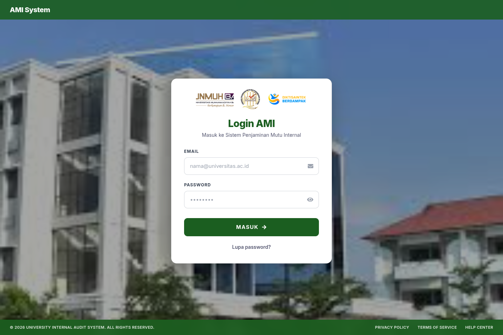

_G-01, `g-01-login-empty.png`._

Prasyarat: pengguna sudah memiliki akun aktif.

Jalur menu: buka halaman login aplikasi.

Aksi utama: isi email dan kata sandi, lalu masuk.

Hasil yang diharapkan: pengguna diarahkan ke dashboard sesuai peran. Jika kredensial salah, aplikasi menampilkan pesan umum `Email atau password salah.`

Catatan batas akses: hanya pengguna yang sudah login yang bisa lanjut ke menu peran. Jika sesi aktif sudah ada, halaman login akan mengarahkan langsung ke beranda peran masing-masing.

### Lupa password dan reset akun

Fitur `Lupa password?` tersedia di halaman login dan mengarah ke alur reset kata sandi. Alur ini hanya aktif bila konfigurasi email reset memang disediakan pada deployment. Jika konfigurasi email tidak lengkap, permintaan reset tetap dijawab dengan pesan umum yang sama, tetapi token tidak dipakai dan tidak ada jaminan pengiriman email.

Prasyarat: alamat email akun terdaftar dan deployment mendukung reset password.

Jalur menu: `Lupa password?` dari halaman login.

Aksi utama: masukkan email, kirim permintaan, lalu buka tautan reset dari email bila diterima.

Hasil yang diharapkan: sistem mengirim instruksi reset jika alamat terdaftar. Tautan reset berlaku selama 60 menit. Kata sandi baru harus minimal 12 karakter dan dikonfirmasi ulang.

Catatan batas akses: tautan reset bersifat sekali pakai. Jika tidak valid atau kedaluwarsa, aplikasi menampilkan halaman reset tidak valid dan pengguna harus meminta tautan baru.

### Logout

Prasyarat: pengguna sedang login.

Jalur menu: tombol `Logout` di sidebar atau di menu akun pojok kanan atas.

Aksi utama: klik `Logout`.

Hasil yang diharapkan: sesi dihancurkan dan pengguna kembali ke halaman login.

Catatan batas akses: logout hanya menerima metode POST.

### Akun Saya

Prasyarat: pengguna sudah login.

Jalur menu: `Akun Saya`.

Aksi utama: ubah nama tampilan dan, jika perlu, unggah foto profil JPEG atau PNG maksimal 2 MiB.

Hasil yang diharapkan: nama dan foto profil diperbarui pada sesi aktif. Jika foto lama ada, aplikasi membersihkan file lama setelah pembaruan berhasil.

Catatan batas akses: pengguna hanya bisa mengubah akun milik sendiri. Tidak ada fitur ubah email atau ubah password dari layar ini.

### Profil Lembaga, akses umum

Prasyarat: peran yang dapat mengakses menu profil lembaga.

Jalur menu: `Profil Lembaga`.

Aksi utama: lihat atau ubah identitas lembaga, sinkronisasi data PDDikti bila tersedia, dan unggah logo lembaga.

Hasil yang diharapkan: data profil lembaga tampil pada halaman profil, dan logo yang diunggah tersimpan di ruang file profil aplikasi.

Catatan batas akses: unggah logo menerima file gambar yang lolos validasi aplikasi. Manual ini tidak mendokumentasikan proses sinkronisasi eksternal lebih jauh dari layar yang ada.

## Dashboard dan menu utama

### Dashboard SPMI untuk peran internal

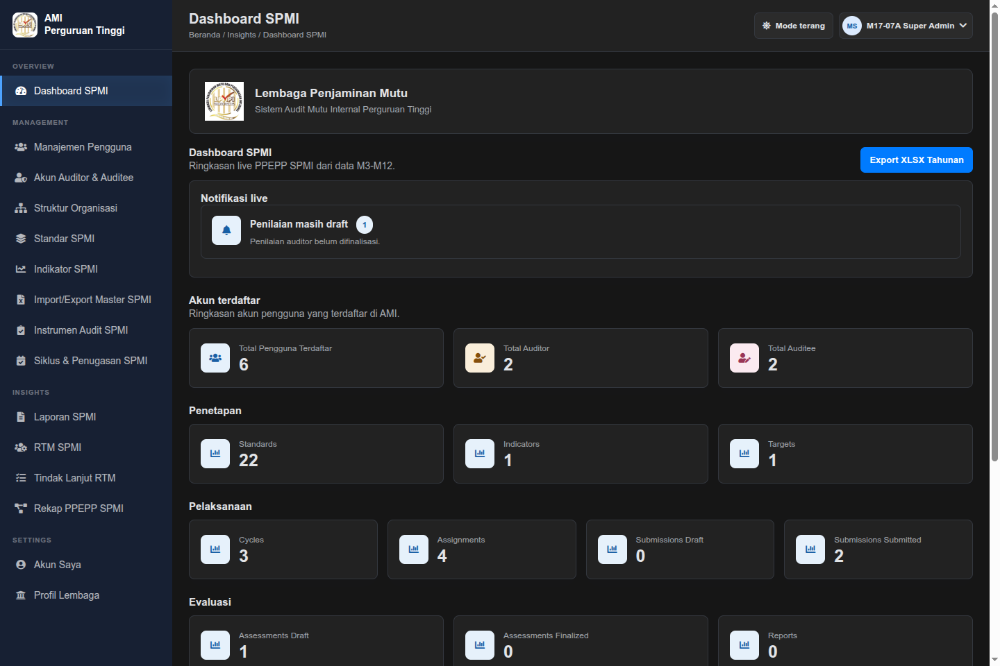

_SA-01, `sa-01-admin-dashboard.png`._

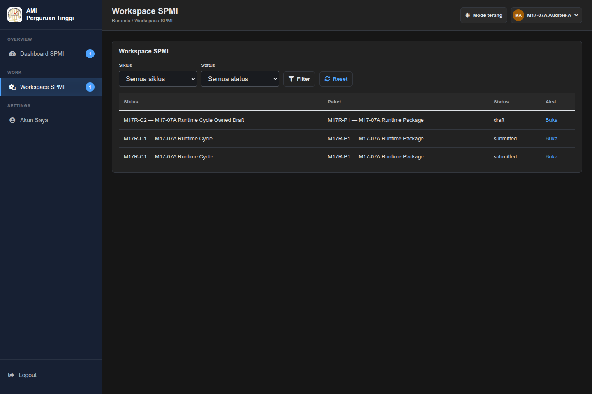

_AU-01, `au-01-workspace-list.png`._

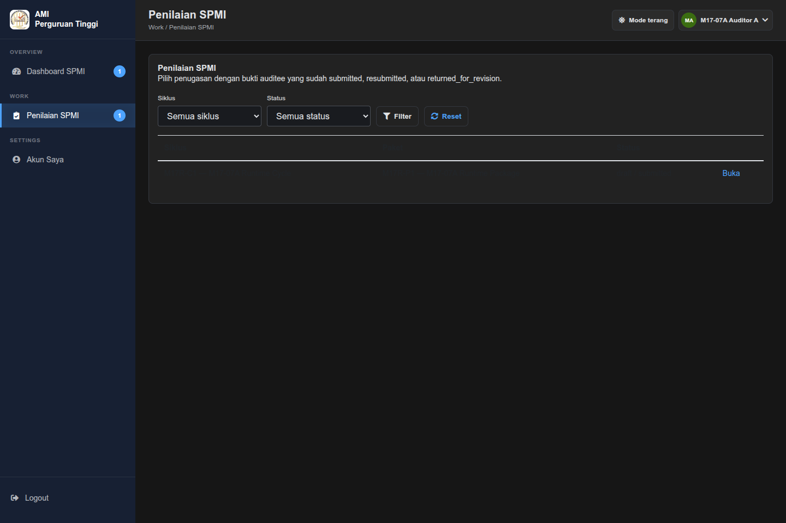

_AR-01, `ar-01-auditor-inbox.png`._

Prasyarat: pengguna sudah login.

Jalur menu: `Dashboard SPMI`.

Aksi utama: baca ringkasan peran, status workflow, dan jumlah perhatian yang muncul pada kartu atau badge menu.

Hasil yang diharapkan: pengguna melihat ringkasan kerja yang sesuai perannya. Super Admin dan Admin LPMPI mendapat gambaran lintas workflow, sementara Auditee dan Auditor melihat tugas yang relevan dengan pekerjaan mereka.

Catatan batas akses: dashboard mengikuti role. Data yang tampil bersifat agregat dan tidak membuka data role lain tanpa menu yang tepat.

## Super Admin

Super Admin melihat menu administratif paling lengkap, termasuk manajemen pengguna, struktur organisasi, standar, indikator, master SPMI, instrumen, siklus, dan laporan.

### Manajemen Pengguna

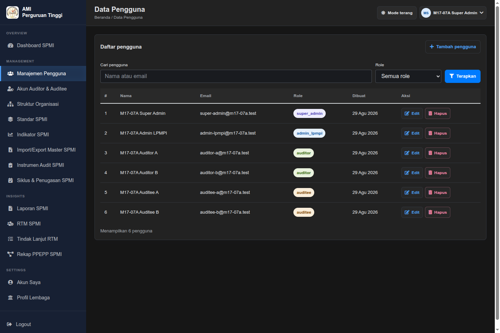

_SA-02, `sa-02-user-management.png`._

Prasyarat: login sebagai Super Admin.

Jalur menu: `Manajemen Pengguna`.

Aksi utama: tinjau daftar akun dan lakukan pengelolaan pengguna sesuai kebutuhan operasional.

Hasil yang diharapkan: daftar akun tampil dan perubahan data pengguna tersimpan melalui alur aplikasi.

Catatan batas akses: menu ini hanya tersedia untuk Super Admin.

### Akun Auditor & Auditee

Prasyarat: login sebagai Super Admin atau Admin LPMPI.

Jalur menu: `Akun Auditor & Auditee`.

Aksi utama: kelola akun yang dipakai untuk role operasional.

Hasil yang diharapkan: akun role operasional dapat dipantau dan disiapkan untuk alur kerja SPMI.

Catatan batas akses: manual ini tidak memaparkan detail provisioning akun yang tidak terlihat pada layar.

### Struktur Organisasi

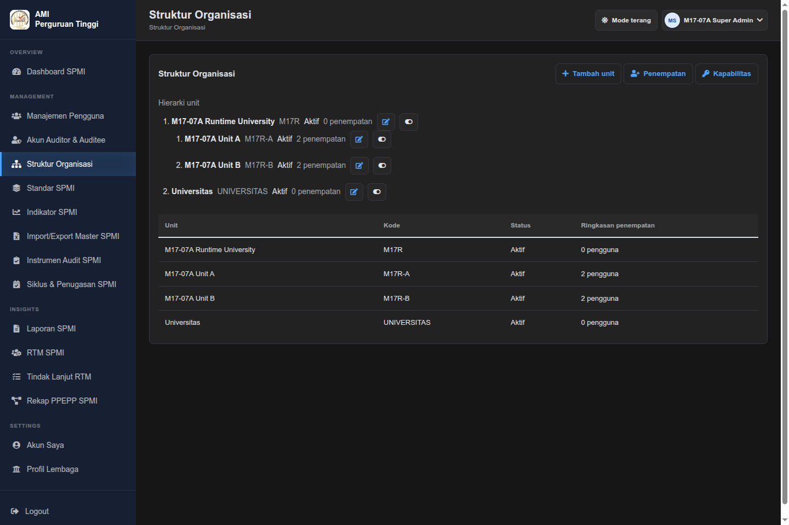

_M-01, `m-01-organization.png`._

Prasyarat: login sebagai Super Admin atau Admin LPMPI.

Jalur menu: `Struktur Organisasi`.

Aksi utama: lihat atau kelola unit organisasi dan hubungan struktur.

Hasil yang diharapkan: struktur organisasi tampil sebagai dasar penugasan dan tanggung jawab.

Catatan batas akses: perubahan unit harus mengikuti mekanisme aplikasi dan tidak boleh menyalahi relasi yang sudah dipakai penugasan.

### Standar SPMI

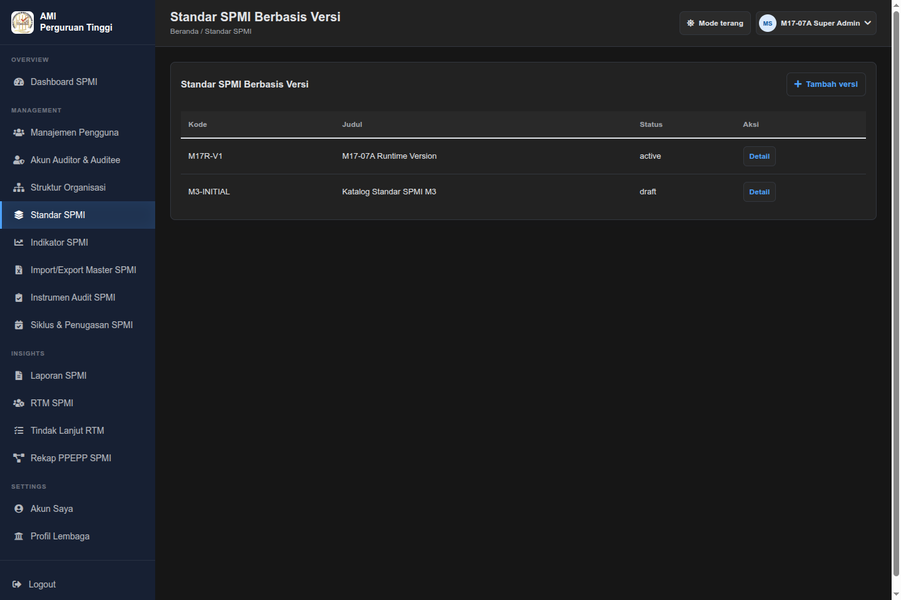

_M-03, `m-03-standards.png`._

Prasyarat: login sebagai Super Admin atau Admin LPMPI.

Jalur menu: `Standar SPMI`.

Aksi utama: buat versi baru, isi atau ubah standar, lalu pindahkan status sesuai workflow.

Hasil yang diharapkan: versi dan standar tersimpan pada status yang sah.

Catatan batas akses: versi hanya dapat diedit saat `draft` atau `review`. Setelah menjadi `approved`, `active`, atau `retired`, isinya hanya baca.

### Indikator SPMI

Prasyarat: login sebagai Super Admin atau Admin LPMPI.

Jalur menu: `Indikator SPMI`.

Aksi utama: kelola indikator dan target tahunan yang masih berada pada versi editable.

Hasil yang diharapkan: indikator dan target yang relevan tersimpan untuk dipakai instrumen.

Catatan batas akses: indikator dan target mengikuti status versi standar, sehingga tetap hanya baca ketika versi sudah final.

### Import/Export Master SPMI

Prasyarat: login sebagai Super Admin atau Admin LPMPI, dan versi SPMI masih editable.

Jalur menu: `Import/Export Master SPMI`.

Aksi utama: unduh template, unggah file `.xlsx`, lihat preview, lalu konfirmasi impor jika isinya sudah benar. Ekspor master dapat dipakai untuk mengambil data versi aktif dalam bentuk spreadsheet.

Hasil yang diharapkan: data master masuk ke versi yang sesuai atau file ekspor terunduh.

Catatan batas akses: template hanya tersedia untuk versi `draft` atau `review`. Import memerlukan POST, file valid, dan preview yang masih berlaku. Jika preview tidak valid atau kedaluwarsa, pengguna harus unggah ulang.

### Instrumen Audit SPMI

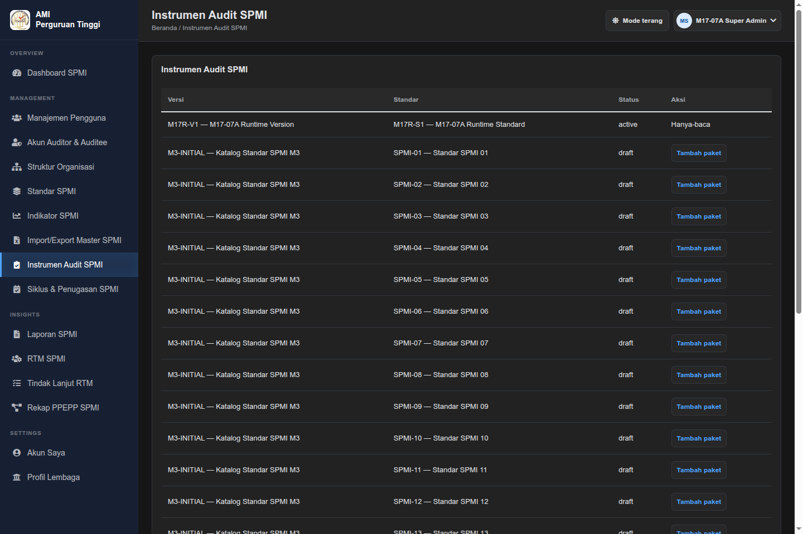

_M-06, `m-06-instruments.png`._

Prasyarat: login sebagai Super Admin atau Admin LPMPI.

Jalur menu: `Instrumen Audit SPMI`.

Aksi utama: buat paket instrumen, susun pertanyaan, atur rubrik, dan unduh lampiran bila tersedia.

Hasil yang diharapkan: paket instrumen terstruktur dan siap dipakai pada siklus audit.

Catatan batas akses: pertanyaan, rubrik, dan paket hanya dapat diubah pada status versi `draft` atau `review`. Saat versi `approved`, `active`, atau `retired`, layar menjadi hanya baca.

### Siklus & Penugasan SPMI

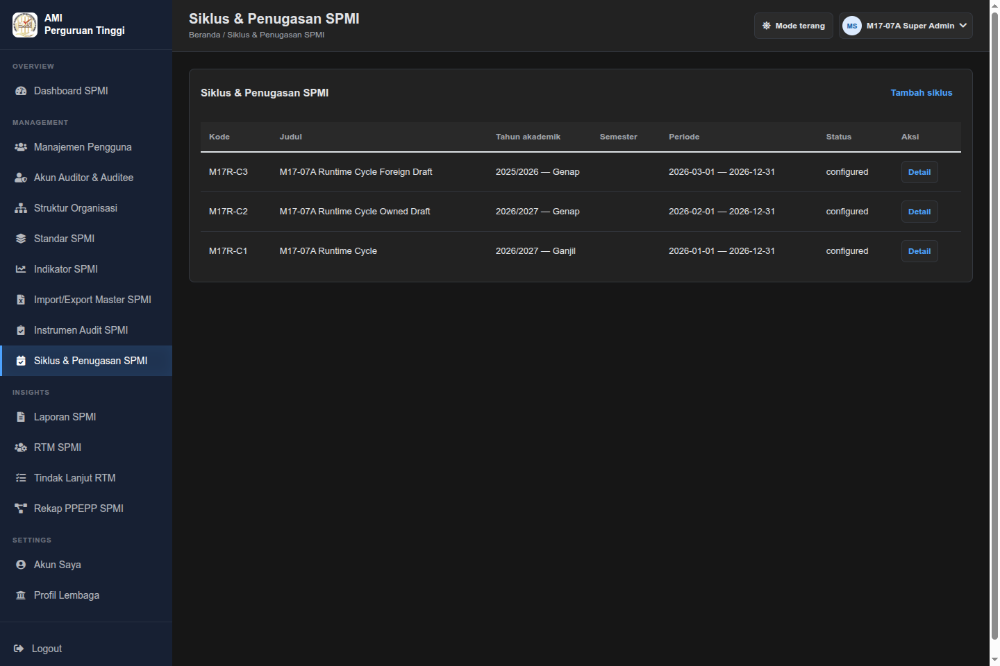

_M-07, `m-07-cycle-list.png`._

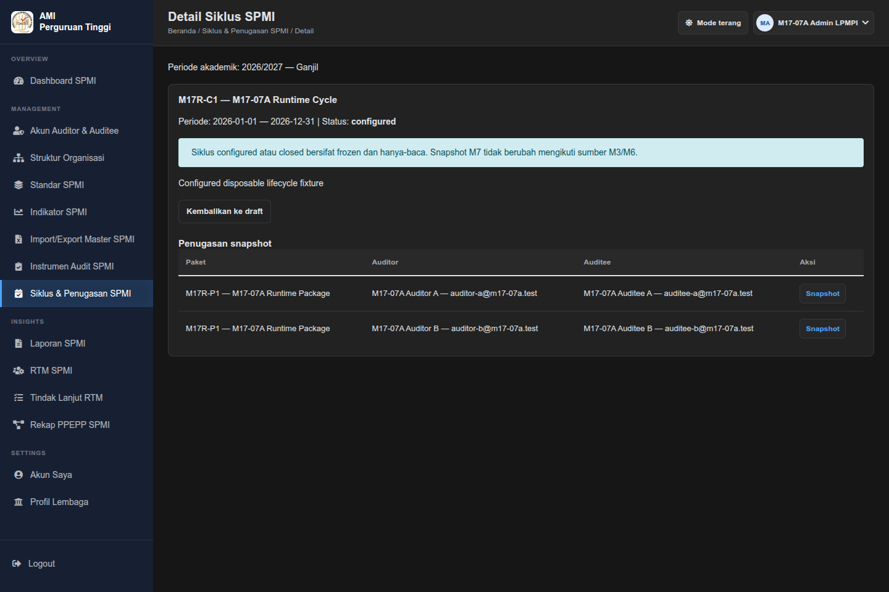

_M-07D, `m-07-cycle-detail.png`._

Prasyarat: login sebagai Super Admin atau Admin LPMPI.

Jalur menu: `Siklus & Penugasan SPMI`.

Aksi utama: buat siklus, isi metadata siklus, tambah penugasan, dan lihat detail penugasan.

Hasil yang diharapkan: siklus dan penugasan tersimpan, lalu siap dipakai auditee dan auditor.

Catatan batas akses: siklus hanya dapat diedit pada `draft`. Saat status menjadi `configured` atau `closed`, data siklus hanya baca.

### Dashboard SPMI administratif

Prasyarat: login sebagai Super Admin atau Admin LPMPI.

Jalur menu: `Dashboard SPMI`.

Aksi utama: baca ringkasan jumlah cycle, assignment, laporan, dan status kerja lain yang disediakan kartu dashboard.

Hasil yang diharapkan: pimpinan kerja melihat kondisi mutakhir SPMI dalam satu layar.

Catatan batas akses: dashboard tidak menggantikan layar detail. Gunakan menu khusus untuk mutasi data.

## Admin LPMPI

Admin LPMPI memakai sebagian besar menu pengelolaan dan seluruh menu insight. Bagian ini menekankan layar yang paling sering dipakai untuk operasional sehari-hari.

### Dashboard SPMI

Gunakan dashboard sebagai pintu masuk untuk melihat status siklus, laporan, dan attention count. Layar ini cocok dipakai sebelum pindah ke menu manajemen lain.

### Laporan SPMI

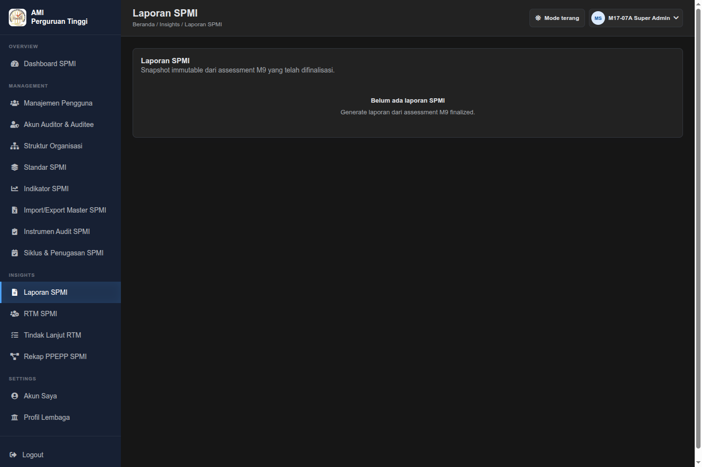

_R-01, `r-01-reports.png`._

Prasyarat: login sebagai Super Admin atau Admin LPMPI.

Jalur menu: `Laporan SPMI`.

Aksi utama: lihat daftar laporan yang sudah terbentuk, buat laporan dari assessment yang memenuhi syarat, lalu buka detail atau ekspor bila perlu.

Hasil yang diharapkan: laporan snapshot SPMI tersimpan dan dapat dibaca per standar.

Catatan batas akses: laporan hanya bisa dibuat dari assessment yang sudah `finalized` dan dari cycle yang `configured` atau `closed`.

### RTM SPMI

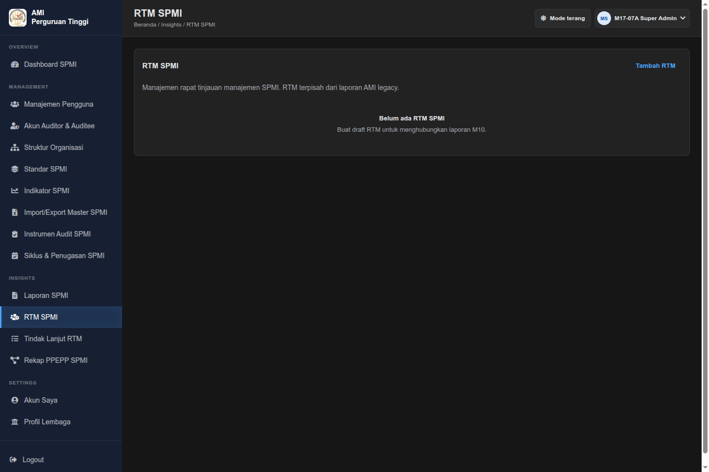

_R-03, `r-03-rtm.png`._

Prasyarat: login sebagai Super Admin atau Admin LPMPI.

Jalur menu: `RTM SPMI`.

Aksi utama: buat rapat tinjauan manajemen, hubungkan laporan yang relevan, dan kelola keputusan rapat.

Hasil yang diharapkan: data RTM tersimpan dan bisa dilihat dalam detail rapat.

Catatan batas akses: RTM bersifat editable hanya pada `draft`. Saat status sudah bukan `draft`, data menjadi hanya baca.

### Tindak Lanjut RTM

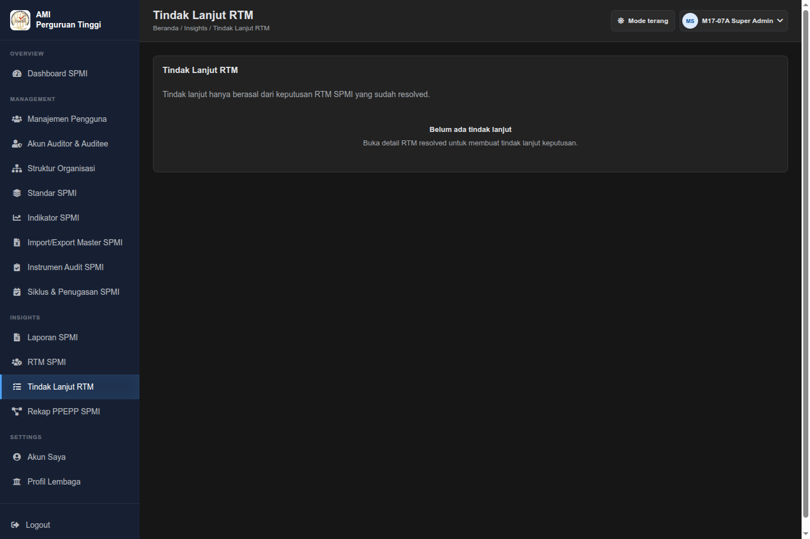

_R-04, `r-04-follow-ups.png`._

Prasyarat: login sebagai Super Admin atau Admin LPMPI.

Jalur menu: `Tindak Lanjut RTM`.

Aksi utama: buat tindak lanjut, isi status penyelesaian, dan lihat detail progres.

Hasil yang diharapkan: daftar tindak lanjut memperlihatkan status penyelesaian yang mutakhir.

Catatan batas akses: tindak lanjut mengikuti mekanisme aplikasi dan hanya dapat diubah sesuai status yang diizinkan layar.

### Rekap PPEPP SPMI

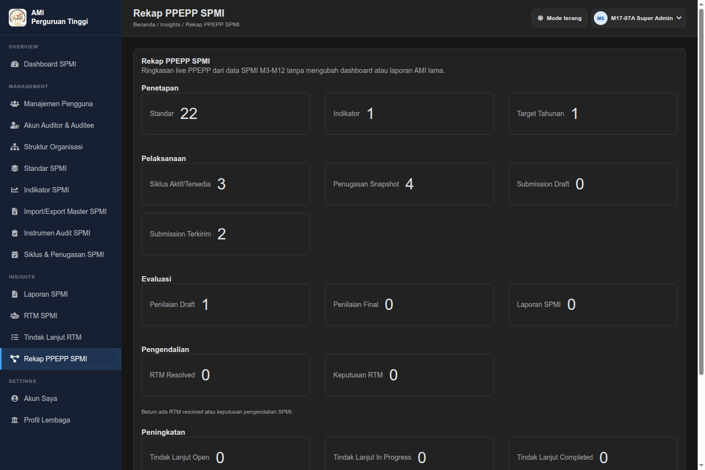

_R-05, `r-05-recap-dashboard.png`._

Prasyarat: login sebagai Super Admin atau Admin LPMPI.

Jalur menu: `Rekap PPEPP SPMI`.

Aksi utama: lihat ringkasan PPEPP dari data siklus, laporan, dan tindak lanjut.

Hasil yang diharapkan: pengguna mendapat gambaran ringkas siklus PPEPP tanpa membuka detail per record.

Catatan batas akses: layar ini lebih cocok untuk monitoring daripada edit data.

### Profil Lembaga, bagian Admin LPMPI

Admin LPMPI dapat memperbarui profil lembaga dan logo, lalu melakukan sinkronisasi bila tersedia. Gunakan layar ini untuk memastikan identitas lembaga konsisten dengan data yang dipakai sistem.

## Auditee

Auditee bekerja di `Workspace SPMI`. Semua langkah berikut berlaku hanya untuk penugasan milik sendiri.

### Daftar workspace

_AU-01, `au-01-workspace-list.png`._

Prasyarat: login sebagai Auditee.

Jalur menu: `Workspace SPMI`.

Aksi utama: pilih assignment yang ditugaskan, lalu buka detail untuk mengisi realisasi.

Hasil yang diharapkan: daftar assignment tampil bersama filter status dan cycle.

Catatan batas akses: assignment yang tidak dimiliki pengguna tidak boleh dibuka. Workspace hanya menampilkan pekerjaan yang terikat pada role dan kepemilikan auditee.

### Mengisi assignment

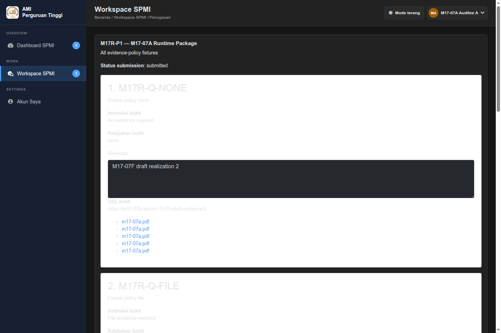

_AU-02, `au-02-editable-assignment.png`._

Prasyarat: assignment berstatus `configured` dengan submission `draft` atau `returned_for_revision`.

Jalur menu: `Workspace SPMI`, lalu buka assignment.

Aksi utama: isi realisasi per item, unggah bukti bila diperlukan, dan lengkapi URL bila kebijakan item menuntut URL.

Hasil yang diharapkan: data tersimpan sebagai draft atau dikirim saat submit.

Catatan batas akses: auditee hanya bisa mengubah submission sebelum `submitted`. Setelah `submitted`, data terkunci sampai auditor mengembalikan untuk revisi. Saat revisi dikembalikan, status menjadi `returned_for_revision` dan auditee boleh mengedit lagi.

### Konfirmasi submission

Prasyarat: assignment sudah dikirim dan aplikasi menyediakan konfirmasi untuk submission yang sah.

Jalur menu: buka assignment lalu konfirmasi submission dari halaman yang disediakan.

Aksi utama: tinjau preview data yang akan dikirim, lalu pastikan isi sudah benar.

Hasil yang diharapkan: pengguna melihat ringkasan submission dan riwayat revisi.

Catatan batas akses: layar konfirmasi hanya muncul untuk assignment yang memenuhi syarat state. Jika submission belum ada atau tidak sah, aplikasi menolak konfirmasi.

### Hasil akhir auditee

Prasyarat: audit sudah memiliki hasil akhir yang valid.

Jalur menu: dari assignment yang relevan, buka hasil akhir.

Aksi utama: baca skor, temuan, dan status akhir yang dikembalikan sistem.

Hasil yang diharapkan: auditee melihat ringkasan hasil akhir tanpa mengubah isi penilaian.

Catatan batas akses: layar ini hanya muncul jika assessment atau laporan akhir sudah terbentuk. Jika belum ada hasil, aplikasi menolak akses.

### Bukti auditee

Prasyarat: item mengharuskan bukti file atau kebijakan kombinasi yang mengizinkan file.

Aksi utama: unggah bukti PDF, JPEG, atau PNG maksimal 5 MiB, atau hapus bukti yang masih dapat diedit.

Hasil yang diharapkan: bukti tersimpan dan bisa diunduh kembali lewat endpoint aplikasi.

Catatan batas akses: bukti hanya bisa diunggah atau dihapus saat submission masih editable. Jumlah bukti per item dibatasi aplikasi. Jika backend bukti yang aktif adalah Google Drive, unduhan tetap lewat aplikasi dan tetap dibatasi kepemilikan.

### Kebijakan bukti yang ditampilkan di item

Kebijakan item hanya ditulis sebagai `none`, `file`, `url`, `either`, atau `both`.

* `none`, item tidak mewajibkan bukti lampiran.
* `file`, item mewajibkan minimal satu file bukti.
* `url`, item mewajibkan URL yang valid.
* `either`, salah satu antara file atau URL cukup.
* `both`, file dan URL harus ada.

## Auditor

Auditor bekerja di `Penilaian SPMI`. Auditor hanya boleh menilai submission yang sudah terkirim atau dikirim ulang.

### Inbox penilaian

_AR-01, `ar-01-auditor-inbox.png`._

Prasyarat: login sebagai Auditor.

Jalur menu: `Penilaian SPMI`.

Aksi utama: lihat daftar assignment yang siap dinilai dan gunakan filter cycle atau status bila perlu.

Hasil yang diharapkan: daftar penilaian yang relevan tampil pada layar.

Catatan batas akses: auditor hanya melihat assignment yang dimiliki sendiri. Filter status menerima `submitted`, `resubmitted`, dan `returned_for_revision`.

### Workspace penilaian

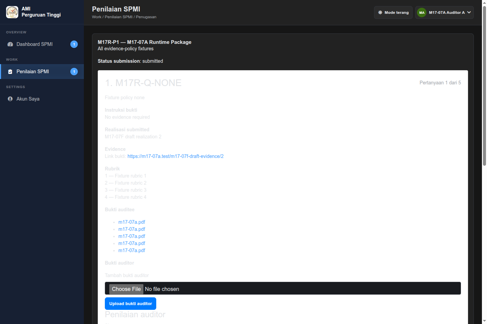

_AR-02, `ar-02-assessment-workspace.png`._

Prasyarat: assignment milik sendiri tersedia dan submission sudah dikirim.

Jalur menu: buka assignment dari inbox penilaian.

Aksi utama: pilih item, baca realisasi auditee, buka bukti, lalu isi skor, jenis temuan, uraian temuan, rekomendasi, dan rencana perbaikan bila diperlukan.

Hasil yang diharapkan: auditor dapat menyimpan draft penilaian per item.

Catatan batas akses: item detail dapat berpindah menggunakan navigasi internal. Layar tetap terkait assignment yang dipilih dan tidak membuka data milik orang lain.

### Draft skor dan temuan

_AR-03, `ar-03-score-finding-draft.png`._

Prasyarat: assignment sedang dalam mode draft penilaian.

Jalur menu: `Penilaian SPMI`, lalu buka item tertentu.

Aksi utama: isi nilai 1 sampai 4, pilih jenis temuan bila ada, dan tambahkan catatan yang sesuai.

Hasil yang diharapkan: perubahan tersimpan sebagai draft item penilaian.

Catatan batas akses: skor boleh kosong saat draft, tetapi finalisasi akan menolak jika semua item belum diberi skor.

### Finalisasi penilaian

Prasyarat: semua item sudah dinilai.

Jalur menu: dari workspace penilaian, gunakan aksi finalisasi.

Aksi utama: finalisasi assessment setelah semua skor dan isi wajib lengkap.

Hasil yang diharapkan: penilaian berstatus `finalized` dan menjadi hanya baca.

Catatan batas akses: finalisasi hanya lolos jika semua skor bernilai 1 sampai 4, temuan OB atau KTS memiliki uraian temuan, dan KTS memiliki rekomendasi serta rencana perbaikan. Setelah finalisasi, penilaian tidak boleh diubah lagi.

### Mengembalikan submission untuk revisi

Prasyarat: submission masih berstatus `submitted` atau `resubmitted`, dan penilaian belum final.

Jalur menu: aksi `Return for revision` di workspace penilaian.

Aksi utama: isi alasan revisi, lalu kembalikan submission.

Hasil yang diharapkan: submission berubah menjadi `returned_for_revision`, dan auditee bisa mengedit ulang.

Catatan batas akses: audit yang sudah final tidak boleh dikembalikan untuk revisi.

### Bukti auditor

Prasyarat: assignment memiliki assessment draft dan aplikasi mengizinkan upload bukti auditor.

Aksi utama: unggah atau hapus bukti auditor pada item yang sedang dinilai.

Hasil yang diharapkan: bukti tersimpan dan ikut terekam pada snapshot laporan.

Catatan batas akses: bukti auditor hanya boleh dikelola pada assessment draft. Setelah finalisasi, bukti menjadi bagian dari riwayat yang terkunci.

## Laporan, RTM, tindak lanjut, dan rekap PPEPP

Bagian ini menjelaskan alur manajemen yang dipakai Admin LPMPI dan Super Admin setelah data audit selesai.

### Laporan SPMI, pengelolaan admin

Laporan dibangun dari assessment yang sudah `finalized`. Sistem menyimpan snapshot data sehingga isi laporan tidak berubah walau data kerja asal bergeser di tempat lain.

Prasyarat: assessment final tersedia.

Jalur menu: `Laporan SPMI`.

Aksi utama: buat laporan dari assessment final, lalu buka detail atau ekspor spreadsheet bila perlu.

Hasil yang diharapkan: laporan SPMI muncul per standar dan dapat dipakai sebagai bahan tindak lanjut.

Catatan batas akses: laporan tidak dapat dibuat dari assessment yang masih draft.

### RTM SPMI, pengelolaan admin

RTM dipakai untuk mencatat tinjauan manajemen atas hasil audit. Layar ini mendukung pembuatan, detail, dan pengeditan saat status masih `draft`.

Prasyarat: data laporan atau kebutuhan rapat sudah tersedia.

Jalur menu: `RTM SPMI`.

Aksi utama: buat rapat, hubungkan laporan, isi peserta, dan tulis keputusan.

Hasil yang diharapkan: RTM tersimpan sebagai dokumen kerja dan menjadi dasar tindak lanjut.

Catatan batas akses: saat status bukan `draft`, RTM tidak lagi dapat diubah.

### Tindak Lanjut RTM, pengelolaan admin

Tindak lanjut berfungsi untuk memantau keputusan RTM sampai status penyelesaiannya jelas.

Prasyarat: RTM atau temuan yang perlu ditindaklanjuti sudah tercatat.

Jalur menu: `Tindak Lanjut RTM`.

Aksi utama: buat item tindak lanjut, ubah detail pelaksanaan, dan pantau statusnya.

Hasil yang diharapkan: daftar tindak lanjut menunjukkan progres yang jelas.

Catatan batas akses: perubahan mengikuti mekanisme edit aplikasi dan perlu dibaca sebagai status kerja, bukan sebagai approval bertingkat.

### Rekap PPEPP SPMI, pengelolaan admin

Rekap PPEPP dipakai untuk melihat ringkasan lintas siklus. Gunakan layar ini ketika ingin membaca pola, bukan saat mengedit transaksi detail.

Prasyarat: data audit dan laporan sudah cukup untuk diringkas.

Jalur menu: `Rekap PPEPP SPMI`.

Aksi utama: baca ringkasan dan kecenderungan data PPEPP.

Hasil yang diharapkan: pimpinan mendapat gambaran keseluruhan tanpa membuka banyak layar detail.

Catatan batas akses: layar ini bersifat ringkasan dan tidak menggantikan data sumber.

## Arsip AMI Legacy

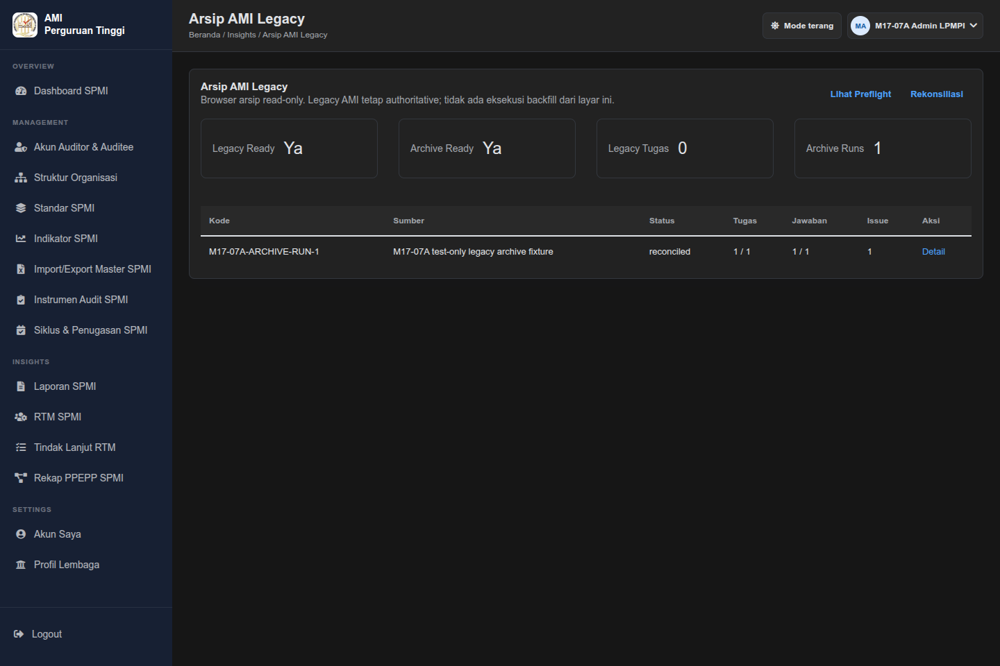

_L-01, `l-01-archive-overview.png`._

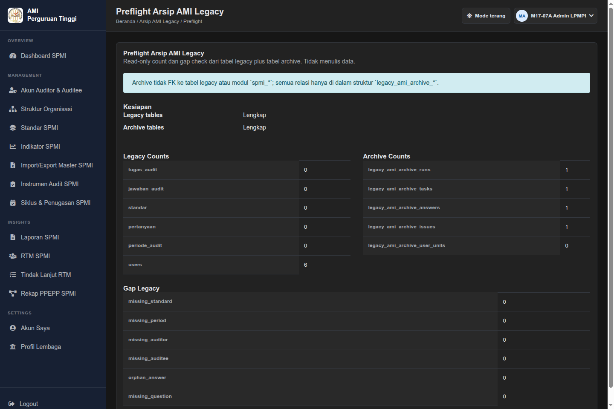

_L-01, `l-01-archive-preflight.png`._

Arsip AMI Legacy adalah area baca saja untuk data historis. Ini domain yang terpisah dari workflow SPMI aktif. Gunakan bagian ini untuk melihat run, task, answers, atau issues yang memang sudah ada di arsip, bukan untuk memutakhirkan data lama.

Prasyarat: login sebagai Admin LPMPI atau role yang memang diberi akses ke arsip.

Jalur menu: `Arsip AMI Legacy`.

Aksi utama: buka overview, cek preflight, lalu baca detail run, task, atau issue.

Hasil yang diharapkan: data legacy dapat dilihat tanpa mengubah isi arsip.

Catatan batas akses: arsip legacy hanya mendukung tampilan GET dan baca saja. Manual ini tidak menyediakan prosedur impor, migrasi, backfill, atau mutasi legacy.

## Capture provenance

Seluruh screenshot pada manual ini bersumber dari fixture sintetis `M17-07A` pada project Compose terisolasi `m17_07a_docs_manual`. Data yang tampil bukan data institusi nyata. Password, alamat akun, cookie, token, URL host, dan ID sensitif tidak didokumentasikan.

Coverage screenshot memang sengaja tidak lengkap untuk semua state lanjutan. `AU-04`, `AU-06`, `AR-05`, dan `AR-06` tidak ditangkap karena seed awal tidak membentuk state submission atau assessment final secara deterministik. Untuk state itu, manual ini memakai penjelasan prose saja.

## Troubleshooting

### Tidak bisa login

Periksa email dan kata sandi, lalu pastikan akun memang sudah dibuat. Jika pesan yang muncul tetap umum, itu normal. Aplikasi tidak membocorkan detail apakah email atau password yang salah.

### Lupa password tidak mengirim email

Pastikan deployment mendukung reset password dan konfigurasi email reset sudah lengkap. Bila konfigurasi belum tersedia, aplikasi tetap menampilkan pesan generik yang sama, tetapi email tidak akan terkirim.

### Logout tidak bekerja

Pastikan tombol logout dikirim sebagai POST. Jika dilakukan lewat cara lain, aplikasi menolak metode tersebut.

### Assignment auditee atau auditor tidak muncul

Periksa peran akun, cycle yang difilter, dan status tugas. Auditee hanya melihat assignment milik sendiri. Auditor hanya melihat submission yang sudah terkirim dan masuk ke ruang penilaian miliknya.

### Submission tidak bisa diedit lagi

Ini normal jika status sudah `submitted`. Auditee baru bisa mengedit lagi setelah auditor mengembalikan untuk revisi, sehingga status menjadi `returned_for_revision`.

### Finalisasi penilaian ditolak

Pastikan semua item sudah diberi skor 1 sampai 4. Jika item bertipe OB atau KTS, uraian temuan harus diisi. Jika jenis temuan KTS, rekomendasi dan rencana perbaikan juga wajib ada.

### Bukti gagal diunduh

Pastikan file memang milik pengguna yang login dan masih terhubung ke assignment yang benar. Bukti dikelola melalui endpoint aplikasi, jadi akses langsung ke file tidak disediakan.

### Import master atau import pertanyaan gagal

Periksa format file, ukuran file, dan apakah versi atau standar yang dipilih masih editable. Template dan preview yang kedaluwarsa harus diulang dari awal.

### Menu legacy hanya tampil read-only

Itu perilaku yang benar. Arsip AMI Legacy memang hanya untuk baca.

## Glosarium

* **SPMI**, Sistem Penjaminan Mutu Internal, alur kerja aktif yang dipakai saat ini.
* **AMI Legacy**, arsip historis dari workflow lama, hanya untuk baca.
* **Cycle**, periode audit yang menampung penugasan dan status proses.
* **Assignment**, penugasan audit untuk auditee atau auditor.
* **Submission**, jawaban auditee atas assignment.
* **Assessment**, penilaian auditor atas submission.
* **Draft**, status kerja yang masih dapat diedit.
* **Submitted**, status yang sudah dikirim auditee.
* **Returned for revision**, status yang dikembalikan auditor agar auditee memperbaiki isinya.
* **Resubmitted**, submission yang dikirim ulang setelah revisi.
* **Finalized**, penilaian auditor yang sudah dikunci.
* **OB**, temuan observasi.
* **KTS**, temuan ketidaksesuaian yang memerlukan rekomendasi dan rencana perbaikan.
* **RTM**, rapat tinjauan manajemen.
* **PPEPP**, kerangka perencanaan, pelaksanaan, evaluasi, pengendalian, dan peningkatan.

## Indeks gambar dan layar

| ID | Nama file | Keterangan singkat |
|---|---|---|
| G-01 | `g-01-login-empty.png` | Form login kosong |
| SA-01 | `sa-01-admin-dashboard.png` | Dashboard SPMI super admin |
| SA-02 | `sa-02-user-management.png` | Manajemen pengguna |
| M-01 | `m-01-organization.png` | Struktur organisasi |
| M-03 | `m-03-standards.png` | Standar SPMI |
| M-06 | `m-06-instruments.png` | Instrumen audit SPMI |
| M-07 | `m-07-cycle-list.png` | Daftar siklus dan penugasan |
| M-07D | `m-07-cycle-detail.png` | Detail siklus |
| AU-01 | `au-01-workspace-list.png` | Daftar workspace auditee |
| AU-02 | `au-02-editable-assignment.png` | Assignment auditee editable |
| AR-01 | `ar-01-auditor-inbox.png` | Inbox auditor |
| AR-02 | `ar-02-assessment-workspace.png` | Workspace penilaian auditor |
| AR-03 | `ar-03-score-finding-draft.png` | Draft skor dan temuan |
| R-01 | `r-01-reports.png` | Laporan SPMI |
| R-03 | `r-03-rtm.png` | RTM SPMI |
| R-04 | `r-04-follow-ups.png` | Tindak lanjut RTM |
| R-05 | `r-05-recap-dashboard.png` | Rekap PPEPP SPMI |
| L-01 | `l-01-archive-overview.png` | Arsip AMI Legacy overview |
| L-01 | `l-01-archive-preflight.png` | Arsip AMI Legacy preflight |

## Referensi layar admin-only

| Label layar | Route ringkas |
|---|---|
| `Dashboard SPMI` | `lpmpi/spmi-dashboard` |
| `Manajemen Pengguna` | `users` |
| `Akun Auditor & Auditee` | `lpmpi/akun` |
| `Struktur Organisasi` | `lpmpi/organization` |
| `Standar SPMI` | `lpmpi/spmi-standards` |
| `Indikator SPMI` | `lpmpi/spmi-indicators` |
| `Import/Export Master SPMI` | `lpmpi/spmi-master` |
| `Instrumen Audit SPMI` | `lpmpi/spmi-instruments` |
| `Siklus & Penugasan SPMI` | `lpmpi/spmi-audits` |
| `Laporan SPMI` | `lpmpi/spmi-reports` |
| `RTM SPMI` | `lpmpi/spmi-rtm` |
| `Tindak Lanjut RTM` | `lpmpi/spmi-follow-ups` |
| `Rekap PPEPP SPMI` | `lpmpi/spmi-recap` |
| `Arsip AMI Legacy` | `lpmpi/legacy-ami-archive` |

## Catatan akhir

Manual ini sengaja tidak memuat PDF export, MFA, rate limiting login, notifikasi umum, approval bertingkat, URL publik untuk bukti, atau otomatisasi Google Drive yang tidak terlihat pada kode dan sumber yang diperiksa. Jika ada perubahan workflow atau layar baru, perbarui manual ini bersamaan dengan manifest screenshot dan status yang tercatat di kode sumber.
