# Threat Model AMI

- Milestone: M1-01
- Versi baseline: 1.0
- Tanggal: 2026-07-24
- Status: Baseline risiko; kontrol yang berlabel **required** belum dianggap terimplementasi
- Cakupan: aplikasi AMI CodeIgniter 3, database, session, private/legacy storage, export, integrasi keluar, backup, dan proses migrasi

## 1. Tujuan dan cara membaca

Threat model ini mengidentifikasi ancaman utama sebelum aplikasi menambah versioning SPMI, snapshot audit, RTM, tindak lanjut, dan audit log. Dokumen ini merupakan hasil penelusuran source code dan baseline lokal, bukan penetration test atau bukti kesiapan produksi.

Istilah pada kolom kontrol:

- **Existing control** adalah kontrol yang dapat ditunjukkan pada repository saat baseline dibuat.
- **Required control** adalah perlakuan risiko yang harus diimplementasikan dan diuji pada milestone berikutnya.
- Tidak ditemukannya kerentanan melalui inspeksi statis bukan bukti bahwa kerentanan tidak ada.
- Konfigurasi, backup, dan data produksi belum diperiksa oleh M1-01.

Dokumen rujukan:

- [Current architecture](../architecture/current-state.md)
- [Current database schema](../database/current-schema.md)
- [ADR 0003 — audit snapshot](../adr/0003-audit-snapshot.md)
- [ADR 0004 — private file storage](../adr/0004-private-file-storage.md)
- [ADR 0005 — role and scope authorization](../adr/0005-role-and-scope-authorization.md)
- [ADR 0006 — legacy migration strategy](../adr/0006-legacy-migration-strategy.md)
- [Product decision register](../product/decision-register.md)

## 2. Ruang lingkup dan asumsi

### Termasuk

- browser pengguna sampai route/controller aplikasi;
- autentikasi, session, role, ownership assignment, dan endpoint admin;
- master SPMI, instrumen, tugas, jawaban, nilai, temuan, bukti, laporan, dan export;
- private storage serta fallback file legacy di document root;
- database MySQL/MariaDB, session file store, log, backup, dan raw SQL migration;
- integrasi PDDikti yang sudah ada;
- aset target RTM, notulen, daftar hadir, dan immutable audit log sebelum fitur tersebut dibangun.

### Di luar pembuktian M1-01

- konfigurasi dan data produksi;
- keamanan host Windows/Laragon, Linux/Docker, reverse proxy, DNS, TLS terminator, firewall, dan object storage di luar repository;
- keamanan internal penyedia PDDikti atau host URL bukti;
- enkripsi, lokasi, akses, serta keberhasilan restore backup aktual;
- keputusan bisnis yang masih `Needs Decision`, termasuk finalizer, retensi, fetch URL bukti, dan tanda tangan digital.

### Asumsi yang harus diverifikasi

1. Semua traffic produksi melewati HTTPS dan tidak memiliki jalur HTTP/internal bypass.
2. `APP_PRIVATE_STORAGE_PATH`, log, dan session file store tidak dapat dibaca oleh user sistem lain.
3. Database production tidak dapat diakses langsung dari internet.
4. Backup database dan storage dibuat sebagai satu recovery set.
5. Route konvensional menuju controller legacy belum dianggap tidak aktif sebelum dibuktikan melalui runtime/router.

## 3. Klasifikasi dampak

| Rating | Kriteria |
|---|---|
| Critical | Dapat menghancurkan atau memalsukan histori audit secara luas, mengambil alih sistem, atau menyebabkan kehilangan produksi yang tidak dapat dipulihkan. |
| High | Dapat mengambil alih akun, mengakses data lintas scope, membocorkan bukti privat, atau mengubah hasil/finalisasi tanpa otorisasi. |
| Medium | Dampak terbatas, membutuhkan prasyarat kuat, atau terutama mengganggu availability/operasional. |
| Low | Dampak kecil dan tidak langsung terhadap kerahasiaan, integritas, atau availability. |

Rating adalah prioritas awal berdasarkan impact dan exploitability yang terlihat dari source. Ia harus diperbarui setelah test dinamis dan pemeriksaan environment M1-02.

## 4. Inventaris aset

| ID | Aset | Klasifikasi utama | Current state / target |
|---|---|---|---|
| A-01 | Akun pengguna, password hash, role, profil, unit | Restricted | Ada pada `users`; autentikasi aktif, status akun aktif/nonaktif belum tersedia. |
| A-02 | Cookie dan data session | Restricted | Cookie browser dan file session CodeIgniter; memuat identitas serta role. |
| A-03 | Dokumen SPMI, standar, pertanyaan, instrumen, penetapan | Confidential / Internal | Ada, tetapi master masih mutable dan sebagian file mempunyai fallback legacy. |
| A-04 | Jawaban dan bukti auditee | Confidential | Saat ini berupa teks dan URL HTTP/HTTPS; upload bukti auditee target belum ada. |
| A-05 | Bukti auditor | Confidential | Upload file ada; disimpan melalui private storage dengan fallback legacy. |
| A-06 | Notulen RTM | Confidential | Aset target; workflow RTM belum ada. |
| A-07 | Daftar hadir RTM | Confidential | Aset target; kewajiban dan retensinya masih `Needs Decision`. |
| A-08 | Data nilai dan status finalisasi | Confidential, integrity-critical | Ada pada `jawaban_audit`; draft dan final berada pada record operasional yang sama. |
| A-09 | Temuan, akar masalah, rekomendasi, rencana perbaikan | Confidential, integrity-critical | Sebagian field temuan/rekomendasi ada; model target lebih terstruktur belum ada. |
| A-10 | Identitas, role, dan assignment auditor | Restricted / Confidential | Ada pada `users` dan `tugas_audit`; satu assignment saat ini menunjuk satu auditor. |
| A-11 | Keputusan RTM, PIC, target, dan verifikasi | Confidential, integrity-critical | Aset target; belum diimplementasikan. |
| A-12 | Audit log keamanan dan perubahan domain | Restricted, integrity-critical | M1-08 menyediakan ledger append-only, HMAC redaction, hash chain, request correlation, serta trigger penolak update/delete. External anchoring, formal retention, dan restricted viewer belum tersedia. |
| A-13 | Backup database dan private storage | Restricted, recovery-critical | README meminta backup/restore, tetapi media, enkripsi, akses, dan hasil restore aktual belum terbukti. |

## 5. Aktor

| Aktor | Tujuan sah atau kemampuan ancaman |
|---|---|
| Pengunjung tanpa login | Mencapai login dan aset publik; dapat mencoba credential stuffing, CSRF, probing route, atau input berbahaya. |
| Auditee | Mengisi tugas dan bukti miliknya; akun jahat/terkompromi dapat mencoba objek auditee lain atau menaikkan privilege. |
| Auditor | Menilai assignment miliknya; akun jahat/terkompromi dapat mencoba assignment lain, mengubah final, atau mengambil bukti. |
| Admin LPMPI | Mengelola master, penugasan, laporan, dan profil sesuai role saat ini; compromise memberi blast radius besar. |
| Super admin | Mengelola user dan area global; compromise memiliki blast radius tertinggi dan override target harus eksplisit. |
| Contributor/deployment operator | Memiliki akses source, environment, migration, backup, atau host; kesalahan dan insider threat harus diperhitungkan. |
| Layanan eksternal/PDDikti | Memberikan data serta redirect/response melalui koneksi keluar; response tidak dipercaya sebagai data aman. |
| Host bukti eksternal | Dibuka oleh browser pengguna saat ini; menjadi ancaman SSRF bila server-side fetch ditambahkan kelak. |
| Penyerang dengan akses database/storage/backup | Dapat membaca, mengubah, menghapus, atau mengembalikan data lama di luar kontrol aplikasi. |

## 6. Trust boundary dan aliran data

```mermaid
flowchart LR
    subgraph U["TB-01 — Client/untrusted network"]
        B["Browser pengguna"]
        E["Host URL bukti"]
    end

    subgraph W["TB-02 — Web runtime"]
        S["Apache / reverse proxy"]
        A["CodeIgniter 3 application"]
    end

    subgraph D["TB-03 — Data services"]
        DB[("MySQL / MariaDB")]
        SS[("Session files")]
        PS[("Private storage")]
        LS[("Legacy uploads under web root")]
        LG[("Application logs")]
    end

    subgraph X["TB-04 — External service"]
        PD["PDDikti endpoints"]
    end

    subgraph O["TB-05 — Operations"]
        BK[("Database + storage backup")]
        MG["Manual SQL migration"]
    end

    B -->|"HTTPS request, cookie, form, upload"| S
    S --> A
    A -->|"Query Builder / transaction"| DB
    A -->|"session id and data"| SS
    A -->|"authorized file I/O"| PS
    A -.->|"temporary legacy fallback"| LS
    A -->|"technical events"| LG
    A -->|"fixed-host HTTPS request"| PD
    B -.->|"user follows stored evidence URL; no server fetch today"| E
    DB --> BK
    PS --> BK
    MG --> DB
```

| Boundary | Data yang melintas | Kepercayaan yang dilarang |
|---|---|---|
| TB-01 Client ke web | credential, cookie, ID objek, form, URL, file | Jangan percaya role, owner ID, path, MIME, extension, atau state dari request. |
| TB-02 Web ke data services | query, session, file key, log | Jangan anggap akses filesystem/database otomatis terotorisasi pada level objek. |
| TB-03 Data ke backup/operator | seluruh data dan file historis | Jangan anggap backup aman hanya karena tidak dilayani web. |
| TB-04 Web ke layanan eksternal | nama/ID institusi dan response JSON | Jangan percaya redirect, DNS, ukuran, schema, atau isi response eksternal. |
| TB-05 Migration ke database | DDL/DML dan backfill | Jangan menjalankan perubahan destruktif tanpa inventory, backup, dry run, verification, dan rollback/restore test. |

Entry point utama adalah login/logout, CRUD admin, import pertanyaan, penugasan, form Auditee/Auditor, submit/revisi/finalisasi, upload/download, laporan/export, sinkronisasi PDDikti, CLI audit, raw migration, dan proses backup/restore.

## 7. Threat scenarios dan kontrol

| Asset | Actor | Threat | Impact | Existing control | Required control | Test |
|---|---|---|---|---|---|---|
| A-01 Akun | Penyerang internet | **TM-01 Credential stuffing** terhadap email/password yang bocor dari layanan lain. | High — account takeover dan akses data sesuai role korban. | M1-03: `password_verify`, pesan gagal generik, active-account check, serta temporary lock berbasis database pada 5 kegagalan/email atau 20/IP dalam 15 menit. M1-08 menambahkan login success/failure/throttle ke immutable audit ledger; identifier jaringan dan snapshot disimpan sebagai HMAC tanpa password/email/IP mentah. | Monitoring/alert, formal retention, kebijakan reset, dan evaluasi MFA/SSO tetap diperlukan. | Smoke terisolasi membuktikan lock, inactive denial, dan audit login; lanjutkan test multi-IP/multi-instance, window expiry, concurrency threshold, monitoring, dan pencarian canary secret pada seluruh log. |
| A-02 Session | Penyerang jaringan/XSS/pengguna perangkat bersama | **TM-02 Session hijacking atau fixation** melalui cookie curian atau session ID pra-login. | High — impersonation sampai session berakhir. | M1-02/M1-03: ID lama dihancurkan saat login/rotasi; cookie HttpOnly/SameSite Lax dan Secure wajib di production; idle 30 menit, absolute 8 jam; logout destroy; guard mencabut sesi saat akun/role/password berubah. | Pertahankan verifikasi TLS/proxy/store permission dan tambahkan monitoring anomali; kebijakan timeout bisnis/MFA masih perlu keputusan stakeholder. | Smoke membandingkan ID sebelum/sesudah login, logout replay, dan session-version revocation; production probe untuk atribut cookie serta test waktu idle/absolute tetap release gate. |
| A-01, A-02, seluruh mutation | Situs penyerang dan korban yang login | **TM-03 CSRF** pada create/update/delete, submit, upload, sinkronisasi, logout, atau finalisasi. | High — aksi sah dijalankan tanpa niat pengguna. | CSRF CodeIgniter aktif global dan logout hanya POST. Namun GET Penetapan saat ini memiliki side effect write. | Jadikan GET read-only; semua mutation memakai POST/PUT/DELETE dan token; SameSite sebagai defense-in-depth; origin/referer check untuk aksi berisiko bila sesuai; pola token AJAX konsisten. | Request tanpa/salah token harus 403 dan tidak mengubah DB/file; crawl GET harus tidak menghasilkan write; uji form serta AJAX dengan rotasi token. |
| A-03, A-04, A-08, A-09, A-11 | Pengguna yang dapat menyimpan teks | **TM-04 Stored XSS** pada jawaban, standar, pertanyaan, temuan, akar masalah, rekomendasi, keputusan RTM, catatan, nama file, atau URL. | High — pencurian session, aksi atas nama korban, dan manipulasi tampilan/laporan. | M1-05: business view memakai `ami_e`/`ami_text`, script data memakai `ami_json`, stored URL memakai allowlist HTTP/HTTPS saat render, dan error development di-encode. M1-07 menambah CSP nonce per request, `script-src-attr 'none'`, origin allowlist, serta melarang `unsafe-eval` dan script `unsafe-inline`. Rich text tidak diizinkan. | Pertahankan gate M1-05/M1-07 dan tambahkan test context-specific pada setiap surface baru. Hilangkan `style-src-attr 'unsafe-inline'` setelah atribut style legacy dipindahkan. Jika rich text benar-benar dibutuhkan, definisikan sanitizer allowlist per field sebelum dibuka. | Regression helper + HTTP/header sudah aktif; lanjutkan browser DOM/console test dan ulangi payload pada RTM/root cause/progress/PDF/email ketika entity atau renderer tersebut dibuat. |
| A-04, A-05, A-08, A-11 | Pengguna login yang menebak ID | **TM-05 IDOR** pada URL tugas, jawaban, bukti, laporan, RTM, dan tindak lanjut. | High — baca/ubah objek milik unit atau assignment lain. | M1-04 memusatkan policy assignment/evidence dan scoped owner query. M2-02 menambahkan direct dated membership. M2-03 memetakan capability per aksi dan menyediakan guard capability + direct active unit; parent scope tidak diwariskan. Modul legacy tanpa unit ID tetap memakai ownership/state lama; RTM belum ada. | Entity baru harus menyimpan unit ID stabil dan memakai guard scope sejak list/query sampai mutasi. Migrasikan objek legacy bertahap tanpa mapping dari teks bebas. | Gunakan dua user, dua unit, assignment aktif/kedaluwarsa, ID berurutan dan ID tidak ada; uji GET/POST/AJAX/download/export. Respons ditolak seragam dan tidak membocorkan metadata. |
| A-01 sampai A-13 | Penyerang melalui input query/filter/import | **TM-06 SQL injection** pada filter, ID, search, import, atau field teks. | High/Critical — kebocoran, perubahan, atau penghapusan database. | Jalur utama memakai Query Builder dan cast integer; satu raw query yang ditemukan berasal dari compiled query dengan ID yang sudah dicast. | Wajib prepared binding/Query Builder, allowlist sort/column, larang konkatenasi input, least-privilege DB user, static scan, serta error production aman. | Payload boolean/time/error pada seluruh filter dan field; static check raw SQL; pastikan tidak ada stack/query leak dan akun aplikasi tidak memiliki privilege administrasi yang tidak diperlukan. |
| A-01, A-03, A-08, A-11 | Pengguna login | **TM-07 Mass assignment** dengan menambah `role`, owner, status, final flag, path, atau field internal ke request. | High — privilege escalation dan state tampering. | Beberapa controller memilih field satu per satu; active Auditor/Auditee menerima array POST tetapi model menormalisasi subset field yang dikenali. Konsistensi seluruh endpoint belum terbukti. | DTO/input allowlist per use case, server-owned actor/owner/state fields, reject unknown sensitive fields, policy check sesudah load object, dan test parameter pollution. | Tambahkan field internal, array duplikat, nested key, owner ID, role, submitted flag, serta storage path pada setiap mutation; DB harus tidak berubah di luar field yang diizinkan. |
| A-03, A-05, A-06, A-07 | Pengguna yang dapat upload | **TM-08 Upload file berbahaya** seperti PHP, PHAR, HTML, SVG aktif, macro, polyglot, atau malware. | High/Critical — code execution, persistent client attack, malware distribution, atau data loss. | M1-06 memusatkan seluruh upload aktif: allowlist kategori/size, random name, PDF/image/OOXML inspection, executable/double-extension/macro/ActiveX/embedding deny, private storage, checksum, metadata, dan attachment download. | Tambahkan AV/CDR dan quarantine automation bila diputuskan; pertahankan OS ACL/no-execute, disk monitoring, dan test setiap format baru. | Smoke menolak PDF palsu dan HTML/script; regression memeriksa denylist/container. EICAR/polyglot/seluruh format serta scanner test tetap release gate bila AV ditambah. |
| A-03, A-05, A-06, A-07 | Pengguna yang memalsukan metadata upload | **TM-09 MIME spoofing** dengan header browser atau extension yang tidak sesuai isi. | High — bypass allowlist dan serangan upload. | `File_security` mengabaikan MIME browser, memakai `finfo`, signature PDF, decoder gambar, serta required-entry/unsafe-entry inspection DOCX/XLSX. SHA-256 dan size diverifikasi lagi sebelum private download. | Pertahankan pasangan extension-content dan parser budget; tambahkan corpus polyglot/malformed untuk setiap dependency/parser update. | Smoke mengirim body PHP sebagai `application/pdf` bernama `.pdf` dan memastikan ditolak; tamper pasca-upload menghasilkan 404. Tambahkan corpus JPEG/DOCX/XLSX malformed. |
| A-03, A-05, A-06, A-07 | Pengguna/penyerang yang mengontrol nama atau key | **TM-10 Path traversal** melalui `../`, separator Windows/Linux, encoded path, symlink, atau storage key. | High/Critical — arbitrary file read/write/delete. | Kategori fixed, storage key 192-bit random, resolver mensyaratkan `basename`, metadata owner dicocokkan, dan controller tidak menerima path request. Production menolak legacy web-root fallback. | Verifikasi canonical root/symlink behavior pada host Linux/Windows dan selesaikan migrasi legacy checksum sebelum release. | Regression memeriksa basename/random key/owner policy; lanjutkan test junction/symlink/UNC/ADS pada environment deployment aktual. |
| A-04 Bukti auditee, jaringan internal | Auditee atau host URL eksternal | **TM-11 SSRF melalui URL bukti** bila server mengambil preview/content URL. | High/Critical — akses metadata cloud, localhost, service internal, credential, atau port scan. | Saat ini hanya format URL `http/https` yang divalidasi dan URL disimpan; tidak ditemukan server-side fetch bukti. BIZ-018 masih terbuka. | Pertahankan no-fetch sebagai default. Jika disetujui: dedicated fetcher, scheme/port/host allowlist, DNS/IP validation setiap redirect, blok private/link-local, response/size/time limit, proxy egress, no cookie/auth forwarding, dan audit. | URL localhost, IPv6, decimal/octal IP, DNS rebinding, redirect ke private IP, credential-in-URL, slow response, oversized body, serta non-HTTP scheme harus ditolak tanpa koneksi internal. |
| A-02 Session | Penyerang yang memasok return/next URL | **TM-12 Open redirect** setelah login, logout, atau aksi lain. | Medium — phishing dan pencurian token pada flow integrasi masa depan. | Redirect yang ditelusuri memakai route internal/literal dan integer ID; belum ditemukan redirect langsung dari parameter URL pengguna. | Gunakan route name/relative allowlist, tolak scheme-relative/backslash/control characters, dan jangan memasukkan token pada query redirect. | Uji `https://evil`, `//evil`, encoded slash/backslash, CRLF, username-host syntax, dan nested `next`; hasil harus tetap pada origin yang diizinkan. |
| A-04, A-08, A-09, A-11 | Pengguna yang datanya diexport | **TM-13 CSV/Excel formula injection** melalui cell yang diawali `=`, `+`, `-`, `@`, tab, CR, atau formula hyperlink. | High — command/data exfiltration saat workbook dibuka. | M1-05: seluruh teks XLSX memakai `setCellValueExplicit(... TYPE_STRING)`; hyperlink hanya HTTP/HTTPS. Smoke mengunduh dan membuka kembali workbook, memastikan payload `=WEBSERVICE(...)` bertipe string dan `javascript:` tidak menjadi nilai link. M1-08 mencatat export sensitif ke immutable audit ledger. Belum ada export CSV/PDF. | Pertahankan explicit type, URL allowlist, dan audit event pada setiap renderer baru. Renderer CSV/PDF wajib mempunyai encoder/test context-specific. | Gate XLSX dan audit export aktif; saat CSV/PDF ditambah, uji DDE/WEBSERVICE/HYPERLINK, whitespace/control prefix, markup, parser target, dan event ledger sebelum release. |
| A-01, A-08, A-10, A-11 | Pengguna login/akun yang role-nya berubah | **TM-14 Privilege escalation** melalui role tampering, session role lama, endpoint legacy, atau override super admin. | High/Critical — akses admin, perubahan nilai, atau finalisasi tidak sah. | M1-03 memvalidasi akun/status/role/`session_version` pada setiap request. M1-04 menambahkan capability dan object/state policy terpusat untuk controller utama maupun legacy. Sensitive Super Admin override memakai API terpisah dan alasan wajib. M1-08 mencatat perubahan role dan override ke immutable audit ledger; belum ada endpoint UI untuk override. | Tambahkan scope organisasi dan separation of duties/finalizer untuk workflow target; inventory setiap route baru dan cakupan event-nya tetap wajib. | Session-version revocation, matriks capability/ownership, dan event ledger sudah diuji; lanjutkan manipulasi cookie/POST role, scope organisasi setelah model tersedia, dan override tanpa capability/alasan. |
| A-08, A-09, A-11 | Auditor/admin atau request terlambat | **TM-15 Perubahan nilai setelah finalisasi** melalui edit, reopen, stale form, atau jalur legacy. | Critical — hasil audit dan keputusan manajemen tidak dapat dipercaya. | Submit penilaian mengubah rows dan status task dalam transaksi. Namun revisi dapat membuka task tanpa alasan/history terpisah, record final tetap mutable, dan dua flow hidup bersama. | State machine service, immutable final record/snapshot, capability final/reopen, reason + amendment, optimistic lock, audit event, final report read model, dan larang direct update final. | Finalisasi lalu replay save lama, edit per-item, jalur legacy, reopen tanpa izin/alasan, serta concurrent final/edit; hash/history final harus tetap dapat dibuktikan. |
| A-04, A-05, A-06, A-07 | Pengguna sah/operator | **TM-16 Penghapusan bukti tanpa audit trail** ketika replace, delete, cleanup, atau cascade. | High — hilangnya dasar penilaian dan non-repudiation. | M1-06 mencatat metadata/checksum + file event serta tombstone retention 90 hari. M1-08 menyalin lifecycle penting ke ledger immutable berantai dan trigger mencegah log diubah/dihapus. | Tetap diperlukan legal hold, backup reconciliation, approval purge, policy retensi resmi, dan external head anchoring. | Smoke membuktikan replacement/retention, event ledger, chain integrity, dan trigger rejection; lanjutkan legal hold, restore, serta scheduled purge production. |
| A-03, A-05, A-06, A-07 | Penyerang internet/pengguna lintas scope/misconfiguration | **TM-17 Kebocoran file private** melalui direct URL, backup, temp, error path, atau download tanpa scope. | High — data audit internal terekspos. | Sensitive/temp upload berada di private root; download melewati capability/object policy lalu central integrity/owner check, attachment, nosniff, CSP sandbox, no-store, dan event. Global M1-07 juga memberi nosniff/no-store pada respons dinamis. Production menolak fallback legacy document-root. Logo institusi adalah exception publik. | Jalankan migration 013 + filesystem migration dry-run/apply dan verifikasi ACL/no-execute/backup serta header pada reverse proxy production. | Smoke menguji admin/Auditee/Auditor authorized path, cross-Auditor denial, header, private location, dan tamper denial; direct HTTP/web-server/backup tetap deployment test. |
| A-01, A-02, A-12 | Developer/operator atau input yang memicu error | **TM-18 Log berisi password, token, cookie, URL sensitif, atau body request**. | High — credential/session theft dan data leakage melalui log/monitoring. | M1-02 mengamankan log teknis. M1-08 memisahkan structured ledger, tidak membaca request body, memakai metadata allowlist, mengeluarkan key secret, serta menyimpan IP/user-agent dan snapshot sebagai HMAC. | Tetap perlukan canary review, least-privilege DB, retention, backup, external monitoring, dan review redaction setiap integrasi baru. | Regression memeriksa source/allowlist; smoke memastikan identifier HMAC dan metadata tanpa key password/token/cookie. Lanjutkan canary search pada staging. |
| A-04, A-08, A-11 | Dua request sah/stale secara bersamaan | **TM-19 Race condition saat submit** Auditee/Auditor atau update agregat. | High — flags campuran, last-write-wins, data parsial, atau laporan salah. | Beberapa batch submit memakai transaksi, tetapi tidak ada row/version lock atau compare-and-swap state yang terverifikasi. Constraint aggregate juga terbatas. | Service transaction, row/advisory lock sesuai desain, state precondition atomik, version column, unique/check constraint, idempotency key, dan retry semantics. | Kirim draft/submit/revisi bersamaan dari dua koneksi; ulangi di batas transaksi; hanya satu transisi valid, tidak ada mixed flags, dan hasil deterministik. |
| A-08, A-11, A-12 | Client retry, proxy, pengguna, atau penyerang | **TM-20 Replay request finalisasi** akibat double-click, retry, atau request yang direkam. | High — event/side effect ganda atau final state ditimpa. | Finalisasi penilaian berada dalam transaksi, tetapi belum mempunyai idempotency key/unique finalization event dan histori final terpisah. | Idempotent finalization service, state compare-and-set, idempotency key unik per actor/object/action, immutable event, response replay aman, dan audit. | Kirim request identik paralel dan berurutan, retry setelah timeout/commit ambigu, serta token lama; satu final event/artefak saja dan respons konsisten. |
| A-03 sampai A-11 | Pengguna login dan endpoint yang hanya role-check | **TM-21 Broken object-level authorization** pada list, count, search, bulk action, export, file, dan objek turunan. | High/Critical — kebocoran atau mutasi lintas organisasi dalam skala besar. | M1-04 menyediakan central capability/object policy dan explicit logged override. M2-02 menyediakan membership langsung aktif. M2-03 memecah capability fill/submit/view/export serta menguji seluruh role × unit × tanggal. RTM/follow-up tetap deny-default. | Terapkan guard scope yang sama pada setiap entity baru dan migrasikan seluruh list/count/search/bulk/export/file legacy setelah tersedia unit ID stabil; separation of duties tetap wajib sebelum RTM/follow-up. | Matriks role × capability × unit × ownership × state untuk list/detail/mutation/bulk/export/download; hitungan dan pesan error tidak boleh membocorkan objek di luar scope. |
| A-13 Backup | Operator, pencuri media, ransomware, atau akun cloud terkompromi | **TM-22 Backup tidak terenkripsi atau restore tidak terkontrol**. | Critical — seluruh akun, nilai, bukti, dan histori bocor atau tidak dapat dipulihkan. | README menginstruksikan backup database + private storage dan uji restore; tidak ada bukti encryption, access policy, offsite/immutable copy, atau restore test aktual. | Enkripsi in transit/at rest dengan key terpisah, least privilege, immutable/offline copy, retention, inventory, checksum, monitoring, documented restore, serta test restore berkala pada lingkungan terisolasi. | Temukan backup dari akun web/DB biasa harus gagal; verifikasi encryption metadata/key separation/checksum; restore set DB+file terisolasi dan jalankan audit consistency/smoke tanpa mengekspos data. |
| A-03 sampai A-13 | Deployment operator atau migration yang salah | **TM-23 Migration destructive** menghapus/mengubah data, cascade, file, atau histori tanpa rollback. | Critical — kehilangan histori dan downtime luas. | Migration CI dinonaktifkan; SQL dijalankan manual; README meminta backup. Terdapat nomor `009` ganda, blok DROP, dan banyak FK cascade pada schema. | ADR 0006: unique ledger, expand/backfill/verify/cutover/retire, idempotent batches, precondition, dry run, backup + tested restore, reconciliation, manual review, dan larangan auto-run destructive DOWN. | Jalankan dua kali pada clone, hentikan di tengah lalu resume, schema drift, data ambigu, rollback aplikasi, restore, dan count/checksum comparison; production-like copy saja, bukan DB utama. |
| A-08, A-09 | Admin LPMPI dan consumer laporan | **TM-24 Kebocoran nilai draft sebagai laporan final** atau agregat resmi. | High — keputusan manajemen memakai hasil yang belum final. | Query laporan membaca data operasional dan dapat memasukkan skor non-null tanpa filter final; export string safety tidak menyelesaikan integritas state. | Final report entity/read model hanya dari state final, snapshot/hash, approval capability, versioned artifact, dan label draft yang tidak ambigu. | Buat nilai draft dan final dalam periode sama; dashboard/detail/export final harus mengabaikan draft, sedangkan preview draft harus jelas dan scoped. |
| A-01, A-03, A-08, A-09 | Admin/operator atau cascade database | **TM-25 Hard delete/cascade menghilangkan histori** melalui delete user, standar, pertanyaan, periode, atau tugas. | Critical — audit lama tidak dapat direkonstruksi dan actor/provenance hilang. | Service memiliki beberapa guard assignment, tetapi schema memakai `ON DELETE CASCADE` pada relasi penting dan master mempunyai hard-delete flow. | Version/retire/soft delete, snapshot, FK restrict untuk histori, anonymization terkontrol bila perlu, impact preview, approval + audit, dan migration reconciliation. | Hapus objek yang direferensikan pada clone; operasi harus ditolak atau mempertahankan immutable historical identity/snapshot dan menghasilkan audit event. |
| A-03 Profil lembaga, jaringan aplikasi | Penyedia eksternal/redirect/DNS | **TM-26 Response atau redirect PDDikti berbahaya** menyebabkan data poisoning, egress tak terduga, atau resource exhaustion. | Medium/High — profil salah, request internal, log injection, atau availability terganggu. | Base URL hard-coded HTTPS, input path di-`rawurlencode`, TLS peer verify dan timeout tersedia; cURL mengikuti redirect dan batas response/schema belum kuat. | Host allowlist berlaku setelah setiap redirect, blok private IP, max redirects/response bytes, schema validation, rate limit/circuit breaker, safe logging, provenance, dan approval sebelum data authoritative ditimpa. | Redirect ke host/private IP, DNS change, huge/slow/malformed JSON, HTML response, duplicate fields, rate limit, dan TLS invalid; tidak boleh menulis partial/untrusted state. |
| A-03 sampai A-12 | Dependency/CDN/package registry compromise | **TM-27 Supply-chain tampering** pada Composer atau asset CDN. | High — malicious code di browser/server dan perubahan build tak terdeteksi. | Beberapa library frontend dipin versinya; Composer memakai declared constraints. `composer.lock` di-ignore dan Chart.js tidak dipin eksplisit. | Commit/verify lockfile bila strategi repo mengizinkan, dependency scanning, pinned versions/hashes, SRI atau self-host asset, trusted registry, review update, reproducible build, dan SBOM. | Build dua clone harus menghasilkan versi sama; putus/ubah CDN; verify SRI/hash; jalankan dependency audit dan uji bahwa update tidak otomatis masuk tanpa review. |
| A-12 Audit log | Pengguna berprivilege, DBA, atau attacker | **TM-28 Audit event tidak ada, dapat diubah, atau dapat dihapus** sehingga aksi sensitif dapat disangkal. | Critical — perubahan role, nilai, bukti, finalisasi, dan export tidak dapat dipertanggungjawabkan. | M1-08 menyediakan append-only event berisi actor/action/object/request/time, HMAC IP/UA dan before/after, metadata allowlist, serialized hash chain, no web mutation UI, CLI verifier, serta trigger penolak update/delete. Current auth/account/master/assignment/submit/revision/file/export surfaces terintegrasi. | Cabut privilege update/delete ledger, anchor head di sistem terpisah, monitor append/verifier, tetapkan retention/legal hold, buat restricted viewer/export, dan gunakan transactional outbox untuk legacy commit yang belum atomik. RTM/PIC/follow-up wajib menambah event ketika dibangun. | Regression 112 checks dan smoke end-to-end membuktikan event, chain, HMAC, serta direct update/delete rejection; production DBA privilege, backup/restore, external anchor, concurrency, dan alert tetap release gate. |
| A-06, A-07, A-11 | Auditor/admin/participant RTM | **TM-29 Finalisasi atau perubahan RTM tanpa kewenangan** ketika modul target ditambahkan. | High/Critical — keputusan, PIC, target, dan bukti tindak lanjut palsu. | Modul RTM belum ada, sehingga belum ada surface/control. Finalizer dan verifier masih `Needs Decision`. | Sebelum implementasi: keputusan BIZ-009/BIZ-010/BIZ-013, capability/state policy, separation of duties, transactional idempotent finalization, immutable amendment, private files, dan audit event. | Negative matrix participant/finalizer/verifier/unit; missing required artefact sesuai keputusan; replay/concurrency; edit final hanya lewat amendment dan seluruh event dapat ditelusuri. |

## 8. Prioritas perlakuan risiko

### P0 — release blocker sebelum surface target dibuka

1. Pertahankan regression gate M1-04 untuk capability dan object/state authorization; lengkapi model organization scope sebelum membuka objek, file, list, agregat, export, RTM, atau endpoint baru yang membutuhkannya (TM-05, TM-14, TM-21, TM-29).
2. Jadikan finalisasi transactional, idempotent, immutable, dan auditable; pisahkan draft dari laporan final (TM-15, TM-19, TM-20, TM-24).
3. Pertahankan ledger M1-08, lengkapi least privilege, external anchoring, retention/legal hold, transactional outbox, dan event modul baru (TM-16, TM-18, TM-28).
4. Pertahankan regression M1-06, selesaikan migrasi legacy/deployment ACL, dan putuskan AV/CDR/legal-hold (TM-08, TM-09, TM-10, TM-16, TM-17).
5. Pertahankan regression gate M1-03 untuk throttling login, active-account check, dan invalidasi session; lengkapi monitoring, kebijakan reset/MFA, serta production timeout/cookie probe (TM-01, TM-02, TM-14).
6. Pertahankan regression gate output encoding M1-05 dan tambahkan security headers M1-07 sebelum field rich-text/RTM bertambah (TM-04).
7. Uji backup/restore dan migration pada salinan terisolasi sebelum perubahan schema utama (TM-22, TM-23, TM-25).

### P1 — diselesaikan dalam security foundation

1. Audit production configuration, proxy/TLS, log, secret, session store, upload limit, dan database privilege pada M1-02.
2. Tambahkan regression suite SQL injection, mass assignment, redirect, CSRF, dan SSRF-no-fetch; perluas formula-injection gate saat renderer selain XLSX ditambahkan (TM-03, TM-06, TM-07, TM-11, TM-12, TM-13).
3. Batasi outbound PDDikti dan perlakukan response sebagai input tidak tepercaya (TM-26).
4. Buat dependency/build reproducible dan kurangi trust terhadap CDN (TM-27).

## 9. Strategi pengujian

1. Semua test mutation dan migration memakai database/storage terisolasi; tidak menjalankan destructive test pada database utama.
2. Fixture authorization minimal mempunyai dua user per role, dua unit, dua assignment, objek parent/child, draft/final, serta user nonaktif.
3. Security test harus memeriksa response **dan** memastikan database, file, event count, serta state tidak berubah ketika request ditolak.
4. Concurrency test menggunakan setidaknya dua koneksi/request independen dan menguji timeout/commit ambigu.
5. File test memakai fixture sintetis tanpa data pribadi; malware memakai test signature yang aman.
6. Log test memakai canary secret yang tidak pernah menjadi credential nyata.
7. Backup restore test memakai salinan terenkripsi dan lingkungan yang tidak dapat mengirim email/webhook atau mengakses layanan produksi.
8. Test minimum M0-03 tetap dijalankan untuk mendeteksi regresi behavior lama selama hardening.

## 10. Traceability ke task berikutnya

| Task | Threat utama yang ditangani |
|---|---|
| M1-02 Security Configuration Audit | TM-02, TM-06, TM-17, TM-18, TM-22 |
| M1-03 Session dan Authentication Hardening | TM-01, TM-02, TM-14 |
| M1-04 Central Authorization Guard | TM-05, TM-14, TM-21, TM-29 |
| M1-05 Output Encoding dan XSS Protection | TM-04 |
| M1-06 File Security Foundation | TM-08, TM-09, TM-10, TM-16, TM-17 |
| M1-07 Security Headers | TM-02, TM-04, TM-17 |
| M1-08 Immutable Audit Log | TM-15, TM-16, TM-18, TM-20, TM-28, TM-29 |
| Milestone finalization/report | TM-15, TM-19, TM-20, TM-24, TM-29 |
| Legacy migration per ADR 0006 | TM-10, TM-17, TM-22, TM-23, TM-25 |

## 11. Bukti repository yang diperiksa

- `index.php`
- `application/config/config.php`, `database.php`, `routes.php`, dan `migration.php`
- `application/controllers/Auth.php`, `Auditee.php`, `Auditor.php`, `Account.php`, `Profil.php`, serta controller LPMPI terkait
- `application/services/Auth_service.php`, `User_service.php`, `Tugas_audit_service.php`, dan `Pddikti_service.php`
- `application/models/User_model.php`, `Jawaban_model.php`, `Jawaban_audit_model.php`, `Tugas_audit_model.php`, dan `Laporan_model.php`
- `application/libraries/Auth_guard.php` dan `application/core/MY_Controller.php`
- `application/helpers/app_helper.php`
- views input/output, terutama form audit dan laporan
- `database_schema.sql`, seluruh `migrations/*.sql`, `README.md`, serta baseline M0-01 sampai M0-04
- `tests/smoke/run.php` dan regression tests yang sudah tersedia

Threat model harus diperbarui ketika trust boundary, actor, jenis file, integrasi, finalizer, retention, atau deployment topology berubah; ketika threat baru ditemukan; dan sebelum tiap release production yang menambah surface area.
